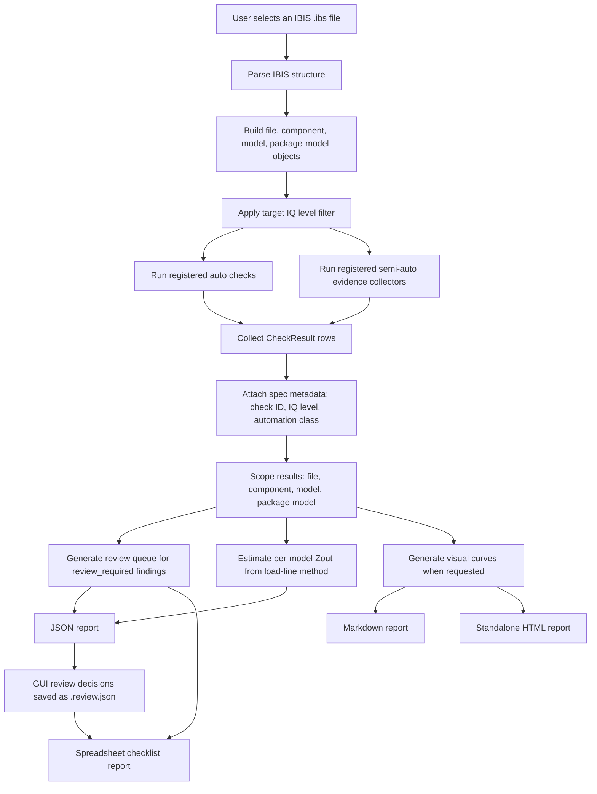
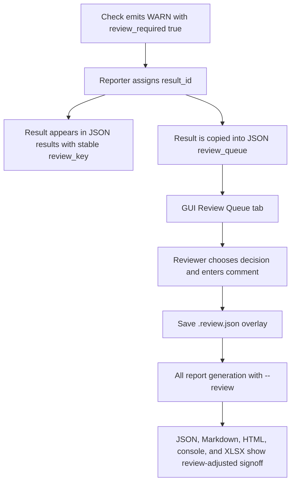

# IBIS QA Tool Demo Brief

Audience: engineering managers, IBIS model makers, SI/PI reviewers, and tool
maintainers.

Purpose: show what the tool does today, what evidence it produces, how it is
used from CLI and GUI, and where human review still fits into the quality
process.

Related detailed references:

- [Implemented check details](implemented-checks.md)
- [Manual check rationale](manual-checks.md)
- [QA methods map](qa-methods.md)
- [Quality levels](quality-levels.md)
- [Z41C comparison against Micron checklist](z41c-micron-comparison-report.md)

## 1. End-to-End Flow



Current pipeline summary:

1. The parser reads the IBIS file once and builds structured objects for the
   header, components, pins, models, waveform tables, I-V tables, ISSO tables,
   package models, and comments/notes used by checks.
2. The runner discovers check modules under `ibis_qa_tool/checks/`.
3. The requested target level, default IQ3, controls which checks run. For
   example, `--max-level 3` skips IQ4 checks completely.
4. Each check emits one or more result rows with status, scope, evidence, and
   review metadata.
5. The reporter produces machine-readable JSON first, then derives Markdown,
   HTML, spreadsheet, visual curve assets, and review queues from the same
   structured data.
6. Zout estimates are added as characterization data. They do not change
   PASS/FAIL status or candidate IQ score.

## 2. Coverage

The canonical check catalog is `data/ibis_quality_spec_3_0.json`, which was
created from the IBIS Quality Specification v3.0 and the checklist workbook.

### Specification Coverage

| Automation class | Spec items | Current tool status | Meaning |
|---|---:|---:|---|
| `auto` | 22 | 22 implemented | Deterministic parser, numeric, or IBISCHK checks. |
| `semi_auto` | 25 | 25 implemented as evidence collectors | Tool computes evidence and raises review-required findings when judgement is needed. |
| `manual` | 20 | 20 documented, not automated | Requires datasheet, extraction, SPICE, measurement, package, or model-maker evidence. |
| `optional` | 1 | Not score-gating | Visible as optional specification context. |
| Total | 68 | 47 automated/semi-automated, 20 manual, 1 optional | No auto or semi-auto item is missing from the runner. |

### Coverage by IQ Level

| Level | Total spec items | Auto implemented | Semi-auto implemented | Manual / external review | Optional |
|---|---:|---:|---:|---:|---:|
| IQ1 | 1 | 1 | 0 | 0 | 0 |
| IQ2 | 35 | 13 | 16 | 6 | 0 |
| IQ3 | 14 | 2 | 2 | 10 | 0 |
| IQ4 | 17 | 6 | 7 | 4 | 0 |
| Optional | 1 | 0 | 0 | 0 | 1 |

### Added Beyond the IBIS Quality Spec

The tool also adds Zout estimation:

- Per-model Pullup/Pulldown output impedance estimates using a load-line
  method derived from the `ibis_zout_report.py` prototype.
- Typ/min/max estimates where usable I-V table corners exist.
- Operating-point voltage/current and load-line details in JSON.
- Zout summary in Markdown, HTML, and spreadsheet reports.
- Per-model Zout load-line visual curves with operating-point markers.
- CLI option `--zout-rload` to change the load impedance from the default
  50 ohm.

Zout is intentionally reported as characterization data, not as an IBIS Quality
Specification PASS/FAIL item.

## 3. Output Formats

The tool can generate five report families from the same run:

| Format | Main audience | Generated by | Notes |
|---|---|---|---|
| Console text | Developer quick check | Default CLI output | Compact PASS/WARN/FAIL summary; `--verbose` shows PASS and NA rows too. |
| JSON | Automation, archive, GUI, downstream tools | `--json` or GUI Save Report | Complete structured report and source of truth for other report layers. |
| Markdown | Model maker and engineering review | `--markdown` or GUI Save Report | Human-readable report suitable for review and email/comment workflows. |
| HTML | Shareable standalone report | `--html` or GUI Save Report | Similar to Markdown but embeds SVG curves as data URIs for one-file sharing. |
| XLSX spreadsheet | Checklist workflow and review overlay | `--spreadsheet report.xlsx` or GUI Save Report | Summary, component/model sheets, raw results, Zout summary, and review decisions. |

The GUI Save Report command writes these together:

- `*.qa.json`
- `*.qa.md`
- `*.qa.html`
- `*.qa.xlsx`
- `*_assets/` SVG curve folder for Markdown and inspection

### JSON Report Structure

JSON is the most complete output. Important top-level fields:

| Field | Purpose |
|---|---|
| `file` | Source IBIS file used by the run. |
| `max_level` | Target IQ level used for the run. Higher-level checks are omitted. |
| `ibis_ver`, `file_rev`, `iq_score_in_file` | Header-level IBIS metadata. |
| `header` | Shared file metadata, including file name, date, source, notes, component/model counts, and IBISCHK version documentation if found. |
| `components` | Component metadata and component-scoped results. |
| `models` | Model metadata, model-scoped results, plot data, and per-model `zout`. |
| `package_models` | Package-model metadata and package-model-scoped results. |
| `zout_summary` | Report-level Zout coverage and estimate counts. |
| `file_results` | File/header-level check results, such as check `2.1` IBISCHK execution. |
| `ungrouped_results` | Results that could not be scoped. This should normally be empty. |
| `results` | Flat list of every generated result row. Best field for downstream analysis. |
| `review_queue` | Subset of `results` where `review_required=true`. |
| `summary` | Result counts by status: PASS, FAIL, WARN, NA, ERROR. |
| `review_summary` | Count of review-required rows and semi-auto rows. |
| `level_summary` | IQ-level rollup of implemented, passed, failed, warning, review, and manual/unimplemented items. |
| `score_summary` | Candidate implemented score. Final official IQ score is not assigned by the tool. |

Each `results[]` row has this shape:

| Field | Purpose |
|---|---|
| `result_id` | Run-local identifier such as `R00042`, used by the review overlay. |
| `check_id` | IBIS Quality Specification item ID, such as `5.3.10`. |
| `iq_level`, `numeric_level` | Quality level metadata preserved per result. |
| `status` | `PASS`, `FAIL`, `WARN`, `NA`, or `ERROR`. |
| `scope` | `file`, `component`, `model`, `package_model`, or `unknown`. |
| `automation_class` | Tool-side classification for the result, usually `auto` or `semi_auto`. |
| `review_required` | Boolean flag used to build the GUI review queue. |
| `component_name`, `model_name`, `package_model_name` | Scoped object names when applicable. |
| `subject` | Human-readable subject for the result row. |
| `message` | Main finding text. |
| `details` | Evidence lines explaining values, limits, or parser observations. |
| `data` | Structured check-specific evidence, for example IBISCHK output or numeric details. |
| `spec_ref` | Specification reference metadata when provided by the check. |

Each model also includes a `zout` block:

| Field | Purpose |
|---|---|
| `available` | Whether at least one load-line estimate was produced. |
| `method` | Zout calculation method label. |
| `r_load_ohm` | Load resistance used for the estimate. |
| `model_type` | IBIS model type. |
| `estimates` | Detailed per-table, per-corner estimates and operating points. |
| `summary` | Compact typ/min/max Pullup and Pulldown Zout values. |
| `notes` | Missing-data or applicability notes. |

### Markdown Report

The Markdown report is written for model makers and engineering reviewers. It
intentionally avoids local workflow-only detail such as full local file paths.

Current content includes:

- Title and file summary.
- Candidate score assessment.
- Summary counts.
- Zout Estimates section.
- Quality Check Results grouped by IQ level and check item.
- Separate tables for shared/general items and per-model items.
- Reasons for WARN/FAIL/ERROR rows.
- Links from attention rows to related visual curves.
- Visual Curves section with I-V, clamp detail, zero-current detail, waveform,
  ISSO, and Zout load-line plots when data exists.
- Appendices explaining IQ levels and special designators.

### Standalone HTML Report

The HTML report is designed for easier sharing:

- Uses the same report structure as Markdown.
- Embeds SVG curves directly as `data:image/svg+xml;base64`.
- Does not require sending the SVG asset folder with the HTML file.
- Keeps IBISCHK excerpts as simple readable text.
- Preserves links between attention items and related curves.

### Spreadsheet Report

The spreadsheet report is intended to support checklist-style review:

- Summary sheet with file metadata, candidate score, status counts, review
  counts, and Zout summary.
- Component sheets with component-scoped check rows.
- Model sheets with model-scoped check rows and Zout triplets.
- Raw results sheet for audit and traceability.
- Optional review overlay from a GUI `*.review.json` file.

When a review overlay is applied, spreadsheet statuses can become:

- `PASS` for accepted review items.
- `EXCEPTION` for accepted exceptions.
- `FAIL` for rejected review items.
- `NA` for not-applicable review decisions.

## 4. CLI and GUI Modes

### CLI Entry Point

Run from the tool directory:

```powershell
cd ibis_qa_tool
python ibis_qa.py path\to\model.ibs
```

Or from the repository root:

```powershell
python ibis_qa_tool\ibis_qa.py path\to\model.ibs
```

### Common CLI Commands

```powershell
# Default quick report. Runs through IQ3.
python ibis_qa_tool\ibis_qa.py Micron\z41c-ibis\z41c.ibs

# Full JSON for downstream tooling.
python ibis_qa_tool\ibis_qa.py Micron\z41c-ibis\z41c.ibs --json > reports\micron\z41c.json

# Model-maker-facing Markdown with SVG visual curves.
python ibis_qa_tool\ibis_qa.py Micron\z41c-ibis\z41c.ibs --markdown --plot-dir reports\micron\z41c_assets > reports\micron\z41c.md

# Standalone HTML. The HTML embeds the SVG curves.
python ibis_qa_tool\ibis_qa.py Micron\z41c-ibis\z41c.ibs --html --plot-dir reports\micron\z41c_assets > reports\micron\z41c.html

# Spreadsheet checklist.
python ibis_qa_tool\ibis_qa.py Micron\z41c-ibis\z41c.ibs --spreadsheet reports\micron\z41c.xlsx

# Apply saved GUI review decisions to the spreadsheet.
python ibis_qa_tool\ibis_qa.py Micron\z41c-ibis\z41c.ibs --spreadsheet reports\micron\z41c_reviewed.xlsx --review reports\micron\z41c.review.json

# Run only through IQ2.
python ibis_qa_tool\ibis_qa.py Micron\z41c-ibis\z41c.ibs --max-level 2 --markdown > reports\micron\z41c_iq2.md

# Use a non-default load resistance for Zout estimates.
python ibis_qa_tool\ibis_qa.py Micron\z41c-ibis\z41c.ibs --json --zout-rload 40 > reports\micron\z41c_rload40.json

# Compare a new run against a previous QA JSON report.
python ibis_qa_tool\ibis_qa.py Micron\z41c-ibis\z41c.ibs --markdown --compare-report reports\micron\z41c_previous.json > reports\micron\z41c_diff.md
```

### CLI Options

| Option | Detail |
|---|---|
| `ibis_file` | Required path to the `.ibs` file. |
| `--json` | Print JSON report to stdout. Mutually exclusive with `--markdown` and `--html`. |
| `--markdown` | Print Markdown report to stdout. Use shell redirection to save it. |
| `--html` | Print standalone HTML report to stdout. Use shell redirection to save it. |
| `--spreadsheet PATH` | Write an `.xlsx` spreadsheet to `PATH`. Can be combined with JSON, Markdown, HTML, or default text output. |
| `--max-level 1|2|3|4` | Run and report checks only up to the requested IQ level. Default is `3`. |
| `--target-level 1|2|3|4` | Alias for `--max-level`, kept for compatibility. |
| `--review PATH` | Apply a `*.review.json` decision overlay to JSON, Markdown, HTML, spreadsheet, and console signoff output. |
| `--review-template PATH` | Write a pending review template containing semi-auto and manual review items. |
| `--review-out PATH` | Write review decisions/template to this path. |
| `--review-interactive` | Prompt for semi-auto and manual review decisions in the terminal. |
| `--reviewer NAME` | Reviewer name for review exports. |
| `--reviewer-org ORG` | Reviewer organization for review exports. |
| `--approval-date DATE` | Approval date for review exports. |
| `--compare-report PATH` | Compare the current run against a previous QA JSON report and include a diff in JSON, Markdown, and HTML outputs. |
| `--plot-dir DIR` | Write SVG visual-curve assets to `DIR`. Needed for Markdown image links and useful for inspecting curves. HTML embeds the curves into the generated file. |
| `--zout-rload OHMS` | Load impedance for Zout estimates. Default is `50`. |
| `--verbose`, `-v` | For console text output, show PASS and NA rows too. JSON/Markdown/HTML already contain the structured result set. |

### GUI Mode

Launch:

```powershell
python ibis_qa_tool\gui.py
```

Current GUI workflow:

1. Browse to an IBIS file.
2. Choose Max Level: IQ1, IQ2, IQ3, or IQ4. Default is IQ3.
3. Run QA.
4. Review summary counters for PASS, FAIL, WARN, NA, ERROR, and review count.
5. Use the Results tab to inspect generated findings.
6. Use the Review Queue tab to inspect semi-auto items needing judgement.
7. Select a queued item, choose a decision, and enter a reviewer comment.
8. Save Review to create a standalone `*.review.json` overlay.
9. Save Report to write JSON, Markdown, standalone HTML, spreadsheet, and SVG
   assets together.

Review decision options:

| Decision | Current meaning |
|---|---|
| `Pending` | No reviewer decision yet. |
| `Accepted` | Reviewer accepts the evidence as acceptable. Spreadsheet overlay treats it as PASS. |
| `Exception` | Reviewer accepts a documented exception. Spreadsheet overlay treats it as EXCEPTION and non-blocking. |
| `Rejected` | Reviewer does not accept the evidence. Spreadsheet overlay treats it as FAIL. |
| `Not Applicable` | Reviewer decides the finding does not apply. Spreadsheet overlay treats it as NA. |

## 5. Review Queue Workflow

### What Enters the Queue

The review queue is generated from result rows where:

```text
review_required = true
```

Most queued items are semi-auto `WARN` rows. These are not automatic failures.
They mean the tool found evidence that needs engineering judgement, technology
context, datasheet comparison, model-maker explanation, or visual inspection.

Examples:

- I-V clamp leakage above the configured evidence threshold.
- Pullup/Pulldown zero-current cases that may be valid technology exceptions.
- V-T duration or point distribution that looks unusual.
- Model Selector descriptions that are too weak to judge automatically.
- Commented dynamic overshoot evidence that needs model-maker confirmation.

### Review Queue Data Flow



### Review JSON Structure

The GUI writes review decisions separately from the QA report:

| Field | Purpose |
|---|---|
| `schema_version` | Review overlay schema version. Currently `2`. |
| `generated_at` | Timestamp of review export. |
| `ibis_file` | IBIS file associated with the review. |
| `reviewer_info` | Reviewer name, organization, and approval date. |
| `summary` | Status counts from the source QA report. |
| `review_summary` | Review-required count from the source QA report. |
| `manual_review_summary` | Manual review item counts. |
| `decision_summary` | Count of decisions by decision label. |
| `decisions` | Reviewer decisions keyed to stable review keys. |

Each `decisions[]` entry includes:

- `review_key`
- `result_id`
- `result_key`
- `manual_key`
- `item_type`
- `check_id`
- `iq_level`
- `numeric_level`
- `scope`
- `subject`
- `decision`
- `comment`
- `external_evidence`
- `datasheet_section`
- `model_maker_action`
- `reviewer`
- `organization`
- `approval_date`
- `source_item`

### Current Behavior and Important Caveats

- Candidate score is intentionally optimistic: it is the highest implemented
  IQ level with no `FAIL` or `ERROR`, capped by `--max-level`.
- `WARN` and review-required items do not lower candidate score by themselves.
- Official final IQ score still requires reviewer decisions, manual-check
  evidence, accepted exceptions, and any required special designators.
- The current review overlay is applied to JSON, Markdown, HTML, spreadsheet,
  and console signoff output.
- `result_id` is now a deterministic stable review key derived from the check,
  scope, subject, status, message, and evidence. The older run-order ID is
  still preserved as `legacy_result_id` for traceability.

### Recommended Review-System Polish

The production-oriented review workflow now includes the polish items below:

1. Done: apply `*.review.json` overlays to Markdown and HTML, not only spreadsheet.
2. Done: add reviewer name, organization, and approval date to review exports.
3. Done: add a manual-review queue for the 20 manual checks, with fields for external
   evidence, datasheet section, decision, comment, and model-maker action.
4. Done: replace run-order `result_id` with a deterministic stable key based on
   check ID, scope, subject, model/component name, and finding type.
5. Done: add batch operations in the GUI, such as accept selected, mark selected
   NA, and require comment before accepting an exception.
6. Done: add a final signoff summary that clearly separates automatic checks,
   semi-auto accepted evidence, accepted exceptions, rejected items, and manual
   evidence still missing.
7. Done: add report-diff support so a reviewer can compare a new model drop
   against the previous QA run. Current support is CLI/report-based; deeper GUI
   diff browsing can still be added later.

## 6. Demo Talking Points

- The tool already implements every check that can reasonably be automated or
  semi-automated from the IBIS file alone: 47 of 47 auto/semi-auto items.
- Manual items are not hidden. They are documented and should become a formal
  manual-review workflow instead of being falsely automated.
- Reports are generated from one structured JSON result model, so CLI, GUI,
  Markdown, HTML, spreadsheet, and review workflow are consistent.
- `--max-level` lets a reviewer run exactly the requested target level, for
  example IQ3, without creating noise from IQ4-only items.
- Zout estimates and visual curves add practical engineering value beyond the
  formal IBIS Quality Specification while keeping score logic separate.
- The current tool is suitable for repeatable QA evidence generation and early
  review workflows. The main remaining product polish is review overlay support
  in all human-facing reports and a stronger manual-review/signoff layer.
