# IBIS QA Report

## File Summary

- Generated: 2026-06-09T23:35:13-05:00
- IBIS file: `Arbel_I3C_IBIS.ibs`
- Target level: IQ3
- IBIS version: 4.0
- File revision: 1
- IBIS file date: Wed Nov 17 18:32:16 IST 2021
- IQ score in file: (not found)
- Components: 1
- Models: 6
- Package models: 0
- Zout estimates: 6 model(s), 36 table/corner point(s)

## Table of Contents
<a id="table-of-contents"></a>

- [Score Assessment](#score-assessment)
- [Review Signoff Summary](#review-signoff-summary)
- [Result Summary](#result-summary)
- [Failed & Error Items](#failed-error-items)
- [Passed Items Per Level](#passed-items-per-level)
- [Zout Estimates](#zout-estimates)
- [Quality Check Results](#quality-check-results)

**LEVEL 1 Checks**

- [LEVEL 1 check results](#level-1-check-results)
- [2.1 - IBIS file passes IBISCHK](#check-2-1)

**LEVEL 2 Checks**

- [LEVEL 2 check results](#level-2-check-results)
- [3.1.1 - (Package) must have typ/min/max values](#check-3-1-1)
- [3.1.2 - (Package) model values must be reasonable](#check-3-1-2)
- [3.2.1 - (Pin) section complete](#check-3-2-1)
- [3.3.1 - (Diff Pin) referenced pin models match](#check-3-3-1)
- [4.1 - (Model Selector) entries have reasonable descriptions](#check-4-1)
- [4.2 - Default (Model Selector) entries are consistent](#check-4-2)
- [5.1.1 - (Model) parameters have correct typ/min/max order](#check-5-1-1)
- [5.1.2 - (Model) C_comp is reasonable](#check-5-1-2)
- [5.1.3 - (Temperature Range) is reasonable](#check-5-1-3)
- [5.1.4 - (Voltage Range) or (* Reference) is reasonable](#check-5-1-4)
- [5.2.5 - (Model Spec) S_Overshoot subparameters complete and match data sheet](#check-5-2-5)
- [5.2.6 - (Model Spec) S_Overshoot subparameters track typ/min/max](#check-5-2-6)
- [5.2.7 - (Model Spec) D_Overshoot_* subparameters complete and match data sheet](#check-5-2-7)
- [5.2.8 - (Model Spec) D_Overshoot_* subparameters track typ/min/max](#check-5-2-8)
- [5.3.1 - I-V tables have correct typ/min/max order](#check-5-3-1)
- [5.3.2 - (Pullup) voltage sweep range is correct](#check-5-3-2)
- [5.3.3 - (Pulldown) voltage sweep range is correct](#check-5-3-3)
- [5.3.4 - (POWER Clamp) voltage sweep range is correct](#check-5-3-4)
- [5.3.5 - (GND Clamp) voltage sweep range is correct](#check-5-3-5)
- [5.3.6 - I-V tables do not exhibit stair-stepping](#check-5-3-6)
- [5.3.7 - Combined I-V tables are monotonic](#check-5-3-7)
- [5.3.8 - (Pulldown) I-V tables pass through zero/zero](#check-5-3-8)
- [5.3.9 - (Pullup) I-V tables pass through zero/zero](#check-5-3-9)
- [5.3.10 - No leakage current in clamp I-V tables](#check-5-3-10)
- [5.3.11 - I-V behavior not double-counted](#check-5-3-11)
- [5.3.12 - On-die termination modeling documented](#check-5-3-12)
- [5.3.13 - ECL models I-V tables swept from -Vcc to +2 * Vcc.](#check-5-3-13)
- [5.3.14 - Point distributions in I-V tables should be sufficient](#check-5-3-14)
- [5.4.1 - Output and I/O buffers have sufficient V-T tables](#check-5-4-1)
- [5.4.2 - V-T tables have reasonable point distribution](#check-5-4-2)
- [5.4.4 - V-T table endpoints match fixture voltages](#check-5-4-4)
- [5.5.1 - (Ramp) R_load present if value other than 50 ohms](#check-5-5-1)
- [5.5.2 - (Ramp) typ/min/max order is correct](#check-5-5-2)
- [5.5.3 - (Ramp) dV value is consistent with I-V table calculations](#check-5-5-3)
- [5.5.4 - (Ramp) dt is consistent with 20%-80% crossing time](#check-5-5-4)

**LEVEL 3 Checks**

- [LEVEL 3 check results](#level-3-check-results)
- [3.2.2 - (Pin) RLC values are present and reasonable](#check-3-2-2)
- [3.3.2 - (Diff Pin) Vdiff and Tdelay_* complete and reasonable](#check-3-3-2)
- [5.2.1 - (Model) Vinl and Vinh reasonable](#check-5-2-1)
- [5.2.2 - (Model Spec) Vinl and Vinh reasonable](#check-5-2-2)
- [5.2.3 - (Model Spec) Vinl+/- and Vinh+/- complete and reasonable](#check-5-2-3)
- [5.2.9 - (Receiver Thresholds) Vth present and matches data sheet, if needed](#check-5-2-9)
- [5.2.10 - (Receiver Thresholds) Vth_min and Vth_max present and match data sheet, if needed](#check-5-2-10)
- [5.2.11 - (Receiver Thresholds) Vinh_ac, Vinl_ac present and match data sheet, if needed](#check-5-2-11)
- [5.2.12 - (Receiver Thresholds) Vinh_dc, Vinl_dc present and match data sheet, if needed](#check-5-2-12)
- [5.2.13 - (Receiver Thresholds) Tslew_ac/Tdiffslew_ac present and match data sheet, if needed](#check-5-2-13)
- [5.2.14 - (Receiver Thresholds) Threshold_sensitivity and Ext_ref present and match data sheet, if needed](#check-5-2-14)
- [5.4.3 - V-T table duration is not excessive](#check-5-4-3)
- [5.6.1 - (Model Spec) Vmeas and Vref used if typ/min/max variation](#check-5-6-1)
- [5.6.2 - Vref consistent for Open-drain, Open-source, and ECL Model_types](#check-5-6-2)

- [Visual Curves by Model](#visual-curves-by-model)
- [Manual Review Items](#manual-review-items)
- [Appendix A: IQ Levels](#appendix-a-iq-levels)
- [Appendix B: Special Designators](#appendix-b-special-designators)

## Score Assessment
<a id="score-assessment"></a>

| Field | Value |
|---|---|
| Final IQ score | To be assigned by the model maker after resolving or documenting findings |
| Candidate level from checked items | IQ1 |
| Candidate level after review overlay | IQ1 |
| Tool comments | Candidate IQ1; resolve the FAIL/ERROR findings before final IQ assignment. WARN and review-required items also need documented judgement. |
| Note | Candidate level is the highest implemented level without FAIL or ERROR. WARN/review items, manual checks, accepted exceptions, and correlation designators still require model-maker documentation before final IQ assignment. |

## Review Signoff Summary
<a id="review-signoff-summary"></a>

| Field | Value |
|---|---|
| Review overlay loaded | No |
| Reviewer |  |
| Organization |  |
| Approval date |  |
| Final signoff ready | No |
| Hard blockers after review | 12 |
| Semi-auto review pending | 19 / 19 |
| Semi-auto accepted | 0 |
| Semi-auto exceptions | 0 |
| Semi-auto rejected | 0 |
| Manual review pending | 91 / 91 |
| Manual accepted | 0 |
| Manual exceptions | 0 |
| Manual rejected | 0 |
| Note | Final IQ assignment is ready only when hard blockers are zero and all semi-auto and manual review items have documented decisions. |

| Status | Generated Count | Review-Adjusted Count |
|---|---:|---:|
| PASS | 130 | 130 |
| FAIL | 12 | 12 |
| WARN | 19 | 19 |
| NA | 23 | 23 |
| ERROR | 0 | 0 |
| EXCEPTION | 0 | 0 |

## Result Summary
<a id="result-summary"></a>

| Status | Generated Count | Review-Adjusted Count |
|---|---:|---:|
| PASS | 130 | 130 |
| FAIL | 12 | 12 |
| WARN | 19 | 19 |
| NA | 23 | 23 |
| ERROR | 0 | 0 |
| EXCEPTION | 0 | 0 |
| Total | 184 | 184 |

## Failed & Error Items
<a id="failed-error-items"></a>

12 item(s) require attention. Each entry links to its full write-up in Quality Check Results and shows the most relevant visual where the issue is reflected in a plot. Items without an associated plot are rule/range checks best understood from the explanation text.


### FAIL: 5.3.7 - mpad_1_S7_1P0

- [Pulldown] + [GND Clamp] combined curve non-monotonic (6 violation(s))
- [Full check details](#check-5-3-7)
- V=1.5: combined current decreases from 43.09mA to 42.35mA
- V=1.6: combined current decreases from 42.35mA to 40.5mA
- V=1.7: combined current decreases from 40.5mA to 37.99mA
- V=1.8: combined current decreases from 37.99mA to 35.06mA
- V=1.9: combined current decreases from 35.06mA to 31.81mA
- V=2: combined current decreases from 31.81mA to 28.4mA

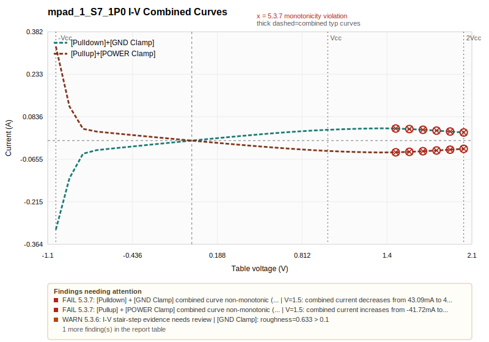
[Jump to I-V curves for mpad_1_S7_1P0](#curve-mpad-1-s7-1p0-iv)

### FAIL: 5.3.7 - mpad_1_S7_1P0

- [Pullup] + [POWER Clamp] combined curve non-monotonic (6 violation(s))
- [Full check details](#check-5-3-7)
- V=1.5: combined current increases from -41.72mA to -41.09mA
- V=1.6: combined current increases from -41.09mA to -39.48mA
- V=1.7: combined current increases from -39.48mA to -37.29mA
- V=1.8: combined current increases from -37.29mA to -34.72mA
- V=1.9: combined current increases from -34.72mA to -31.9mA
- V=2: combined current increases from -31.9mA to -28.9mA


[Jump to I-V curves for mpad_1_S7_1P0](#curve-mpad-1-s7-1p0-iv)

### FAIL: 5.3.7 - mpad_1_S7_1P0_I3C

- [Pulldown] + [GND Clamp] combined curve non-monotonic (6 violation(s))
- [Full check details](#check-5-3-7)
- V=1.5: combined current decreases from 30.43mA to 29.84mA
- V=1.6: combined current decreases from 29.84mA to 28.43mA
- V=1.7: combined current decreases from 28.43mA to 26.55mA
- V=1.8: combined current decreases from 26.55mA to 24.36mA
- V=1.9: combined current decreases from 24.36mA to 22.01mA
- V=2: combined current decreases from 22.01mA to 19.6mA

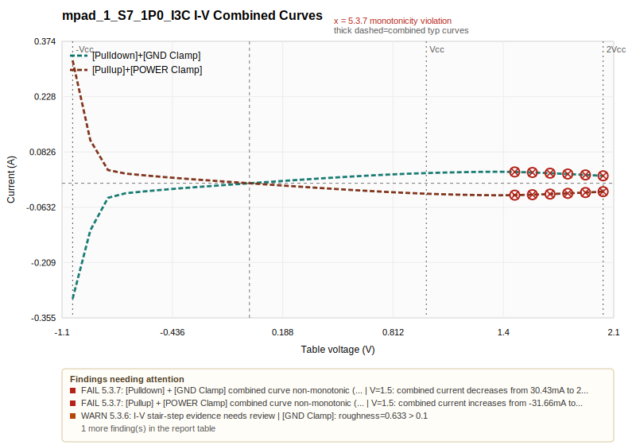
[Jump to I-V curves for mpad_1_S7_1P0_I3C](#curve-mpad-1-s7-1p0-i3c-iv)

### FAIL: 5.3.7 - mpad_1_S7_1P0_I3C

- [Pullup] + [POWER Clamp] combined curve non-monotonic (6 violation(s))
- [Full check details](#check-5-3-7)
- V=1.5: combined current increases from -31.66mA to -31.27mA
- V=1.6: combined current increases from -31.27mA to -30.13mA
- V=1.7: combined current increases from -30.13mA to -28.5mA
- V=1.8: combined current increases from -28.5mA to -26.55mA
- V=1.9: combined current increases from -26.55mA to -24.4mA
- V=2: combined current increases from -24.4mA to -22.1mA


[Jump to I-V curves for mpad_1_S7_1P0_I3C](#curve-mpad-1-s7-1p0-i3c-iv)

### FAIL: 5.3.7 - mpad_1_S7_1P2

- [Pulldown] + [GND Clamp] combined curve non-monotonic (7 violation(s))
- [Full check details](#check-5-3-7)
- V=1.8: combined current decreases from 67.25mA to 66.58mA
- V=1.9: combined current decreases from 66.58mA to 65.04mA
- V=2: combined current decreases from 65.04mA to 62.94mA
- V=2.1: combined current decreases from 62.94mA to 60.41mA
- V=2.2: combined current decreases from 60.41mA to 57.5mA
- V=2.3: combined current decreases from 57.5mA to 54.4mA
- V=2.4: combined current decreases from 54.4mA to 51mA

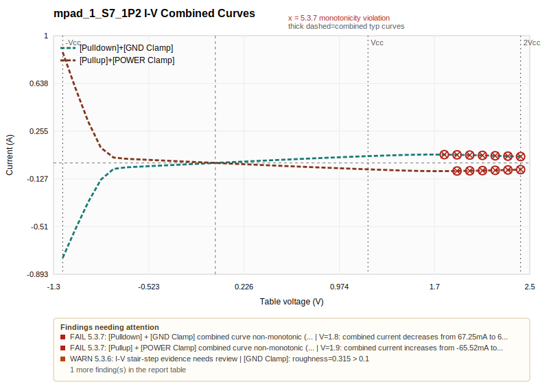
[Jump to I-V curves for mpad_1_S7_1P2](#curve-mpad-1-s7-1p2-iv)

### FAIL: 5.3.7 - mpad_1_S7_1P2

- [Pullup] + [POWER Clamp] combined curve non-monotonic (6 violation(s))
- [Full check details](#check-5-3-7)
- V=1.9: combined current increases from -65.52mA to -64.65mA
- V=2: combined current increases from -64.65mA to -63.18mA
- V=2.1: combined current increases from -63.18mA to -61.3mA
- V=2.2: combined current increases from -61.3mA to -59mA
- V=2.3: combined current increases from -59mA to -56.4mA
- V=2.4: combined current increases from -56.4mA to -53.5mA


[Jump to I-V curves for mpad_1_S7_1P2](#curve-mpad-1-s7-1p2-iv)

### FAIL: 5.3.7 - mpad_1_S7_1P2_I3C

- [Pulldown] + [GND Clamp] combined curve non-monotonic (7 violation(s))
- [Full check details](#check-5-3-7)
- V=1.8: combined current decreases from 47.59mA to 46.97mA
- V=1.9: combined current decreases from 46.97mA to 45.72mA
- V=2: combined current decreases from 45.72mA to 44.06mA
- V=2.1: combined current decreases from 44.06mA to 42.11mA
- V=2.2: combined current decreases from 42.11mA to 40.1mA
- V=2.3: combined current decreases from 40.1mA to 37.9mA
- V=2.4: combined current decreases from 37.9mA to 35.6mA

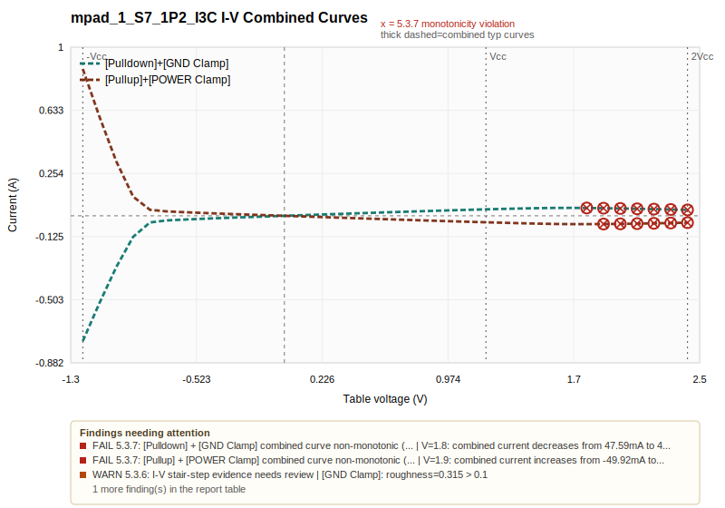
[Jump to I-V curves for mpad_1_S7_1P2_I3C](#curve-mpad-1-s7-1p2-i3c-iv)

### FAIL: 5.3.7 - mpad_1_S7_1P2_I3C

- [Pullup] + [POWER Clamp] combined curve non-monotonic (6 violation(s))
- [Full check details](#check-5-3-7)
- V=1.9: combined current increases from -49.92mA to -49.38mA
- V=2: combined current increases from -49.38mA to -48.32mA
- V=2.1: combined current increases from -48.32mA to -46.9mA
- V=2.2: combined current increases from -46.9mA to -45.1mA
- V=2.3: combined current increases from -45.1mA to -43.1mA
- V=2.4: combined current increases from -43.1mA to -41mA


[Jump to I-V curves for mpad_1_S7_1P2_I3C](#curve-mpad-1-s7-1p2-i3c-iv)

### FAIL: 5.3.7 - mpad_1_S7_1P8

- [Pulldown] + [GND Clamp] combined curve non-monotonic (14 violation(s))
- [Full check details](#check-5-3-7)
- V=2.3: combined current decreases from 71.2mA to 70.89mA
- V=2.4: combined current decreases from 70.89mA to 69.54mA
- V=2.5: combined current decreases from 69.54mA to 67.53mA
- V=2.6: combined current decreases from 67.53mA to 65.13mA
- V=2.7: combined current decreases from 65.13mA to 62.41mA
- V=2.8: combined current decreases from 62.41mA to 59.5mA
- V=2.9: combined current decreases from 59.5mA to 56.5mA
- V=3: combined current decreases from 56.5mA to 53.2mA
- V=3.1: combined current decreases from 53.2mA to 50mA
- V=3.2: combined current decreases from 50mA to 46mA

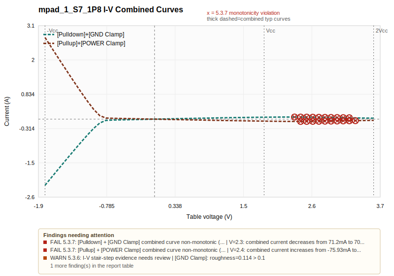
[Jump to I-V curves for mpad_1_S7_1P8](#curve-mpad-1-s7-1p8-iv)

### FAIL: 5.3.7 - mpad_1_S7_1P8

- [Pullup] + [POWER Clamp] combined curve non-monotonic (13 violation(s))
- [Full check details](#check-5-3-7)
- V=2.4: combined current increases from -75.93mA to -75.44mA
- V=2.5: combined current increases from -75.44mA to -74.17mA
- V=2.6: combined current increases from -74.17mA to -72.35mA
- V=2.7: combined current increases from -72.35mA to -70.1mA
- V=2.8: combined current increases from -70.1mA to -67.5mA
- V=2.9: combined current increases from -67.5mA to -64.7mA
- V=3: combined current increases from -64.7mA to -61.7mA
- V=3.1: combined current increases from -61.7mA to -58.4mA
- V=3.2: combined current increases from -58.4mA to -55mA
- V=3.3: combined current increases from -55mA to -51mA


[Jump to I-V curves for mpad_1_S7_1P8](#curve-mpad-1-s7-1p8-iv)

### FAIL: 5.3.7 - mpad_1_S7_1P8_I3C

- [Pulldown] + [GND Clamp] combined curve non-monotonic (13 violation(s))
- [Full check details](#check-5-3-7)
- V=2.4: combined current decreases from 55.84mA to 55.18mA
- V=2.5: combined current decreases from 55.18mA to 54.06mA
- V=2.6: combined current decreases from 54.06mA to 52.64mA
- V=2.7: combined current decreases from 52.64mA to 51.01mA
- V=2.8: combined current decreases from 51.01mA to 49.3mA
- V=2.9: combined current decreases from 49.3mA to 47.6mA
- V=3: combined current decreases from 47.6mA to 45.7mA
- V=3.1: combined current decreases from 45.7mA to 44mA
- V=3.2: combined current decreases from 44mA to 41mA
- V=3.3: combined current decreases from 41mA to 39mA

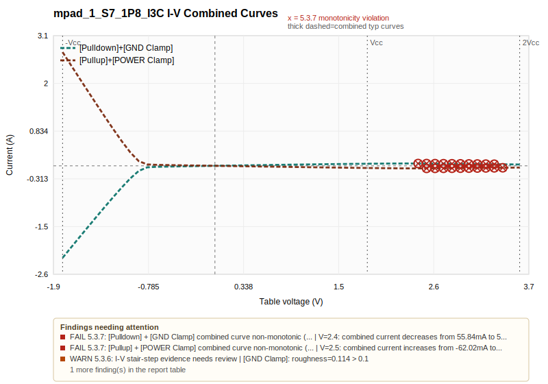
[Jump to I-V curves for mpad_1_S7_1P8_I3C](#curve-mpad-1-s7-1p8-i3c-iv)

### FAIL: 5.3.7 - mpad_1_S7_1P8_I3C

- [Pullup] + [POWER Clamp] combined curve non-monotonic (12 violation(s))
- [Full check details](#check-5-3-7)
- V=2.5: combined current increases from -62.02mA to -61.69mA
- V=2.6: combined current increases from -61.69mA to -60.98mA
- V=2.7: combined current increases from -60.98mA to -60mA
- V=2.8: combined current increases from -60mA to -58.7mA
- V=2.9: combined current increases from -58.7mA to -57.3mA
- V=3: combined current increases from -57.3mA to -55.7mA
- V=3.1: combined current increases from -55.7mA to -53.4mA
- V=3.2: combined current increases from -53.4mA to -51mA
- V=3.3: combined current increases from -51mA to -49mA
- V=3.4: combined current increases from -49mA to -47mA


[Jump to I-V curves for mpad_1_S7_1P8_I3C](#curve-mpad-1-s7-1p8-i3c-iv)

[Back to table of contents](#table-of-contents)

## Passed Items Per Level
<a id="passed-items-per-level"></a>

| Level | Required Items | Checked | Passed | NA | Needs Review | Failed | Error | Manual/External Review |
|---|---:|---:|---:|---:|---:|---:|---:|---:|
| LEVEL 1 | 1 | 1 | 1 | 0 | 0 | 0 | 0 | 0 |
| LEVEL 2 | 35 | 28 | 18 | 5 | 4 | 1 | 0 | 7 |
| LEVEL 3 | 14 | 4 | 1 | 3 | 0 | 0 | 0 | 10 |

## Zout Estimates
<a id="zout-estimates"></a>

Estimated output impedance is derived from Pullup/Pulldown I-V load-line intersections using Rload = 50 ohm. These values are characterization data for the model maker; they are not IQ PASS/FAIL checks.

- Models with estimates: 6 / 6
- Estimated table/corner points: 36

| Model | Type | Pulldown Zout typ/min/max | Pullup Zout typ/min/max | Load-line plot | Notes |
|---|---|---:|---:|---|---|
| mpad_1_S7_1P0 | I/O | 22.2 ohm / 29 ohm / 16.9 ohm | 23.8 ohm / 30.6 ohm / 18.1 ohm | [View plot](#curve-mpad-1-s7-1p0-zout) | Estimated from available corners. |
| mpad_1_S7_1P0_I3C | I/O | 31.5 ohm / 41.5 ohm / 23.8 ohm | 32 ohm / 41.2 ohm / 24.5 ohm | [View plot](#curve-mpad-1-s7-1p0-i3c-zout) | Estimated from available corners. |
| mpad_1_S7_1P2 | I/O | 20.5 ohm / 25.7 ohm / 16 ohm | 21.9 ohm / 27.3 ohm / 17.1 ohm | [View plot](#curve-mpad-1-s7-1p2-zout) | Estimated from available corners. |
| mpad_1_S7_1P2_I3C | I/O | 28.8 ohm / 36.3 ohm / 22.4 ohm | 29.6 ohm / 36.7 ohm / 23.1 ohm | [View plot](#curve-mpad-1-s7-1p2-i3c-zout) | Estimated from available corners. |
| mpad_1_S7_1P8 | I/O | 23.8 ohm / 29.6 ohm / 18.7 ohm | 25 ohm / 31 ohm / 19.5 ohm | [View plot](#curve-mpad-1-s7-1p8-zout) | Estimated from available corners. |
| mpad_1_S7_1P8_I3C | I/O | 32.1 ohm / 39.9 ohm / 25.3 ohm | 32.8 ohm / 40.4 ohm / 25.8 ohm | [View plot](#curve-mpad-1-s7-1p8-i3c-zout) | Estimated from available corners. |

## Quality Check Results
<a id="quality-check-results"></a>

Rows are grouped by IQ level and then by check item. Each check item is summarized by result type so PASS, WARN, FAIL, NA, and manual/external-review status are visible in one place.

Source location note: this parser currently keeps the raw IBIS text but does not retain per-result IBIS source line numbers. The report identifies the affected scope, subject, and evidence; exact line references require parser metadata work.

### LEVEL 1 Check Results
<a id="level-1-check-results"></a>


#### 2.1 - IBIS file passes IBISCHK
<a id="check-2-1"></a>

- Automation class: `auto`
- Spec reference: Quality spec source line 303; section 2

| Type | Outcome | Pass | Warn | Fail | NA | Error | Review | Subjects | Visual Curves | Explanation / Details |
|---|---|---:|---:|---:|---:|---:|---:|---|---|---|
| File/Header | PASS | 3 | 0 | 0 | 0 | 0 | 0 | arbel_i3c_ibis.ibs |  | No existing '\|IQ Score:' tag found inside the .ibs file. This is reported as a writeback note only; it does not fail the quality check because this tool is intended to help assign the score.<br>IBISCHK version not found documented inside the .ibs file. This is reported as a documentation note only; it does not block Level 1.<br>IBISCHK: 0 errors, 7 warning(s): IBISCHK executable: ibischk7_64.exe |

**IBISCHK execution summary**

| Field | Value |
|---|---|
| Executable | ibischk7_64.exe |
| Version | 7.2.1 |
| Return code | 0 |
| Errors | 0 |
| Warnings | 7 |
| Cautions | 0 |

**IBISCHK output excerpt**

```text
IBISCHK7 V7.2.1

Checking C:\Users\simom\Desktop\Projects\IBIS Files\Arbel_I3C_IBIS.ibs for IBIS 4.2 Compatibility...

WARNING (line   55) - IBIS files should not contain tab characters.
NOTE (line  112) - Pulldown Minimum data is non-monotonic
NOTE (line  113) - Pulldown Typical data is non-monotonic
NOTE (line  114) - Pulldown Maximum data is non-monotonic
NOTE (line  148) - Pullup Minimum data is non-monotonic
NOTE (line  149) - Pullup Typical data is non-monotonic
NOTE (line  150) - Pullup Maximum data is non-monotonic
WARNING -
    Model 'mpad_1_S7_1P0': Vmeas timing test load parameter should be specified
NOTE (line 4274) - Pulldown Minimum data is non-monotonic
NOTE (line 4275) - Pulldown Typical data is non-monotonic
NOTE (line 4276) - Pulldown Maximum data is non-monotonic
NOTE (line 4310) - Pullup Minimum data is non-monotonic
NOTE (line 4311) - Pullup Typical data is non-monotonic
NOTE (line 4312) - Pullup Maximum data is non-monotonic
WARNING - Model 'mpad_1_S7_1P0_I3C': Vmeas timing test load parameter should be specified
NOTE (line 8441) - Pulldown Minimum data is non-monotonic
NOTE (line 8442) - Pulldown Typical data is non-monotonic
NOTE (line 8443) - Pulldown Maximum data is non-monotonic
NOTE (line 8483) - Pullup Minimum data is non-monotonic
NOTE (line 8485) - Pullup Typical data is non-monotonic
```

[Back to table of contents](#table-of-contents)

### LEVEL 2 Check Results
<a id="level-2-check-results"></a>


#### 3.1.1 - [Package] must have typ/min/max values
<a id="check-3-1-1"></a>

- Automation class: `auto`
- Spec reference: Quality spec source line 347; section 3.1

| Type | Outcome | Pass | Warn | Fail | NA | Error | Review | Subjects | Visual Curves | Explanation / Details |
|---|---|---:|---:|---:|---:|---:|---:|---|---|---|
| Component | NA | 0 | 0 | 0 | 1 | 0 | 0 | Arbel |  | Bare-die component — stub package values expected, check NA |

[Back to table of contents](#table-of-contents)

#### 3.1.2 - [Package] model values must be reasonable
<a id="check-3-1-2"></a>

- Automation class: `semi_auto`
- Spec reference: Quality spec source line 351; section 3.1

| Type | Outcome | Pass | Warn | Fail | NA | Error | Review | Subjects | Visual Curves | Explanation / Details |
|---|---|---:|---:|---:|---:|---:|---:|---|---|---|
| Component | NA | 0 | 0 | 0 | 1 | 0 | 0 | Arbel |  | Bare-die component — package limits check NA |

[Back to table of contents](#table-of-contents)

#### 3.2.1 - [Pin] section complete
<a id="check-3-2-1"></a>

- Automation class: `semi_auto`
- Spec reference: Quality spec source line 422; section 3.2

| Type | Outcome | Pass | Warn | Fail | NA | Error | Review | Subjects | Visual Curves | Explanation / Details |
|---|---|---:|---:|---:|---:|---:|---:|---|---|---|
| Component | PASS | 1 | 0 | 0 | 0 | 0 | 0 | Arbel |  | [Pin] has 10 complete entry/entries with resolvable model references |

[Back to table of contents](#table-of-contents)

#### 3.3.1 - [Diff Pin] referenced pin models match
<a id="check-3-3-1"></a>

- Automation class: `auto`
- Spec reference: Quality spec source line 459; section 3.3

| Type | Outcome | Pass | Warn | Fail | NA | Error | Review | Subjects | Visual Curves | Explanation / Details |
|---|---|---:|---:|---:|---:|---:|---:|---|---|---|
| Component | NA | 0 | 0 | 0 | 1 | 0 | 0 | Arbel |  | No [Diff Pin] section — check NA |

[Back to table of contents](#table-of-contents)

#### 4.1 - [Model Selector] entries have reasonable descriptions
<a id="check-4-1"></a>

- Automation class: `semi_auto`
- Spec reference: Quality spec source line 493; section 4

| Type | Outcome | Pass | Warn | Fail | NA | Error | Review | Subjects | Visual Curves | Explanation / Details |
|---|---|---:|---:|---:|---:|---:|---:|---|---|---|
| File/Header | WARN | 0 | 1 | 0 | 0 | 0 | 1 | arbel_i3c_ibis.ibs |  | [Model Selector] mpad_1 description evidence needs review: mpad_1_S7_1P0: weak or missing description; mpad_1_S7_1P0_I3C: weak or missing description |

[Back to table of contents](#table-of-contents)

#### 4.2 - Default [Model Selector] entries are consistent
<a id="check-4-2"></a>

- Automation class: `manual`
- Spec reference: Quality spec source line 497; section 4

| Type | Outcome | Pass | Warn | Fail | NA | Error | Review | Subjects | Visual Curves | Explanation / Details |
|---|---|---:|---:|---:|---:|---:|---:|---|---|---|
| Manual/External | MANUAL REVIEW | 0 | 0 | 0 | 0 | 0 | 1 | Applies where relevant |  | Not executed by the automated tool; this item needs model-maker or reviewer evidence. |

[Back to table of contents](#table-of-contents)

#### 5.1.1 - [Model] parameters have correct typ/min/max order
<a id="check-5-1-1"></a>

- Automation class: `semi_auto`
- Spec reference: Quality spec source line 511; section 5.1

| Type | Outcome | Pass | Warn | Fail | NA | Error | Review | Subjects | Visual Curves | Explanation / Details |
|---|---|---:|---:|---:|---:|---:|---:|---|---|---|
| Model | PASS | 6 | 0 | 0 | 0 | 0 | 0 | mpad_1_S7_1P0<br>mpad_1_S7_1P0_I3C<br>mpad_1_S7_1P2<br>mpad_1_S7_1P2_I3C<br>mpad_1_S7_1P8<br>mpad_1_S7_1P8_I3C |  | 6x 3 model parameter set(s) have typ/min/max order evidence: C_comp; Voltage Range |

[Back to table of contents](#table-of-contents)

#### 5.1.2 - [Model] C_comp is reasonable
<a id="check-5-1-2"></a>

- Automation class: `semi_auto`
- Spec reference: Quality spec source line 517; section 5.1

| Type | Outcome | Pass | Warn | Fail | NA | Error | Review | Subjects | Visual Curves | Explanation / Details |
|---|---|---:|---:|---:|---:|---:|---:|---|---|---|
| Model | PASS | 6 | 0 | 0 | 0 | 0 | 0 | mpad_1_S7_1P0<br>mpad_1_S7_1P0_I3C<br>mpad_1_S7_1P2<br>mpad_1_S7_1P2_I3C<br>mpad_1_S7_1P8<br>mpad_1_S7_1P8_I3C |  | 6x C_comp evidence is positive and within review threshold: C_comp |

[Back to table of contents](#table-of-contents)

#### 5.1.3 - [Temperature Range] is reasonable
<a id="check-5-1-3"></a>

- Automation class: `manual`
- Spec reference: Quality spec source line 547; section 5.1

| Type | Outcome | Pass | Warn | Fail | NA | Error | Review | Subjects | Visual Curves | Explanation / Details |
|---|---|---:|---:|---:|---:|---:|---:|---|---|---|
| Manual/External | MANUAL REVIEW | 0 | 0 | 0 | 0 | 0 | 1 | Applies where relevant |  | Not executed by the automated tool; this item needs model-maker or reviewer evidence. |

[Back to table of contents](#table-of-contents)

#### 5.1.4 - [Voltage Range] or [* Reference] is reasonable
<a id="check-5-1-4"></a>

- Automation class: `semi_auto`
- Spec reference: Quality spec source line 571; section 5.1

| Type | Outcome | Pass | Warn | Fail | NA | Error | Review | Subjects | Visual Curves | Explanation / Details |
|---|---|---:|---:|---:|---:|---:|---:|---|---|---|
| Model | PASS | 6 | 0 | 0 | 0 | 0 | 0 | mpad_1_S7_1P0<br>mpad_1_S7_1P0_I3C<br>mpad_1_S7_1P2<br>mpad_1_S7_1P2_I3C<br>mpad_1_S7_1P8<br>mpad_1_S7_1P8_I3C |  | 2x Voltage/reference evidence parsed, defaults resolved, and basic consistency looks reasonable: Voltage Range: typ=1V, min=0.95V, max=1.05V (explicit); Pullup Reference: typ=1V, min=0.95V, max=1.05V (default from Voltage Range)<br>2x Voltage/reference evidence parsed, defaults resolved, and basic consistency looks reasonable: Voltage Range: typ=1.2V, min=1.14V, max=1.26V (explicit); Pullup Reference: typ=1.2V, min=1.14V, max=1.26V (default from Voltage Range)<br>2x Voltage/reference evidence parsed, defaults resolved, and basic consistency looks reasonable: Voltage Range: typ=1.8V, min=1.71V, max=1.89V (explicit); Pullup Reference: typ=1.8V, min=1.71V, max=1.89V (default from Voltage Range) |

[Back to table of contents](#table-of-contents)

#### 5.2.5 - [Model Spec] S_Overshoot subparameters complete and match data sheet
<a id="check-5-2-5"></a>

- Automation class: `manual`
- Spec reference: Quality spec source line 625; section 5.2

| Type | Outcome | Pass | Warn | Fail | NA | Error | Review | Subjects | Visual Curves | Explanation / Details |
|---|---|---:|---:|---:|---:|---:|---:|---|---|---|
| Manual/External | MANUAL REVIEW | 0 | 0 | 0 | 0 | 0 | 1 | Applies where relevant |  | Not executed by the automated tool; this item needs model-maker or reviewer evidence. |

[Back to table of contents](#table-of-contents)

#### 5.2.6 - [Model Spec] S_Overshoot subparameters track typ/min/max
<a id="check-5-2-6"></a>

- Automation class: `semi_auto`
- Spec reference: Quality spec source line 629; section 5.2

| Type | Outcome | Pass | Warn | Fail | NA | Error | Review | Subjects | Visual Curves | Explanation / Details |
|---|---|---:|---:|---:|---:|---:|---:|---|---|---|
| Model | NA | 0 | 0 | 0 | 6 | 0 | 0 | mpad_1_S7_1P0<br>mpad_1_S7_1P0_I3C<br>mpad_1_S7_1P2<br>mpad_1_S7_1P2_I3C<br>mpad_1_S7_1P8<br>mpad_1_S7_1P8_I3C |  | 6x No [Model Spec] S_Overshoot data parsed |

[Back to table of contents](#table-of-contents)

#### 5.2.7 - [Model Spec] D_Overshoot_* subparameters complete and match data sheet
<a id="check-5-2-7"></a>

- Automation class: `manual`
- Spec reference: Quality spec source line 633; section 5.2

| Type | Outcome | Pass | Warn | Fail | NA | Error | Review | Subjects | Visual Curves | Explanation / Details |
|---|---|---:|---:|---:|---:|---:|---:|---|---|---|
| Manual/External | MANUAL REVIEW | 0 | 0 | 0 | 0 | 0 | 1 | Applies where relevant |  | Not executed by the automated tool; this item needs model-maker or reviewer evidence. |

[Back to table of contents](#table-of-contents)

#### 5.2.8 - [Model Spec] D_Overshoot_* subparameters track typ/min/max
<a id="check-5-2-8"></a>

- Automation class: `semi_auto`
- Spec reference: Quality spec source line 643; section 5.2

| Type | Outcome | Pass | Warn | Fail | NA | Error | Review | Subjects | Visual Curves | Explanation / Details |
|---|---|---:|---:|---:|---:|---:|---:|---|---|---|
| Model | NA | 0 | 0 | 0 | 6 | 0 | 0 | mpad_1_S7_1P0<br>mpad_1_S7_1P0_I3C<br>mpad_1_S7_1P2<br>mpad_1_S7_1P2_I3C<br>mpad_1_S7_1P8<br>mpad_1_S7_1P8_I3C |  | 6x No [Model Spec] D_Overshoot data parsed |

[Back to table of contents](#table-of-contents)

#### 5.3.1 - I-V tables have correct typ/min/max order
<a id="check-5-3-1"></a>

- Automation class: `auto`
- Spec reference: Quality spec source line 705; section 5.3

| Type | Outcome | Pass | Warn | Fail | NA | Error | Review | Subjects | Visual Curves | Explanation / Details |
|---|---|---:|---:|---:|---:|---:|---:|---|---|---|
| Model | PASS | 24 | 0 | 0 | 0 | 0 | 0 | mpad_1_S7_1P0<br>mpad_1_S7_1P0_I3C<br>mpad_1_S7_1P2<br>mpad_1_S7_1P2_I3C<br>mpad_1_S7_1P8<br>mpad_1_S7_1P8_I3C |  | 6x [Pulldown] rows are voltage/typ/min/max with expected active-region corner ordering<br>6x [Pullup] rows are voltage/typ/min/max with expected active-region corner ordering<br>6x [GND Clamp] rows are voltage/typ/min/max<br>1 more evidence message(s) |

[Back to table of contents](#table-of-contents)

#### 5.3.2 - [Pullup] voltage sweep range is correct
<a id="check-5-3-2"></a>

- Automation class: `auto`
- Spec reference: Quality spec source line 715; section 5.3

| Type | Outcome | Pass | Warn | Fail | NA | Error | Review | Subjects | Visual Curves | Explanation / Details |
|---|---|---:|---:|---:|---:|---:|---:|---|---|---|
| Model | PASS | 6 | 0 | 0 | 0 | 0 | 0 | mpad_1_S7_1P0<br>mpad_1_S7_1P0_I3C<br>mpad_1_S7_1P2<br>mpad_1_S7_1P2_I3C<br>mpad_1_S7_1P8<br>mpad_1_S7_1P8_I3C |  | 2x [Pullup] voltage sweep OK (-1V to 2V)<br>2x [Pullup] voltage sweep OK (-1.2V to 2.4V)<br>2x [Pullup] voltage sweep OK (-1.8V to 3.6V) |

[Back to table of contents](#table-of-contents)

#### 5.3.3 - [Pulldown] voltage sweep range is correct
<a id="check-5-3-3"></a>

- Automation class: `auto`
- Spec reference: Quality spec source line 719; section 5.3

| Type | Outcome | Pass | Warn | Fail | NA | Error | Review | Subjects | Visual Curves | Explanation / Details |
|---|---|---:|---:|---:|---:|---:|---:|---|---|---|
| Model | PASS | 6 | 0 | 0 | 0 | 0 | 0 | mpad_1_S7_1P0<br>mpad_1_S7_1P0_I3C<br>mpad_1_S7_1P2<br>mpad_1_S7_1P2_I3C<br>mpad_1_S7_1P8<br>mpad_1_S7_1P8_I3C |  | 2x [Pulldown] voltage sweep OK (-1V to 2V)<br>2x [Pulldown] voltage sweep OK (-1.2V to 2.4V)<br>2x [Pulldown] voltage sweep OK (-1.8V to 3.6V) |

[Back to table of contents](#table-of-contents)

#### 5.3.4 - [POWER Clamp] voltage sweep range is correct
<a id="check-5-3-4"></a>

- Automation class: `auto`
- Spec reference: Quality spec source line 723; section 5.3

| Type | Outcome | Pass | Warn | Fail | NA | Error | Review | Subjects | Visual Curves | Explanation / Details |
|---|---|---:|---:|---:|---:|---:|---:|---|---|---|
| Model | PASS | 6 | 0 | 0 | 0 | 0 | 0 | mpad_1_S7_1P0<br>mpad_1_S7_1P0_I3C<br>mpad_1_S7_1P2<br>mpad_1_S7_1P2_I3C<br>mpad_1_S7_1P8<br>mpad_1_S7_1P8_I3C |  | 2x [POWER Clamp] voltage sweep OK (-1V to 0V)<br>2x [POWER Clamp] voltage sweep OK (-1.2V to 0V)<br>2x [POWER Clamp] voltage sweep OK (-1.8V to 0V) |

[Back to table of contents](#table-of-contents)

#### 5.3.5 - [GND Clamp] voltage sweep range is correct
<a id="check-5-3-5"></a>

- Automation class: `auto`
- Spec reference: Quality spec source line 731; section 5.3

| Type | Outcome | Pass | Warn | Fail | NA | Error | Review | Subjects | Visual Curves | Explanation / Details |
|---|---|---:|---:|---:|---:|---:|---:|---|---|---|
| Model | PASS | 6 | 0 | 0 | 0 | 0 | 0 | mpad_1_S7_1P0<br>mpad_1_S7_1P0_I3C<br>mpad_1_S7_1P2<br>mpad_1_S7_1P2_I3C<br>mpad_1_S7_1P8<br>mpad_1_S7_1P8_I3C |  | 2x [GND Clamp] voltage sweep OK (-1V to 1V)<br>2x [GND Clamp] voltage sweep OK (-1.2V to 1.2V)<br>2x [GND Clamp] voltage sweep OK (-1.8V to 1.8V) |

[Back to table of contents](#table-of-contents)

#### 5.3.6 - I-V tables do not exhibit stair-stepping
<a id="check-5-3-6"></a>

- Automation class: `semi_auto`
- Spec reference: Quality spec source line 735; section 5.3

| Type | Outcome | Pass | Warn | Fail | NA | Error | Review | Subjects | Visual Curves | Explanation / Details |
|---|---|---:|---:|---:|---:|---:|---:|---|---|---|
| Model | WARN | 0 | 6 | 0 | 0 | 0 | 6 | mpad_1_S7_1P0<br>mpad_1_S7_1P0_I3C<br>mpad_1_S7_1P2<br>mpad_1_S7_1P2_I3C<br>mpad_1_S7_1P8<br>mpad_1_S7_1P8_I3C | [mpad_1_S7_1P0 I-V curves](#curve-mpad-1-s7-1p0-iv)<br>[mpad_1_S7_1P0_I3C I-V curves](#curve-mpad-1-s7-1p0-i3c-iv)<br>[mpad_1_S7_1P2 I-V curves](#curve-mpad-1-s7-1p2-iv)<br>[mpad_1_S7_1P2_I3C I-V curves](#curve-mpad-1-s7-1p2-i3c-iv)<br>2 more | 2x I-V stair-step evidence needs review: [GND Clamp]: roughness=0.633 > 0.1; [POWER Clamp]: roughness=0.689 > 0.1<br>2x I-V stair-step evidence needs review: [GND Clamp]: roughness=0.315 > 0.1; [POWER Clamp]: roughness=0.335 > 0.1<br>2x I-V stair-step evidence needs review: [GND Clamp]: roughness=0.114 > 0.1; [POWER Clamp]: roughness=0.116 > 0.1 |

[Back to table of contents](#table-of-contents)

#### 5.3.7 - Combined I-V tables are monotonic
<a id="check-5-3-7"></a>

- Automation class: `auto`
- Spec reference: Quality spec source line 741; section 5.3

| Type | Outcome | Pass | Warn | Fail | NA | Error | Review | Subjects | Visual Curves | Explanation / Details |
|---|---|---:|---:|---:|---:|---:|---:|---|---|---|
| Model | FAIL | 0 | 0 | 12 | 0 | 0 | 0 | mpad_1_S7_1P0<br>mpad_1_S7_1P0_I3C<br>mpad_1_S7_1P2<br>mpad_1_S7_1P2_I3C<br>mpad_1_S7_1P8<br>mpad_1_S7_1P8_I3C | [mpad_1_S7_1P0 I-V curves](#curve-mpad-1-s7-1p0-iv)<br>[mpad_1_S7_1P0_I3C I-V curves](#curve-mpad-1-s7-1p0-i3c-iv)<br>[mpad_1_S7_1P2 I-V curves](#curve-mpad-1-s7-1p2-iv)<br>[mpad_1_S7_1P2_I3C I-V curves](#curve-mpad-1-s7-1p2-i3c-iv)<br>2 more | [Pulldown] + [GND Clamp] combined curve non-monotonic (6 violation(s)): V=1.5: combined current decreases from 43.09mA to 42.35mA; V=1.6: combined current decreases from 42.35mA to 40.5mA<br>[Pullup] + [POWER Clamp] combined curve non-monotonic (6 violation(s)): V=1.5: combined current increases from -41.72mA to -41.09mA; V=1.6: combined current increases from -41.09mA to -39.48mA<br>[Pulldown] + [GND Clamp] combined curve non-monotonic (6 violation(s)): V=1.5: combined current decreases from 30.43mA to 29.84mA; V=1.6: combined current decreases from 29.84mA to 28.43mA<br>9 more evidence message(s) |

[Back to table of contents](#table-of-contents)

#### 5.3.8 - [Pulldown] I-V tables pass through zero/zero
<a id="check-5-3-8"></a>

- Automation class: `auto`
- Spec reference: Quality spec source line 749; section 5.3

| Type | Outcome | Pass | Warn | Fail | NA | Error | Review | Subjects | Visual Curves | Explanation / Details |
|---|---|---:|---:|---:|---:|---:|---:|---|---|---|
| Model | PASS | 6 | 0 | 0 | 0 | 0 | 0 | mpad_1_S7_1P0<br>mpad_1_S7_1P0_I3C<br>mpad_1_S7_1P2<br>mpad_1_S7_1P2_I3C<br>mpad_1_S7_1P8<br>mpad_1_S7_1P8_I3C |  | 6x [Pulldown] passes through near 0 at 0V (within +/-1uA) |

[Back to table of contents](#table-of-contents)

#### 5.3.9 - [Pullup] I-V tables pass through zero/zero
<a id="check-5-3-9"></a>

- Automation class: `auto`
- Spec reference: Quality spec source line 753; section 5.3

| Type | Outcome | Pass | Warn | Fail | NA | Error | Review | Subjects | Visual Curves | Explanation / Details |
|---|---|---:|---:|---:|---:|---:|---:|---|---|---|
| Model | PASS | 6 | 0 | 0 | 0 | 0 | 0 | mpad_1_S7_1P0<br>mpad_1_S7_1P0_I3C<br>mpad_1_S7_1P2<br>mpad_1_S7_1P2_I3C<br>mpad_1_S7_1P8<br>mpad_1_S7_1P8_I3C |  | 6x [Pullup] passes through near 0 at 0V (within +/-1uA) |

[Back to table of contents](#table-of-contents)

#### 5.3.10 - No leakage current in clamp I-V tables
<a id="check-5-3-10"></a>

- Automation class: `semi_auto`
- Spec reference: Quality spec source line 757; section 5.3

| Type | Outcome | Pass | Warn | Fail | NA | Error | Review | Subjects | Visual Curves | Explanation / Details |
|---|---|---:|---:|---:|---:|---:|---:|---|---|---|
| Model | PASS | 6 | 0 | 0 | 0 | 0 | 0 | mpad_1_S7_1P0<br>mpad_1_S7_1P0_I3C<br>mpad_1_S7_1P2<br>mpad_1_S7_1P2_I3C<br>mpad_1_S7_1P8<br>mpad_1_S7_1P8_I3C |  | 6x Clamp leakage evidence is within threshold at 0V |

[Back to table of contents](#table-of-contents)

#### 5.3.11 - I-V behavior not double-counted
<a id="check-5-3-11"></a>

- Automation class: `manual`
- Spec reference: Quality spec source line 767; section 5.3

| Type | Outcome | Pass | Warn | Fail | NA | Error | Review | Subjects | Visual Curves | Explanation / Details |
|---|---|---:|---:|---:|---:|---:|---:|---|---|---|
| Manual/External | MANUAL REVIEW | 0 | 0 | 0 | 0 | 0 | 1 | Applies where relevant |  | Not executed by the automated tool; this item needs model-maker or reviewer evidence. |

[Back to table of contents](#table-of-contents)

#### 5.3.12 - On-die termination modeling documented
<a id="check-5-3-12"></a>

- Automation class: `manual`
- Spec reference: Quality spec source line 773; section 5.3

| Type | Outcome | Pass | Warn | Fail | NA | Error | Review | Subjects | Visual Curves | Explanation / Details |
|---|---|---:|---:|---:|---:|---:|---:|---|---|---|
| Manual/External | MANUAL REVIEW | 0 | 0 | 0 | 0 | 0 | 1 | Applies where relevant |  | Not executed by the automated tool; this item needs model-maker or reviewer evidence. |

[Back to table of contents](#table-of-contents)

#### 5.3.13 - ECL models I-V tables swept from -Vcc to +2 * Vcc.
<a id="check-5-3-13"></a>

- Automation class: `auto`
- Spec reference: Quality spec source line 777; section 5.3

| Type | Outcome | Pass | Warn | Fail | NA | Error | Review | Subjects | Visual Curves | Explanation / Details |
|---|---|---:|---:|---:|---:|---:|---:|---|---|---|
| Manual/External | MANUAL REVIEW | 0 | 0 | 0 | 0 | 0 | 1 | Applies where relevant |  | Not executed by the automated tool; this item needs model-maker or reviewer evidence. |

[Back to table of contents](#table-of-contents)

#### 5.3.14 - Point distributions in I-V tables should be sufficient
<a id="check-5-3-14"></a>

- Automation class: `semi_auto`
- Spec reference: Quality spec source line 781; section 5.3

| Type | Outcome | Pass | Warn | Fail | NA | Error | Review | Subjects | Visual Curves | Explanation / Details |
|---|---|---:|---:|---:|---:|---:|---:|---|---|---|
| Model | WARN | 0 | 6 | 0 | 0 | 0 | 6 | mpad_1_S7_1P0<br>mpad_1_S7_1P0_I3C<br>mpad_1_S7_1P2<br>mpad_1_S7_1P2_I3C<br>mpad_1_S7_1P8<br>mpad_1_S7_1P8_I3C | [mpad_1_S7_1P0 I-V curves](#curve-mpad-1-s7-1p0-iv)<br>[mpad_1_S7_1P0_I3C I-V curves](#curve-mpad-1-s7-1p0-i3c-iv)<br>[mpad_1_S7_1P2 I-V curves](#curve-mpad-1-s7-1p2-iv)<br>[mpad_1_S7_1P2_I3C I-V curves](#curve-mpad-1-s7-1p2-i3c-iv)<br>2 more | 2x I-V point distribution evidence needs review: [POWER Clamp]: 11 point(s) < 20<br>2x I-V point distribution evidence needs review: [POWER Clamp]: 13 point(s) < 20<br>2x I-V point distribution evidence needs review: [POWER Clamp]: 19 point(s) < 20 |

[Back to table of contents](#table-of-contents)

#### 5.4.1 - Output and I/O buffers have sufficient V-T tables
<a id="check-5-4-1"></a>

- Automation class: `semi_auto`
- Spec reference: Quality spec source line 787; section 5.4

| Type | Outcome | Pass | Warn | Fail | NA | Error | Review | Subjects | Visual Curves | Explanation / Details |
|---|---|---:|---:|---:|---:|---:|---:|---|---|---|
| Model | PASS | 6 | 0 | 0 | 0 | 0 | 0 | mpad_1_S7_1P0<br>mpad_1_S7_1P0_I3C<br>mpad_1_S7_1P2<br>mpad_1_S7_1P2_I3C<br>mpad_1_S7_1P8<br>mpad_1_S7_1P8_I3C |  | 6x V-T waveform evidence includes 2 rising and 2 falling table(s) |

[Back to table of contents](#table-of-contents)

#### 5.4.2 - V-T tables have reasonable point distribution
<a id="check-5-4-2"></a>

- Automation class: `semi_auto`
- Spec reference: Quality spec source line 807; section 5.4

| Type | Outcome | Pass | Warn | Fail | NA | Error | Review | Subjects | Visual Curves | Explanation / Details |
|---|---|---:|---:|---:|---:|---:|---:|---|---|---|
| Model | PASS | 6 | 0 | 0 | 0 | 0 | 0 | mpad_1_S7_1P0<br>mpad_1_S7_1P0_I3C<br>mpad_1_S7_1P2<br>mpad_1_S7_1P2_I3C<br>mpad_1_S7_1P8<br>mpad_1_S7_1P8_I3C |  | 6x V-T point counts meet evidence threshold |

[Back to table of contents](#table-of-contents)

#### 5.4.4 - V-T table endpoints match fixture voltages
<a id="check-5-4-4"></a>

- Automation class: `semi_auto`
- Spec reference: Quality spec source line 817; section 5.4

| Type | Outcome | Pass | Warn | Fail | NA | Error | Review | Subjects | Visual Curves | Explanation / Details |
|---|---|---:|---:|---:|---:|---:|---:|---|---|---|
| Model | PASS | 6 | 0 | 0 | 0 | 0 | 0 | mpad_1_S7_1P0<br>mpad_1_S7_1P0_I3C<br>mpad_1_S7_1P2<br>mpad_1_S7_1P2_I3C<br>mpad_1_S7_1P8<br>mpad_1_S7_1P8_I3C |  | 6x V-T endpoint fixture evidence is within threshold |

[Back to table of contents](#table-of-contents)

#### 5.5.1 - [Ramp] R_load present if value other than 50 ohms
<a id="check-5-5-1"></a>

- Automation class: `auto`
- Spec reference: Quality spec source line 833; section 5.5

| Type | Outcome | Pass | Warn | Fail | NA | Error | Review | Subjects | Visual Curves | Explanation / Details |
|---|---|---:|---:|---:|---:|---:|---:|---|---|---|
| Model | PASS | 6 | 0 | 0 | 0 | 0 | 0 | mpad_1_S7_1P0<br>mpad_1_S7_1P0_I3C<br>mpad_1_S7_1P2<br>mpad_1_S7_1P2_I3C<br>mpad_1_S7_1P8<br>mpad_1_S7_1P8_I3C |  | 6x R_load = 1000.0Ω documented |

[Back to table of contents](#table-of-contents)

#### 5.5.2 - [Ramp] typ/min/max order is correct
<a id="check-5-5-2"></a>

- Automation class: `semi_auto`
- Spec reference: Quality spec source line 837; section 5.5

| Type | Outcome | Pass | Warn | Fail | NA | Error | Review | Subjects | Visual Curves | Explanation / Details |
|---|---|---:|---:|---:|---:|---:|---:|---|---|---|
| Model | PASS | 6 | 0 | 0 | 0 | 0 | 0 | mpad_1_S7_1P0<br>mpad_1_S7_1P0_I3C<br>mpad_1_S7_1P2<br>mpad_1_S7_1P2_I3C<br>mpad_1_S7_1P8<br>mpad_1_S7_1P8_I3C |  | 6x Ramp typ/min/max slew order evidence is ordered: dV/dt_r; dV/dt_f |

[Back to table of contents](#table-of-contents)

#### 5.5.3 - [Ramp] dV value is consistent with I-V table calculations
<a id="check-5-5-3"></a>

- Automation class: `auto`
- Spec reference: Quality spec source line 841; section 5.5

| Type | Outcome | Pass | Warn | Fail | NA | Error | Review | Subjects | Visual Curves | Explanation / Details |
|---|---|---:|---:|---:|---:|---:|---:|---|---|---|
| Model | PASS | 6 | 0 | 0 | 0 | 0 | 0 | mpad_1_S7_1P0<br>mpad_1_S7_1P0_I3C<br>mpad_1_S7_1P2<br>mpad_1_S7_1P2_I3C<br>mpad_1_S7_1P8<br>mpad_1_S7_1P8_I3C |  | [Ramp] rising/falling dV values are consistent with per-corner I-V load-line estimates: Rise dV/typ: ramp=0.5864V, expected≈0.5864V from Vhigh=0.9773V, Vlow=-6.457e-08V, error=0.0% (push-pull fixture=0V); Rise dV/min: ramp=0.554V, expected≈0.583V from Vhigh=0.9716V, Vlow=-3.642e-07V, error=5.0% (push-pull fixture=0V)<br>[Ramp] rising/falling dV values are consistent with per-corner I-V load-line estimates: Rise dV/typ: ramp=0.5819V, expected≈0.5818V from Vhigh=0.9697V, Vlow=-6.722e-08V, error=0.0% (push-pull fixture=0V); Rise dV/min: ramp=0.5486V, expected≈0.5774V from Vhigh=0.9623V, Vlow=-3.791e-07V, error=5.0% (push-pull fixture=0V)<br>[Ramp] rising/falling dV values are consistent with per-corner I-V load-line estimates: Rise dV/typ: ramp=0.705V, expected≈0.7047V from Vhigh=1.175V, Vlow=-7.144e-08V, error=0.0% (push-pull fixture=0V); Rise dV/min: ramp=0.666V, expected≈0.7013V from Vhigh=1.169V, Vlow=-3.865e-07V, error=5.0% (push-pull fixture=0V)<br>3 more evidence message(s) |

[Back to table of contents](#table-of-contents)

#### 5.5.4 - [Ramp] dt is consistent with 20%-80% crossing time
<a id="check-5-5-4"></a>

- Automation class: `semi_auto`
- Spec reference: Quality spec source line 845; section 5.5

| Type | Outcome | Pass | Warn | Fail | NA | Error | Review | Subjects | Visual Curves | Explanation / Details |
|---|---|---:|---:|---:|---:|---:|---:|---|---|---|
| Model | WARN | 0 | 6 | 0 | 0 | 0 | 6 | mpad_1_S7_1P0<br>mpad_1_S7_1P0_I3C<br>mpad_1_S7_1P2<br>mpad_1_S7_1P2_I3C<br>mpad_1_S7_1P8<br>mpad_1_S7_1P8_I3C | [mpad_1_S7_1P0 V-T curves](#curve-mpad-1-s7-1p0-waveform)<br>[mpad_1_S7_1P0_I3C V-T curves](#curve-mpad-1-s7-1p0-i3c-waveform)<br>[mpad_1_S7_1P2 V-T curves](#curve-mpad-1-s7-1p2-waveform)<br>[mpad_1_S7_1P2_I3C V-T curves](#curve-mpad-1-s7-1p2-i3c-waveform)<br>2 more | Ramp dt versus V-T 20-80% evidence needs review: avg Ramp dt=5.414e-08s, avg V-T 20-80% span=3.520e-08s, diff=53.8%<br>Ramp dt versus V-T 20-80% evidence needs review: avg Ramp dt=5.829e-09s, avg V-T 20-80% span=7.763e-09s, diff=24.9%<br>Ramp dt versus V-T 20-80% evidence needs review: avg Ramp dt=5.421e-08s, avg V-T 20-80% span=3.525e-08s, diff=53.8%<br>3 more evidence message(s) |

[Back to table of contents](#table-of-contents)

### LEVEL 3 Check Results
<a id="level-3-check-results"></a>


#### 3.2.2 - [Pin] RLC values are present and reasonable
<a id="check-3-2-2"></a>

- Automation class: `auto`
- Spec reference: Quality spec source line 442; section 3.2

| Type | Outcome | Pass | Warn | Fail | NA | Error | Review | Subjects | Visual Curves | Explanation / Details |
|---|---|---:|---:|---:|---:|---:|---:|---|---|---|
| Component | NA | 0 | 0 | 0 | 1 | 0 | 0 | Arbel |  | Bare-die component - per-pin package RLC completeness is not required |

[Back to table of contents](#table-of-contents)

#### 3.3.2 - [Diff Pin] Vdiff and Tdelay_* complete and reasonable
<a id="check-3-3-2"></a>

- Automation class: `auto`
- Spec reference: Quality spec source line 463; section 3.3

| Type | Outcome | Pass | Warn | Fail | NA | Error | Review | Subjects | Visual Curves | Explanation / Details |
|---|---|---:|---:|---:|---:|---:|---:|---|---|---|
| Component | NA | 0 | 0 | 0 | 1 | 0 | 0 | Arbel |  | No [Diff Pin] section — check NA |

[Back to table of contents](#table-of-contents)

#### 5.2.1 - [Model] Vinl and Vinh reasonable
<a id="check-5-2-1"></a>

- Automation class: `manual`
- Spec reference: Quality spec source line 599; section 5.2

| Type | Outcome | Pass | Warn | Fail | NA | Error | Review | Subjects | Visual Curves | Explanation / Details |
|---|---|---:|---:|---:|---:|---:|---:|---|---|---|
| Manual/External | MANUAL REVIEW | 0 | 0 | 0 | 0 | 0 | 1 | Applies where relevant |  | Not executed by the automated tool; this item needs model-maker or reviewer evidence. |

[Back to table of contents](#table-of-contents)

#### 5.2.2 - [Model Spec] Vinl and Vinh reasonable
<a id="check-5-2-2"></a>

- Automation class: `manual`
- Spec reference: Quality spec source line 605; section 5.2

| Type | Outcome | Pass | Warn | Fail | NA | Error | Review | Subjects | Visual Curves | Explanation / Details |
|---|---|---:|---:|---:|---:|---:|---:|---|---|---|
| Manual/External | MANUAL REVIEW | 0 | 0 | 0 | 0 | 0 | 1 | Applies where relevant |  | Not executed by the automated tool; this item needs model-maker or reviewer evidence. |

[Back to table of contents](#table-of-contents)

#### 5.2.3 - [Model Spec] Vinl+/- and Vinh+/- complete and reasonable
<a id="check-5-2-3"></a>

- Automation class: `manual`
- Spec reference: Quality spec source line 615; section 5.2

| Type | Outcome | Pass | Warn | Fail | NA | Error | Review | Subjects | Visual Curves | Explanation / Details |
|---|---|---:|---:|---:|---:|---:|---:|---|---|---|
| Manual/External | MANUAL REVIEW | 0 | 0 | 0 | 0 | 0 | 1 | Applies where relevant |  | Not executed by the automated tool; this item needs model-maker or reviewer evidence. |

[Back to table of contents](#table-of-contents)

#### 5.2.9 - [Receiver Thresholds] Vth present and matches data sheet, if needed
<a id="check-5-2-9"></a>

- Automation class: `manual`
- Spec reference: Quality spec source line 647; section 5.2

| Type | Outcome | Pass | Warn | Fail | NA | Error | Review | Subjects | Visual Curves | Explanation / Details |
|---|---|---:|---:|---:|---:|---:|---:|---|---|---|
| Manual/External | MANUAL REVIEW | 0 | 0 | 0 | 0 | 0 | 1 | Applies where relevant |  | Not executed by the automated tool; this item needs model-maker or reviewer evidence. |

[Back to table of contents](#table-of-contents)

#### 5.2.10 - [Receiver Thresholds] Vth_min and Vth_max present and match data sheet, if needed
<a id="check-5-2-10"></a>

- Automation class: `manual`
- Spec reference: Quality spec source line 653; section 5.2

| Type | Outcome | Pass | Warn | Fail | NA | Error | Review | Subjects | Visual Curves | Explanation / Details |
|---|---|---:|---:|---:|---:|---:|---:|---|---|---|
| Manual/External | MANUAL REVIEW | 0 | 0 | 0 | 0 | 0 | 1 | Applies where relevant |  | Not executed by the automated tool; this item needs model-maker or reviewer evidence. |

[Back to table of contents](#table-of-contents)

#### 5.2.11 - [Receiver Thresholds] Vinh_ac, Vinl_ac present and match data sheet, if needed
<a id="check-5-2-11"></a>

- Automation class: `manual`
- Spec reference: Quality spec source line 663; section 5.2

| Type | Outcome | Pass | Warn | Fail | NA | Error | Review | Subjects | Visual Curves | Explanation / Details |
|---|---|---:|---:|---:|---:|---:|---:|---|---|---|
| Manual/External | MANUAL REVIEW | 0 | 0 | 0 | 0 | 0 | 1 | Applies where relevant |  | Not executed by the automated tool; this item needs model-maker or reviewer evidence. |

[Back to table of contents](#table-of-contents)

#### 5.2.12 - [Receiver Thresholds] Vinh_dc, Vinl_dc present and match data sheet, if needed
<a id="check-5-2-12"></a>

- Automation class: `manual`
- Spec reference: Quality spec source line 673; section 5.2

| Type | Outcome | Pass | Warn | Fail | NA | Error | Review | Subjects | Visual Curves | Explanation / Details |
|---|---|---:|---:|---:|---:|---:|---:|---|---|---|
| Manual/External | MANUAL REVIEW | 0 | 0 | 0 | 0 | 0 | 1 | Applies where relevant |  | Not executed by the automated tool; this item needs model-maker or reviewer evidence. |

[Back to table of contents](#table-of-contents)

#### 5.2.13 - [Receiver Thresholds] Tslew_ac/Tdiffslew_ac present and match data sheet, if needed
<a id="check-5-2-13"></a>

- Automation class: `manual`
- Spec reference: Quality spec source line 679; section 5.2

| Type | Outcome | Pass | Warn | Fail | NA | Error | Review | Subjects | Visual Curves | Explanation / Details |
|---|---|---:|---:|---:|---:|---:|---:|---|---|---|
| Manual/External | MANUAL REVIEW | 0 | 0 | 0 | 0 | 0 | 1 | Applies where relevant |  | Not executed by the automated tool; this item needs model-maker or reviewer evidence. |

[Back to table of contents](#table-of-contents)

#### 5.2.14 - [Receiver Thresholds] Threshold_sensitivity and Ext_ref present and match data sheet, if needed
<a id="check-5-2-14"></a>

- Automation class: `manual`
- Spec reference: Quality spec source line 685; section 5.2

| Type | Outcome | Pass | Warn | Fail | NA | Error | Review | Subjects | Visual Curves | Explanation / Details |
|---|---|---:|---:|---:|---:|---:|---:|---|---|---|
| Manual/External | MANUAL REVIEW | 0 | 0 | 0 | 0 | 0 | 1 | Applies where relevant |  | Not executed by the automated tool; this item needs model-maker or reviewer evidence. |

[Back to table of contents](#table-of-contents)

#### 5.4.3 - V-T table duration is not excessive
<a id="check-5-4-3"></a>

- Automation class: `semi_auto`
- Spec reference: Quality spec source line 813; section 5.4

| Type | Outcome | Pass | Warn | Fail | NA | Error | Review | Subjects | Visual Curves | Explanation / Details |
|---|---|---:|---:|---:|---:|---:|---:|---|---|---|
| Model | PASS | 6 | 0 | 0 | 0 | 0 | 0 | mpad_1_S7_1P0<br>mpad_1_S7_1P0_I3C<br>mpad_1_S7_1P2<br>mpad_1_S7_1P2_I3C<br>mpad_1_S7_1P8<br>mpad_1_S7_1P8_I3C |  | 6x V-T duration evidence is within threshold |

[Back to table of contents](#table-of-contents)

#### 5.6.1 - [Model Spec] Vmeas and Vref used if typ/min/max variation
<a id="check-5-6-1"></a>

- Automation class: `manual`
- Spec reference: Quality spec source line 861; section 5.6

| Type | Outcome | Pass | Warn | Fail | NA | Error | Review | Subjects | Visual Curves | Explanation / Details |
|---|---|---:|---:|---:|---:|---:|---:|---|---|---|
| Manual/External | MANUAL REVIEW | 0 | 0 | 0 | 0 | 0 | 1 | Applies where relevant |  | Not executed by the automated tool; this item needs model-maker or reviewer evidence. |

[Back to table of contents](#table-of-contents)

#### 5.6.2 - Vref consistent for Open-drain, Open-source, and ECL Model_types
<a id="check-5-6-2"></a>

- Automation class: `semi_auto`
- Spec reference: Quality spec source line 865; section 5.6

| Type | Outcome | Pass | Warn | Fail | NA | Error | Review | Subjects | Visual Curves | Explanation / Details |
|---|---|---:|---:|---:|---:|---:|---:|---|---|---|
| Model | NA | 0 | 0 | 0 | 6 | 0 | 0 | mpad_1_S7_1P0<br>mpad_1_S7_1P0_I3C<br>mpad_1_S7_1P2<br>mpad_1_S7_1P2_I3C<br>mpad_1_S7_1P8<br>mpad_1_S7_1P8_I3C |  | 6x Model_type=I/O does not require this Vref consistency evidence |

[Back to table of contents](#table-of-contents)

## Visual Curves by Model
<a id="visual-curves-by-model"></a>

Figures provide curve/table context for the linked QA items. The quality-check tables above remain the authoritative status summary.
### Model: `mpad_1_S7_1P0`

- Candidate model score from model-scoped checked items: IQ1
- Model type: I/O
- Waveform tables: 4


#### Visual Curves

##### I-V Combined Curves
<a id="curve-mpad-1-s7-1p0-iv"></a>

Related WARN/FAIL QA items: [5.3.6](#check-5-3-6), [5.3.7](#check-5-3-7), [5.3.14](#check-5-3-14)


##### I-V clamp detail
<a id="curve-mpad-1-s7-1p0-iv-clamp"></a>

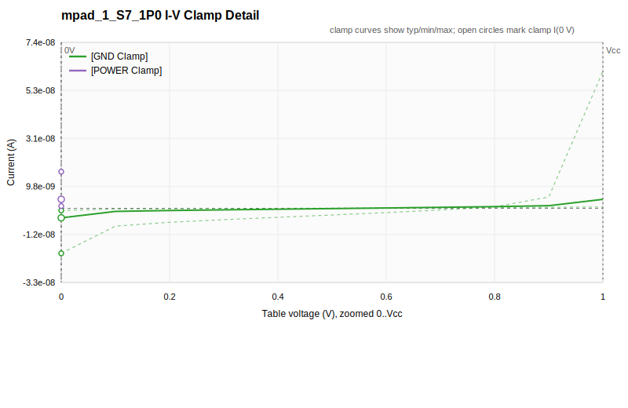

##### I-V pullup/pulldown 0 V detail
<a id="curve-mpad-1-s7-1p0-iv-zero"></a>

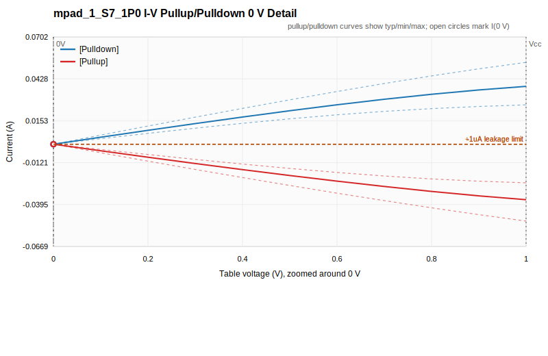

##### I-V clamp sweep range
<a id="curve-mpad-1-s7-1p0-iv-clamp-sweep"></a>

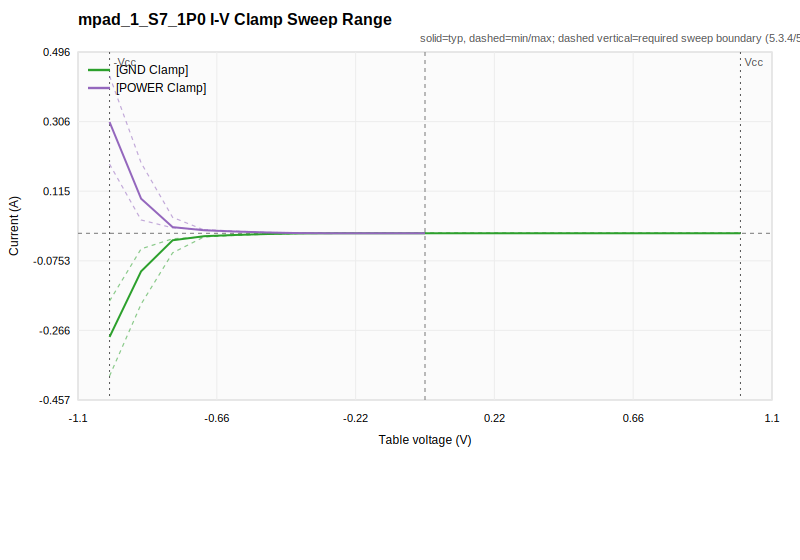

##### Zout load-line curves
<a id="curve-mpad-1-s7-1p0-zout"></a>

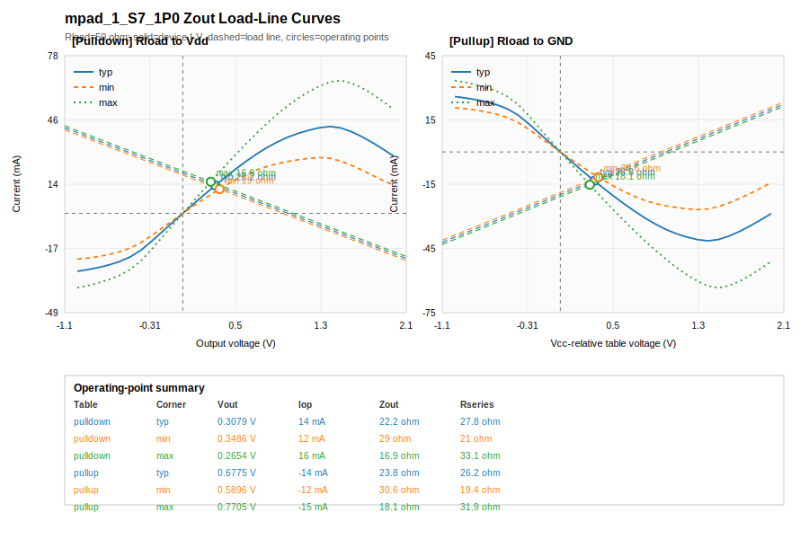

##### V-T waveforms
<a id="curve-mpad-1-s7-1p0-waveform"></a>

Related WARN/FAIL QA items: [5.5.4](#check-5-5-4)

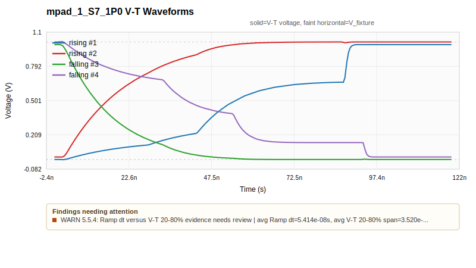


### Model: `mpad_1_S7_1P0_I3C`

- Candidate model score from model-scoped checked items: IQ1
- Model type: I/O
- Waveform tables: 4


#### Visual Curves

##### I-V Combined Curves
<a id="curve-mpad-1-s7-1p0-i3c-iv"></a>

Related WARN/FAIL QA items: [5.3.6](#check-5-3-6), [5.3.7](#check-5-3-7), [5.3.14](#check-5-3-14)


##### I-V clamp detail
<a id="curve-mpad-1-s7-1p0-i3c-iv-clamp"></a>

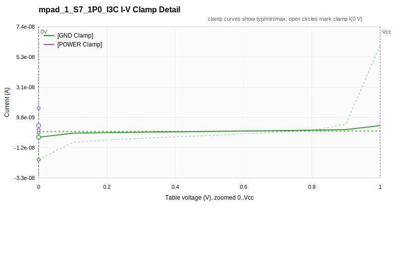

##### I-V pullup/pulldown 0 V detail
<a id="curve-mpad-1-s7-1p0-i3c-iv-zero"></a>

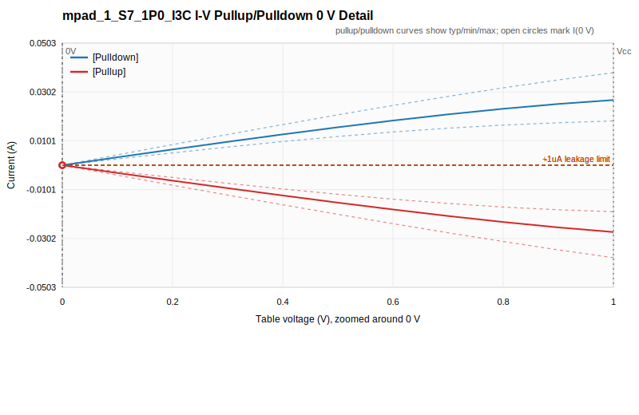

##### I-V clamp sweep range
<a id="curve-mpad-1-s7-1p0-i3c-iv-clamp-sweep"></a>

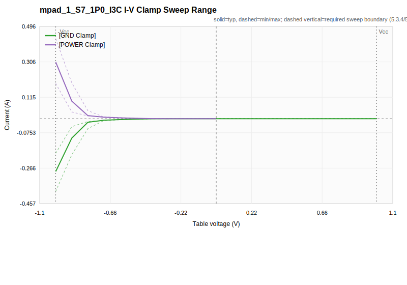

##### Zout load-line curves
<a id="curve-mpad-1-s7-1p0-i3c-zout"></a>

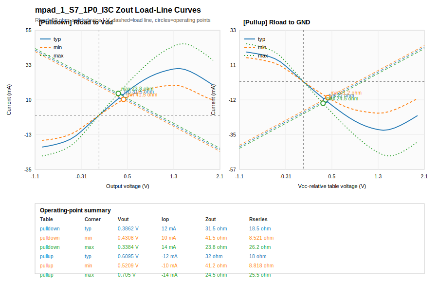

##### V-T waveforms
<a id="curve-mpad-1-s7-1p0-i3c-waveform"></a>

Related WARN/FAIL QA items: [5.5.4](#check-5-5-4)

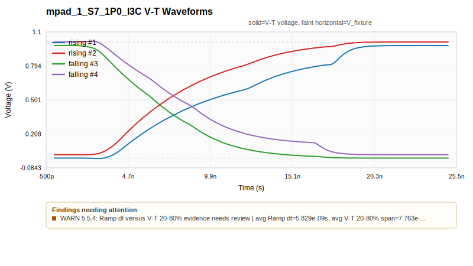


### Model: `mpad_1_S7_1P2`

- Candidate model score from model-scoped checked items: IQ1
- Model type: I/O
- Waveform tables: 4


#### Visual Curves

##### I-V Combined Curves
<a id="curve-mpad-1-s7-1p2-iv"></a>

Related WARN/FAIL QA items: [5.3.6](#check-5-3-6), [5.3.7](#check-5-3-7), [5.3.14](#check-5-3-14)


##### I-V clamp detail
<a id="curve-mpad-1-s7-1p2-iv-clamp"></a>

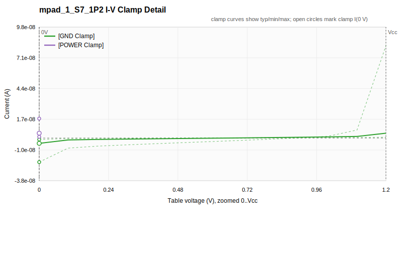

##### I-V pullup/pulldown 0 V detail
<a id="curve-mpad-1-s7-1p2-iv-zero"></a>

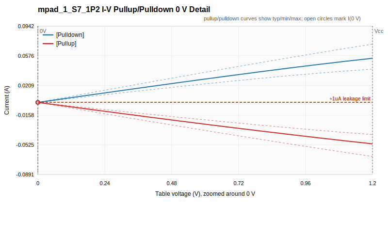

##### I-V clamp sweep range
<a id="curve-mpad-1-s7-1p2-iv-clamp-sweep"></a>

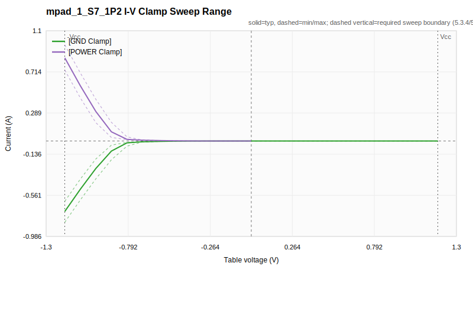

##### Zout load-line curves
<a id="curve-mpad-1-s7-1p2-zout"></a>

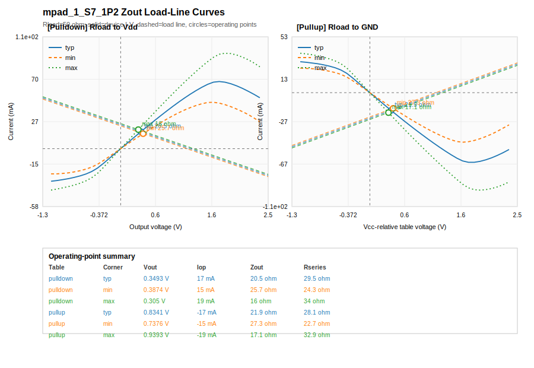

##### V-T waveforms
<a id="curve-mpad-1-s7-1p2-waveform"></a>

Related WARN/FAIL QA items: [5.5.4](#check-5-5-4)

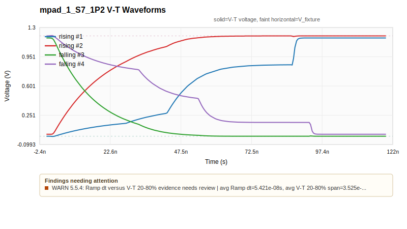


### Model: `mpad_1_S7_1P2_I3C`

- Candidate model score from model-scoped checked items: IQ1
- Model type: I/O
- Waveform tables: 4


#### Visual Curves

##### I-V Combined Curves
<a id="curve-mpad-1-s7-1p2-i3c-iv"></a>

Related WARN/FAIL QA items: [5.3.6](#check-5-3-6), [5.3.7](#check-5-3-7), [5.3.14](#check-5-3-14)


##### I-V clamp detail
<a id="curve-mpad-1-s7-1p2-i3c-iv-clamp"></a>

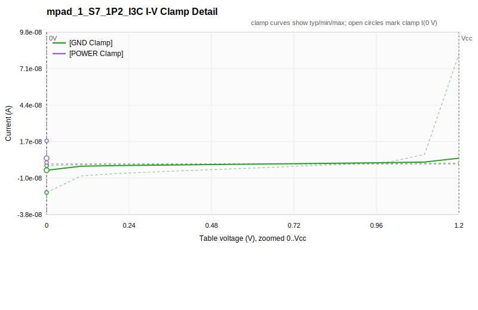

##### I-V pullup/pulldown 0 V detail
<a id="curve-mpad-1-s7-1p2-i3c-iv-zero"></a>

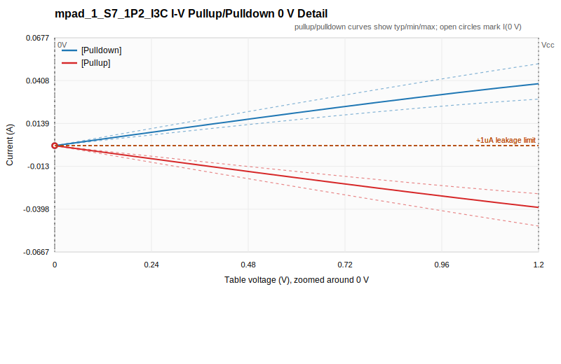

##### I-V clamp sweep range
<a id="curve-mpad-1-s7-1p2-i3c-iv-clamp-sweep"></a>


##### Zout load-line curves
<a id="curve-mpad-1-s7-1p2-i3c-zout"></a>

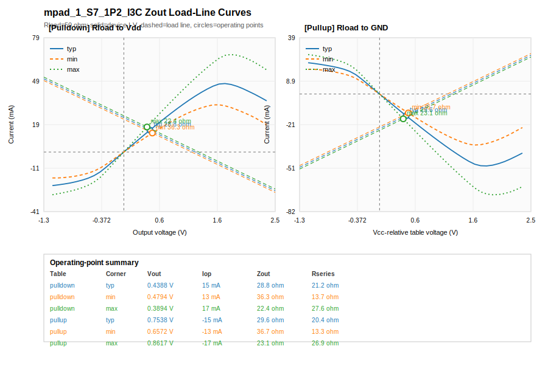

##### V-T waveforms
<a id="curve-mpad-1-s7-1p2-i3c-waveform"></a>

Related WARN/FAIL QA items: [5.5.4](#check-5-5-4)

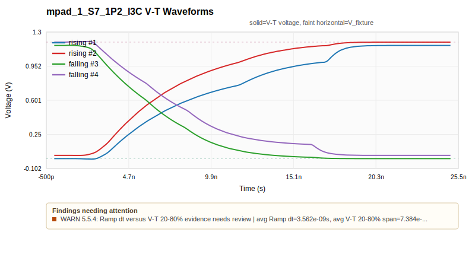


### Model: `mpad_1_S7_1P8`

- Candidate model score from model-scoped checked items: IQ1
- Model type: I/O
- Waveform tables: 4


#### Visual Curves

##### I-V Combined Curves
<a id="curve-mpad-1-s7-1p8-iv"></a>

Related WARN/FAIL QA items: [5.3.6](#check-5-3-6), [5.3.7](#check-5-3-7), [5.3.14](#check-5-3-14)


##### I-V clamp detail
<a id="curve-mpad-1-s7-1p8-iv-clamp"></a>

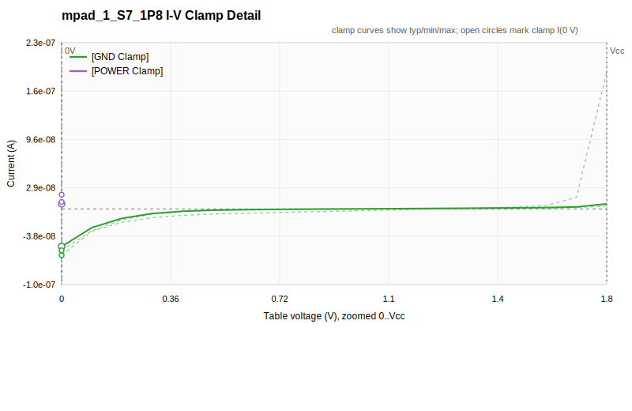

##### I-V pullup/pulldown 0 V detail
<a id="curve-mpad-1-s7-1p8-iv-zero"></a>

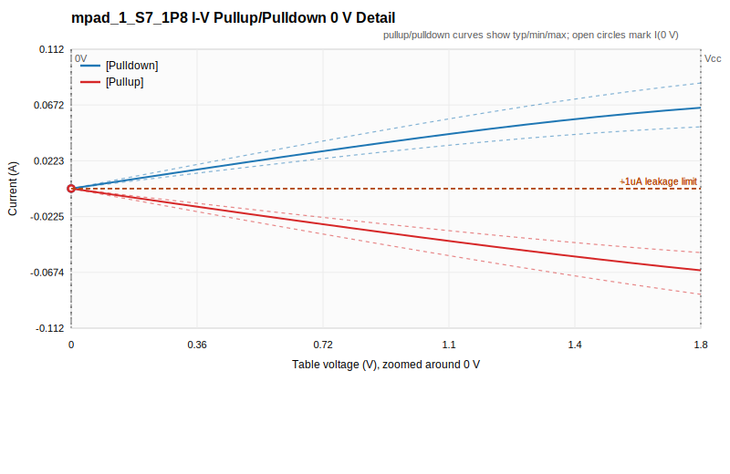

##### I-V clamp sweep range
<a id="curve-mpad-1-s7-1p8-iv-clamp-sweep"></a>

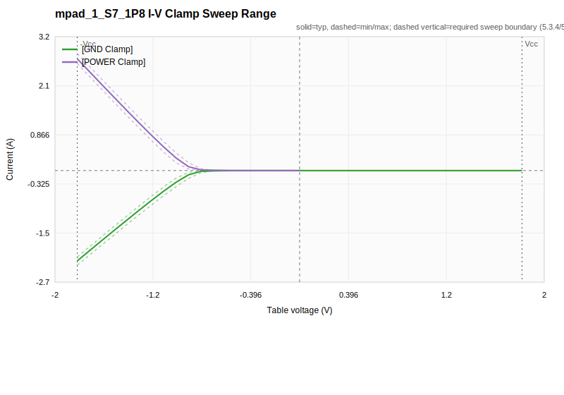

##### Zout load-line curves
<a id="curve-mpad-1-s7-1p8-zout"></a>


##### V-T waveforms
<a id="curve-mpad-1-s7-1p8-waveform"></a>

Related WARN/FAIL QA items: [5.5.4](#check-5-5-4)

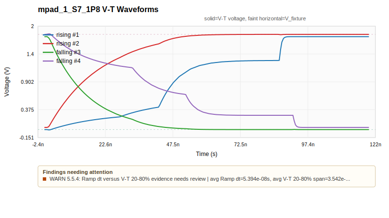


### Model: `mpad_1_S7_1P8_I3C`

- Candidate model score from model-scoped checked items: IQ1
- Model type: I/O
- Waveform tables: 4


#### Visual Curves

##### I-V Combined Curves
<a id="curve-mpad-1-s7-1p8-i3c-iv"></a>

Related WARN/FAIL QA items: [5.3.6](#check-5-3-6), [5.3.7](#check-5-3-7), [5.3.14](#check-5-3-14)


##### I-V clamp detail
<a id="curve-mpad-1-s7-1p8-i3c-iv-clamp"></a>

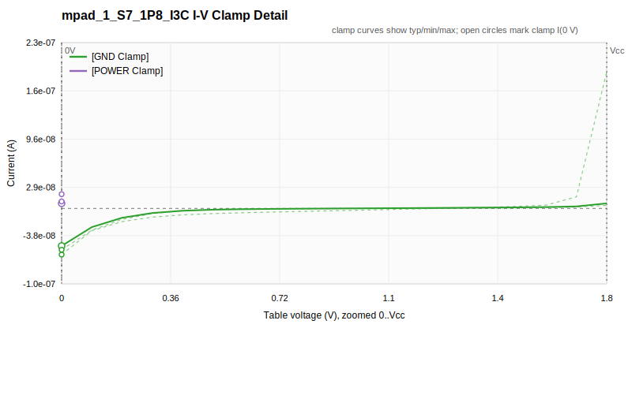

##### I-V pullup/pulldown 0 V detail
<a id="curve-mpad-1-s7-1p8-i3c-iv-zero"></a>

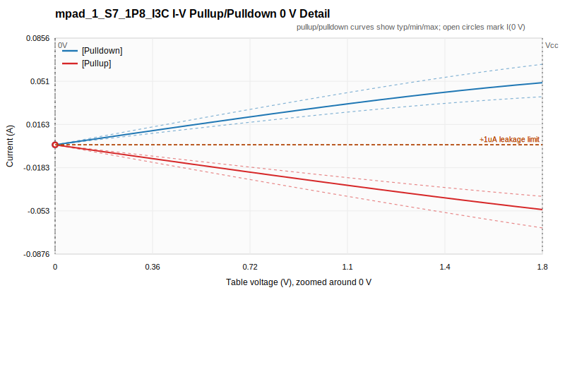

##### I-V clamp sweep range
<a id="curve-mpad-1-s7-1p8-i3c-iv-clamp-sweep"></a>

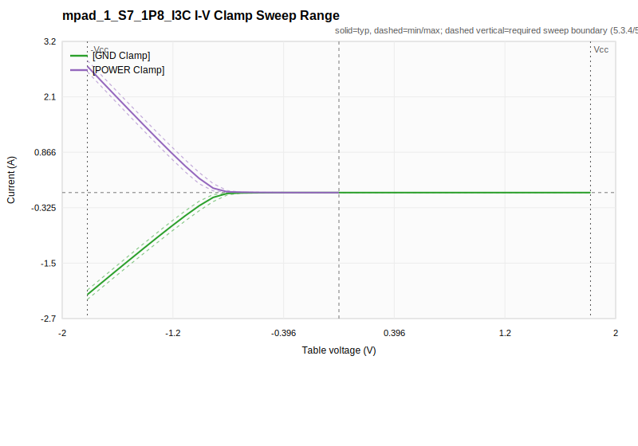

##### Zout load-line curves
<a id="curve-mpad-1-s7-1p8-i3c-zout"></a>

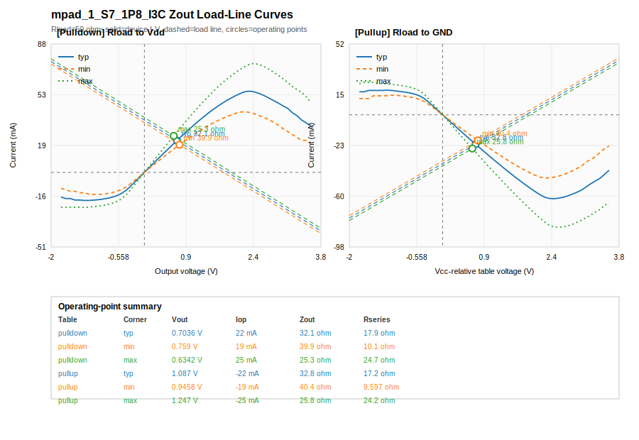

##### V-T waveforms
<a id="curve-mpad-1-s7-1p8-i3c-waveform"></a>

Related WARN/FAIL QA items: [5.5.4](#check-5-5-4)

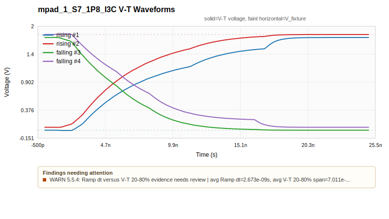


## Manual Review Items
<a id="manual-review-items"></a>

Manual items require external evidence such as datasheets, extraction notes, SPICE/measurement data, package files, or model-maker documentation.

| Level | Check | Scope | Subject | Decision | Evidence / Reference | Comment / Action |
|---|---|---|---|---|---|---|
| LEVEL 2 | 4.2 - Default [Model Selector] entries are consistent | Component | Arbel | Pending | Default model selector consistency depends on product configuration and likely use cases. |  |
| LEVEL 2 | 5.1.3 - [Temperature Range] is reasonable | Model | mpad_1_S7_1P0 | Pending | Requires extraction conditions, technology behavior, and datasheet operating temperature comparison. |  |
| LEVEL 2 | 5.1.3 - [Temperature Range] is reasonable | Model | mpad_1_S7_1P0_I3C | Pending | Requires extraction conditions, technology behavior, and datasheet operating temperature comparison. |  |
| LEVEL 2 | 5.1.3 - [Temperature Range] is reasonable | Model | mpad_1_S7_1P2 | Pending | Requires extraction conditions, technology behavior, and datasheet operating temperature comparison. |  |
| LEVEL 2 | 5.1.3 - [Temperature Range] is reasonable | Model | mpad_1_S7_1P2_I3C | Pending | Requires extraction conditions, technology behavior, and datasheet operating temperature comparison. |  |
| LEVEL 2 | 5.1.3 - [Temperature Range] is reasonable | Model | mpad_1_S7_1P8 | Pending | Requires extraction conditions, technology behavior, and datasheet operating temperature comparison. |  |
| LEVEL 2 | 5.1.3 - [Temperature Range] is reasonable | Model | mpad_1_S7_1P8_I3C | Pending | Requires extraction conditions, technology behavior, and datasheet operating temperature comparison. |  |
| LEVEL 2 | 5.2.5 - [Model Spec] S_Overshoot subparameters complete and match data sheet | Model | mpad_1_S7_1P0 | Pending | Requires datasheet functional overshoot limits. |  |
| LEVEL 2 | 5.2.5 - [Model Spec] S_Overshoot subparameters complete and match data sheet | Model | mpad_1_S7_1P0_I3C | Pending | Requires datasheet functional overshoot limits. |  |
| LEVEL 2 | 5.2.5 - [Model Spec] S_Overshoot subparameters complete and match data sheet | Model | mpad_1_S7_1P2 | Pending | Requires datasheet functional overshoot limits. |  |
| LEVEL 2 | 5.2.5 - [Model Spec] S_Overshoot subparameters complete and match data sheet | Model | mpad_1_S7_1P2_I3C | Pending | Requires datasheet functional overshoot limits. |  |
| LEVEL 2 | 5.2.5 - [Model Spec] S_Overshoot subparameters complete and match data sheet | Model | mpad_1_S7_1P8 | Pending | Requires datasheet functional overshoot limits. |  |
| LEVEL 2 | 5.2.5 - [Model Spec] S_Overshoot subparameters complete and match data sheet | Model | mpad_1_S7_1P8_I3C | Pending | Requires datasheet functional overshoot limits. |  |
| LEVEL 2 | 5.2.7 - [Model Spec] D_Overshoot_* subparameters complete and match data sheet | Model | mpad_1_S7_1P0 | Pending | Requires datasheet dynamic overshoot limits and documented conversion method. |  |
| LEVEL 2 | 5.2.7 - [Model Spec] D_Overshoot_* subparameters complete and match data sheet | Model | mpad_1_S7_1P0_I3C | Pending | Requires datasheet dynamic overshoot limits and documented conversion method. |  |
| LEVEL 2 | 5.2.7 - [Model Spec] D_Overshoot_* subparameters complete and match data sheet | Model | mpad_1_S7_1P2 | Pending | Requires datasheet dynamic overshoot limits and documented conversion method. |  |
| LEVEL 2 | 5.2.7 - [Model Spec] D_Overshoot_* subparameters complete and match data sheet | Model | mpad_1_S7_1P2_I3C | Pending | Requires datasheet dynamic overshoot limits and documented conversion method. |  |
| LEVEL 2 | 5.2.7 - [Model Spec] D_Overshoot_* subparameters complete and match data sheet | Model | mpad_1_S7_1P8 | Pending | Requires datasheet dynamic overshoot limits and documented conversion method. |  |
| LEVEL 2 | 5.2.7 - [Model Spec] D_Overshoot_* subparameters complete and match data sheet | Model | mpad_1_S7_1P8_I3C | Pending | Requires datasheet dynamic overshoot limits and documented conversion method. |  |
| LEVEL 2 | 5.3.11 - I-V behavior not double-counted | Model | mpad_1_S7_1P0 | Pending | Double-counting of clamp, driver, and termination behavior needs curve/context review. |  |
| LEVEL 2 | 5.3.11 - I-V behavior not double-counted | Model | mpad_1_S7_1P0_I3C | Pending | Double-counting of clamp, driver, and termination behavior needs curve/context review. |  |
| LEVEL 2 | 5.3.11 - I-V behavior not double-counted | Model | mpad_1_S7_1P2 | Pending | Double-counting of clamp, driver, and termination behavior needs curve/context review. |  |
| LEVEL 2 | 5.3.11 - I-V behavior not double-counted | Model | mpad_1_S7_1P2_I3C | Pending | Double-counting of clamp, driver, and termination behavior needs curve/context review. |  |
| LEVEL 2 | 5.3.11 - I-V behavior not double-counted | Model | mpad_1_S7_1P8 | Pending | Double-counting of clamp, driver, and termination behavior needs curve/context review. |  |
| LEVEL 2 | 5.3.11 - I-V behavior not double-counted | Model | mpad_1_S7_1P8_I3C | Pending | Double-counting of clamp, driver, and termination behavior needs curve/context review. |  |
| LEVEL 2 | 5.3.12 - On-die termination modeling documented | Model | mpad_1_S7_1P0 | Pending | Requires documentation review for on-die termination modeling method. |  |
| LEVEL 2 | 5.3.12 - On-die termination modeling documented | Model | mpad_1_S7_1P0_I3C | Pending | Requires documentation review for on-die termination modeling method. |  |
| LEVEL 2 | 5.3.12 - On-die termination modeling documented | Model | mpad_1_S7_1P2 | Pending | Requires documentation review for on-die termination modeling method. |  |
| LEVEL 2 | 5.3.12 - On-die termination modeling documented | Model | mpad_1_S7_1P2_I3C | Pending | Requires documentation review for on-die termination modeling method. |  |
| LEVEL 2 | 5.3.12 - On-die termination modeling documented | Model | mpad_1_S7_1P8 | Pending | Requires documentation review for on-die termination modeling method. |  |
| LEVEL 2 | 5.3.12 - On-die termination modeling documented | Model | mpad_1_S7_1P8_I3C | Pending | Requires documentation review for on-die termination modeling method. |  |
| LEVEL 3 | 5.2.1 - [Model] Vinl and Vinh reasonable | Model | mpad_1_S7_1P0 | Pending | Requires comparing thresholds against datasheet and Vmeas intent. |  |
| LEVEL 3 | 5.2.1 - [Model] Vinl and Vinh reasonable | Model | mpad_1_S7_1P0_I3C | Pending | Requires comparing thresholds against datasheet and Vmeas intent. |  |
| LEVEL 3 | 5.2.1 - [Model] Vinl and Vinh reasonable | Model | mpad_1_S7_1P2 | Pending | Requires comparing thresholds against datasheet and Vmeas intent. |  |
| LEVEL 3 | 5.2.1 - [Model] Vinl and Vinh reasonable | Model | mpad_1_S7_1P2_I3C | Pending | Requires comparing thresholds against datasheet and Vmeas intent. |  |
| LEVEL 3 | 5.2.1 - [Model] Vinl and Vinh reasonable | Model | mpad_1_S7_1P8 | Pending | Requires comparing thresholds against datasheet and Vmeas intent. |  |
| LEVEL 3 | 5.2.1 - [Model] Vinl and Vinh reasonable | Model | mpad_1_S7_1P8_I3C | Pending | Requires comparing thresholds against datasheet and Vmeas intent. |  |
| LEVEL 3 | 5.2.2 - [Model Spec] Vinl and Vinh reasonable | Model | mpad_1_S7_1P0 | Pending | Requires datasheet threshold ranges and supply variation interpretation. |  |
| LEVEL 3 | 5.2.2 - [Model Spec] Vinl and Vinh reasonable | Model | mpad_1_S7_1P0_I3C | Pending | Requires datasheet threshold ranges and supply variation interpretation. |  |
| LEVEL 3 | 5.2.2 - [Model Spec] Vinl and Vinh reasonable | Model | mpad_1_S7_1P2 | Pending | Requires datasheet threshold ranges and supply variation interpretation. |  |
| LEVEL 3 | 5.2.2 - [Model Spec] Vinl and Vinh reasonable | Model | mpad_1_S7_1P2_I3C | Pending | Requires datasheet threshold ranges and supply variation interpretation. |  |
| LEVEL 3 | 5.2.2 - [Model Spec] Vinl and Vinh reasonable | Model | mpad_1_S7_1P8 | Pending | Requires datasheet threshold ranges and supply variation interpretation. |  |
| LEVEL 3 | 5.2.2 - [Model Spec] Vinl and Vinh reasonable | Model | mpad_1_S7_1P8_I3C | Pending | Requires datasheet threshold ranges and supply variation interpretation. |  |
| LEVEL 3 | 5.2.3 - [Model Spec] Vinl+/- and Vinh+/- complete and reasonable | Model | mpad_1_S7_1P0 | Pending | Requires datasheet/hysteresis intent plus comment review for exceptions. |  |
| LEVEL 3 | 5.2.3 - [Model Spec] Vinl+/- and Vinh+/- complete and reasonable | Model | mpad_1_S7_1P0_I3C | Pending | Requires datasheet/hysteresis intent plus comment review for exceptions. |  |
| LEVEL 3 | 5.2.3 - [Model Spec] Vinl+/- and Vinh+/- complete and reasonable | Model | mpad_1_S7_1P2 | Pending | Requires datasheet/hysteresis intent plus comment review for exceptions. |  |
| LEVEL 3 | 5.2.3 - [Model Spec] Vinl+/- and Vinh+/- complete and reasonable | Model | mpad_1_S7_1P2_I3C | Pending | Requires datasheet/hysteresis intent plus comment review for exceptions. |  |
| LEVEL 3 | 5.2.3 - [Model Spec] Vinl+/- and Vinh+/- complete and reasonable | Model | mpad_1_S7_1P8 | Pending | Requires datasheet/hysteresis intent plus comment review for exceptions. |  |
| LEVEL 3 | 5.2.3 - [Model Spec] Vinl+/- and Vinh+/- complete and reasonable | Model | mpad_1_S7_1P8_I3C | Pending | Requires datasheet/hysteresis intent plus comment review for exceptions. |  |
| LEVEL 3 | 5.2.9 - [Receiver Thresholds] Vth present and matches data sheet, if needed | Model | mpad_1_S7_1P0 | Pending | Requires datasheet timing threshold and receiver-threshold applicability. |  |
| LEVEL 3 | 5.2.9 - [Receiver Thresholds] Vth present and matches data sheet, if needed | Model | mpad_1_S7_1P0_I3C | Pending | Requires datasheet timing threshold and receiver-threshold applicability. |  |
| LEVEL 3 | 5.2.9 - [Receiver Thresholds] Vth present and matches data sheet, if needed | Model | mpad_1_S7_1P2 | Pending | Requires datasheet timing threshold and receiver-threshold applicability. |  |
| LEVEL 3 | 5.2.9 - [Receiver Thresholds] Vth present and matches data sheet, if needed | Model | mpad_1_S7_1P2_I3C | Pending | Requires datasheet timing threshold and receiver-threshold applicability. |  |
| LEVEL 3 | 5.2.9 - [Receiver Thresholds] Vth present and matches data sheet, if needed | Model | mpad_1_S7_1P8 | Pending | Requires datasheet timing threshold and receiver-threshold applicability. |  |
| LEVEL 3 | 5.2.9 - [Receiver Thresholds] Vth present and matches data sheet, if needed | Model | mpad_1_S7_1P8_I3C | Pending | Requires datasheet timing threshold and receiver-threshold applicability. |  |
| LEVEL 3 | 5.2.10 - [Receiver Thresholds] Vth_min and Vth_max present and match data sheet, if needed | Model | mpad_1_S7_1P0 | Pending | Requires datasheet Vth tolerance interpretation. |  |
| LEVEL 3 | 5.2.10 - [Receiver Thresholds] Vth_min and Vth_max present and match data sheet, if needed | Model | mpad_1_S7_1P0_I3C | Pending | Requires datasheet Vth tolerance interpretation. |  |
| LEVEL 3 | 5.2.10 - [Receiver Thresholds] Vth_min and Vth_max present and match data sheet, if needed | Model | mpad_1_S7_1P2 | Pending | Requires datasheet Vth tolerance interpretation. |  |
| LEVEL 3 | 5.2.10 - [Receiver Thresholds] Vth_min and Vth_max present and match data sheet, if needed | Model | mpad_1_S7_1P2_I3C | Pending | Requires datasheet Vth tolerance interpretation. |  |
| LEVEL 3 | 5.2.10 - [Receiver Thresholds] Vth_min and Vth_max present and match data sheet, if needed | Model | mpad_1_S7_1P8 | Pending | Requires datasheet Vth tolerance interpretation. |  |
| LEVEL 3 | 5.2.10 - [Receiver Thresholds] Vth_min and Vth_max present and match data sheet, if needed | Model | mpad_1_S7_1P8_I3C | Pending | Requires datasheet Vth tolerance interpretation. |  |
| LEVEL 3 | 5.2.11 - [Receiver Thresholds] Vinh_ac, Vinl_ac present and match data sheet, if needed | Model | mpad_1_S7_1P0 | Pending | Requires datasheet AC threshold values and offset conversion review. |  |
| LEVEL 3 | 5.2.11 - [Receiver Thresholds] Vinh_ac, Vinl_ac present and match data sheet, if needed | Model | mpad_1_S7_1P0_I3C | Pending | Requires datasheet AC threshold values and offset conversion review. |  |
| LEVEL 3 | 5.2.11 - [Receiver Thresholds] Vinh_ac, Vinl_ac present and match data sheet, if needed | Model | mpad_1_S7_1P2 | Pending | Requires datasheet AC threshold values and offset conversion review. |  |
| LEVEL 3 | 5.2.11 - [Receiver Thresholds] Vinh_ac, Vinl_ac present and match data sheet, if needed | Model | mpad_1_S7_1P2_I3C | Pending | Requires datasheet AC threshold values and offset conversion review. |  |
| LEVEL 3 | 5.2.11 - [Receiver Thresholds] Vinh_ac, Vinl_ac present and match data sheet, if needed | Model | mpad_1_S7_1P8 | Pending | Requires datasheet AC threshold values and offset conversion review. |  |
| LEVEL 3 | 5.2.11 - [Receiver Thresholds] Vinh_ac, Vinl_ac present and match data sheet, if needed | Model | mpad_1_S7_1P8_I3C | Pending | Requires datasheet AC threshold values and offset conversion review. |  |
| LEVEL 3 | 5.2.12 - [Receiver Thresholds] Vinh_dc, Vinl_dc present and match data sheet, if needed | Model | mpad_1_S7_1P0 | Pending | Requires datasheet DC threshold values and offset conversion review. |  |
| LEVEL 3 | 5.2.12 - [Receiver Thresholds] Vinh_dc, Vinl_dc present and match data sheet, if needed | Model | mpad_1_S7_1P0_I3C | Pending | Requires datasheet DC threshold values and offset conversion review. |  |
| LEVEL 3 | 5.2.12 - [Receiver Thresholds] Vinh_dc, Vinl_dc present and match data sheet, if needed | Model | mpad_1_S7_1P2 | Pending | Requires datasheet DC threshold values and offset conversion review. |  |
| LEVEL 3 | 5.2.12 - [Receiver Thresholds] Vinh_dc, Vinl_dc present and match data sheet, if needed | Model | mpad_1_S7_1P2_I3C | Pending | Requires datasheet DC threshold values and offset conversion review. |  |
| LEVEL 3 | 5.2.12 - [Receiver Thresholds] Vinh_dc, Vinl_dc present and match data sheet, if needed | Model | mpad_1_S7_1P8 | Pending | Requires datasheet DC threshold values and offset conversion review. |  |
| LEVEL 3 | 5.2.12 - [Receiver Thresholds] Vinh_dc, Vinl_dc present and match data sheet, if needed | Model | mpad_1_S7_1P8_I3C | Pending | Requires datasheet DC threshold values and offset conversion review. |  |
| LEVEL 3 | 5.2.13 - [Receiver Thresholds] Tslew_ac/Tdiffslew_ac present and match data sheet, if needed | Model | mpad_1_S7_1P0 | Pending | Requires datasheet slew-limit values and differential/single-ended applicability. |  |
| LEVEL 3 | 5.2.13 - [Receiver Thresholds] Tslew_ac/Tdiffslew_ac present and match data sheet, if needed | Model | mpad_1_S7_1P0_I3C | Pending | Requires datasheet slew-limit values and differential/single-ended applicability. |  |
| LEVEL 3 | 5.2.13 - [Receiver Thresholds] Tslew_ac/Tdiffslew_ac present and match data sheet, if needed | Model | mpad_1_S7_1P2 | Pending | Requires datasheet slew-limit values and differential/single-ended applicability. |  |
| LEVEL 3 | 5.2.13 - [Receiver Thresholds] Tslew_ac/Tdiffslew_ac present and match data sheet, if needed | Model | mpad_1_S7_1P2_I3C | Pending | Requires datasheet slew-limit values and differential/single-ended applicability. |  |
| LEVEL 3 | 5.2.13 - [Receiver Thresholds] Tslew_ac/Tdiffslew_ac present and match data sheet, if needed | Model | mpad_1_S7_1P8 | Pending | Requires datasheet slew-limit values and differential/single-ended applicability. |  |
| LEVEL 3 | 5.2.13 - [Receiver Thresholds] Tslew_ac/Tdiffslew_ac present and match data sheet, if needed | Model | mpad_1_S7_1P8_I3C | Pending | Requires datasheet slew-limit values and differential/single-ended applicability. |  |
| LEVEL 3 | 5.2.14 - [Receiver Thresholds] Threshold_sensitivity and Ext_ref present and match data sheet, if needed | Model | mpad_1_S7_1P0 | Pending | Requires datasheet/reference-supply behavior. |  |
| LEVEL 3 | 5.2.14 - [Receiver Thresholds] Threshold_sensitivity and Ext_ref present and match data sheet, if needed | Model | mpad_1_S7_1P0_I3C | Pending | Requires datasheet/reference-supply behavior. |  |
| LEVEL 3 | 5.2.14 - [Receiver Thresholds] Threshold_sensitivity and Ext_ref present and match data sheet, if needed | Model | mpad_1_S7_1P2 | Pending | Requires datasheet/reference-supply behavior. |  |
| LEVEL 3 | 5.2.14 - [Receiver Thresholds] Threshold_sensitivity and Ext_ref present and match data sheet, if needed | Model | mpad_1_S7_1P2_I3C | Pending | Requires datasheet/reference-supply behavior. |  |
| LEVEL 3 | 5.2.14 - [Receiver Thresholds] Threshold_sensitivity and Ext_ref present and match data sheet, if needed | Model | mpad_1_S7_1P8 | Pending | Requires datasheet/reference-supply behavior. |  |
| LEVEL 3 | 5.2.14 - [Receiver Thresholds] Threshold_sensitivity and Ext_ref present and match data sheet, if needed | Model | mpad_1_S7_1P8_I3C | Pending | Requires datasheet/reference-supply behavior. |  |
| LEVEL 3 | 5.6.1 - [Model Spec] Vmeas and Vref used if typ/min/max variation | Model | mpad_1_S7_1P0 | Pending | Requires deciding whether Vmeas/Vref variation exists across corners. |  |
| LEVEL 3 | 5.6.1 - [Model Spec] Vmeas and Vref used if typ/min/max variation | Model | mpad_1_S7_1P0_I3C | Pending | Requires deciding whether Vmeas/Vref variation exists across corners. |  |
| LEVEL 3 | 5.6.1 - [Model Spec] Vmeas and Vref used if typ/min/max variation | Model | mpad_1_S7_1P2 | Pending | Requires deciding whether Vmeas/Vref variation exists across corners. |  |
| LEVEL 3 | 5.6.1 - [Model Spec] Vmeas and Vref used if typ/min/max variation | Model | mpad_1_S7_1P2_I3C | Pending | Requires deciding whether Vmeas/Vref variation exists across corners. |  |
| LEVEL 3 | 5.6.1 - [Model Spec] Vmeas and Vref used if typ/min/max variation | Model | mpad_1_S7_1P8 | Pending | Requires deciding whether Vmeas/Vref variation exists across corners. |  |
| LEVEL 3 | 5.6.1 - [Model Spec] Vmeas and Vref used if typ/min/max variation | Model | mpad_1_S7_1P8_I3C | Pending | Requires deciding whether Vmeas/Vref variation exists across corners. |  |

## Appendix A: IQ Levels
<a id="appendix-a-iq-levels"></a>

| Level | Name | Meaning |
|---|---|---|
| IQ0 | Not Checked | No documented quality checking has been performed. |
| IQ1 | Passes IBISCHK | IBISCHK has been run with zero errors and documented handling of warnings. |
| IQ2 | Suitable for Waveform Simulation | IQ1 plus all LEVEL 2 checks for basic waveform simulation data. |
| IQ3 | Suitable for Timing Analysis | IQ2 plus all LEVEL 3 checks for timing analysis data. |

## Appendix B: Special Designators
<a id="appendix-b-special-designators"></a>

Special letters may be appended to the IQ score when the supporting evidence is documented.

| Designator | Name | Meaning |
|---|---|---|
| G | Contains Golden Waveforms | The file contains golden waveform data using [Test Data] and [Test Load] or equivalent external documentation. |
| M | Measurement Correlated | IBIS simulation has been correlated against hardware measurements with documented methods/results. |
| S | Simulation Correlated | IBIS simulation has been correlated against a reference simulation such as SPICE with documented methods/results. |
| X | Exceptions | One or more checks require documented exceptions in [Notes] or comments. |

## Appendix C: Scoring Notes
<a id="appendix-c-scoring-notes"></a>

- Base level: The summary IQ number is the highest level for which all required checks at that level and below pass, are NA, or are accepted exceptions.
- Optional checks: OPTIONAL checks are good practice but do not change the summary IQ number.
- Correlation designators: Append M, S, and/or G when measurement correlation, simulation correlation, and/or golden waveform evidence is documented for a reasonable set of models.
- Exception designator: Append X when any check passes only by documented exception or any remaining parser warning needs user attention.
- Writeback: The summary IQ score must be written into the IBIS file, preferably in [Notes]; detailed per-check status is better stored in a quality report.

