# IBIS QA Report

## File Summary

- Generated: 2026-06-09T23:35:18-05:00
- IBIS file: `Hibiki_IOCL_I3C_I2C_ibis_20260211.ibs`
- Target level: IQ3
- IBIS version: 4.2
- File revision: 1.0
- IBIS file date: Tue Feb 26 19:11:02 2026
- IQ score in file: (not found)
- Components: 1
- Models: 4
- Package models: 0
- Zout estimates: 2 model(s), 12 table/corner point(s)

## Table of Contents
<a id="table-of-contents"></a>

- [Score Assessment](#score-assessment)
- [Review Signoff Summary](#review-signoff-summary)
- [Result Summary](#result-summary)
- [Failed & Error Items](#failed-error-items)
- [Passed Items Per Level](#passed-items-per-level)
- [Zout Estimates](#zout-estimates)
- [Quality Check Results](#quality-check-results)

**LEVEL 1 Checks**

- [LEVEL 1 check results](#level-1-check-results)
- [2.1 - IBIS file passes IBISCHK](#check-2-1)

**LEVEL 2 Checks**

- [LEVEL 2 check results](#level-2-check-results)
- [3.1.1 - (Package) must have typ/min/max values](#check-3-1-1)
- [3.1.2 - (Package) model values must be reasonable](#check-3-1-2)
- [3.2.1 - (Pin) section complete](#check-3-2-1)
- [3.3.1 - (Diff Pin) referenced pin models match](#check-3-3-1)
- [4.1 - (Model Selector) entries have reasonable descriptions](#check-4-1)
- [4.2 - Default (Model Selector) entries are consistent](#check-4-2)
- [5.1.1 - (Model) parameters have correct typ/min/max order](#check-5-1-1)
- [5.1.2 - (Model) C_comp is reasonable](#check-5-1-2)
- [5.1.3 - (Temperature Range) is reasonable](#check-5-1-3)
- [5.1.4 - (Voltage Range) or (* Reference) is reasonable](#check-5-1-4)
- [5.2.5 - (Model Spec) S_Overshoot subparameters complete and match data sheet](#check-5-2-5)
- [5.2.6 - (Model Spec) S_Overshoot subparameters track typ/min/max](#check-5-2-6)
- [5.2.7 - (Model Spec) D_Overshoot_* subparameters complete and match data sheet](#check-5-2-7)
- [5.2.8 - (Model Spec) D_Overshoot_* subparameters track typ/min/max](#check-5-2-8)
- [5.3.1 - I-V tables have correct typ/min/max order](#check-5-3-1)
- [5.3.2 - (Pullup) voltage sweep range is correct](#check-5-3-2)
- [5.3.3 - (Pulldown) voltage sweep range is correct](#check-5-3-3)
- [5.3.4 - (POWER Clamp) voltage sweep range is correct](#check-5-3-4)
- [5.3.5 - (GND Clamp) voltage sweep range is correct](#check-5-3-5)
- [5.3.6 - I-V tables do not exhibit stair-stepping](#check-5-3-6)
- [5.3.7 - Combined I-V tables are monotonic](#check-5-3-7)
- [5.3.8 - (Pulldown) I-V tables pass through zero/zero](#check-5-3-8)
- [5.3.9 - (Pullup) I-V tables pass through zero/zero](#check-5-3-9)
- [5.3.10 - No leakage current in clamp I-V tables](#check-5-3-10)
- [5.3.11 - I-V behavior not double-counted](#check-5-3-11)
- [5.3.12 - On-die termination modeling documented](#check-5-3-12)
- [5.3.13 - ECL models I-V tables swept from -Vcc to +2 * Vcc.](#check-5-3-13)
- [5.3.14 - Point distributions in I-V tables should be sufficient](#check-5-3-14)
- [5.4.1 - Output and I/O buffers have sufficient V-T tables](#check-5-4-1)
- [5.4.2 - V-T tables have reasonable point distribution](#check-5-4-2)
- [5.4.4 - V-T table endpoints match fixture voltages](#check-5-4-4)
- [5.5.1 - (Ramp) R_load present if value other than 50 ohms](#check-5-5-1)
- [5.5.2 - (Ramp) typ/min/max order is correct](#check-5-5-2)
- [5.5.3 - (Ramp) dV value is consistent with I-V table calculations](#check-5-5-3)
- [5.5.4 - (Ramp) dt is consistent with 20%-80% crossing time](#check-5-5-4)

**LEVEL 3 Checks**

- [LEVEL 3 check results](#level-3-check-results)
- [3.2.2 - (Pin) RLC values are present and reasonable](#check-3-2-2)
- [3.3.2 - (Diff Pin) Vdiff and Tdelay_* complete and reasonable](#check-3-3-2)
- [5.2.1 - (Model) Vinl and Vinh reasonable](#check-5-2-1)
- [5.2.2 - (Model Spec) Vinl and Vinh reasonable](#check-5-2-2)
- [5.2.3 - (Model Spec) Vinl+/- and Vinh+/- complete and reasonable](#check-5-2-3)
- [5.2.9 - (Receiver Thresholds) Vth present and matches data sheet, if needed](#check-5-2-9)
- [5.2.10 - (Receiver Thresholds) Vth_min and Vth_max present and match data sheet, if needed](#check-5-2-10)
- [5.2.11 - (Receiver Thresholds) Vinh_ac, Vinl_ac present and match data sheet, if needed](#check-5-2-11)
- [5.2.12 - (Receiver Thresholds) Vinh_dc, Vinl_dc present and match data sheet, if needed](#check-5-2-12)
- [5.2.13 - (Receiver Thresholds) Tslew_ac/Tdiffslew_ac present and match data sheet, if needed](#check-5-2-13)
- [5.2.14 - (Receiver Thresholds) Threshold_sensitivity and Ext_ref present and match data sheet, if needed](#check-5-2-14)
- [5.4.3 - V-T table duration is not excessive](#check-5-4-3)
- [5.6.1 - (Model Spec) Vmeas and Vref used if typ/min/max variation](#check-5-6-1)
- [5.6.2 - Vref consistent for Open-drain, Open-source, and ECL Model_types](#check-5-6-2)

- [Visual Curves by Model](#visual-curves-by-model)
- [Manual Review Items](#manual-review-items)
- [Appendix A: IQ Levels](#appendix-a-iq-levels)
- [Appendix B: Special Designators](#appendix-b-special-designators)

## Score Assessment
<a id="score-assessment"></a>

| Field | Value |
|---|---|
| Final IQ score | To be assigned by the model maker after resolving or documenting findings |
| Candidate level from checked items | IQ1 |
| Candidate level after review overlay | IQ1 |
| Tool comments | Candidate IQ1; resolve the FAIL/ERROR findings before final IQ assignment. WARN and review-required items also need documented judgement. |
| Note | Candidate level is the highest implemented level without FAIL or ERROR. WARN/review items, manual checks, accepted exceptions, and correlation designators still require model-maker documentation before final IQ assignment. |

## Review Signoff Summary
<a id="review-signoff-summary"></a>

| Field | Value |
|---|---|
| Review overlay loaded | No |
| Reviewer |  |
| Organization |  |
| Approval date |  |
| Final signoff ready | No |
| Hard blockers after review | 8 |
| Semi-auto review pending | 5 / 5 |
| Semi-auto accepted | 0 |
| Semi-auto exceptions | 0 |
| Semi-auto rejected | 0 |
| Manual review pending | 61 / 61 |
| Manual accepted | 0 |
| Manual exceptions | 0 |
| Manual rejected | 0 |
| Note | Final IQ assignment is ready only when hard blockers are zero and all semi-auto and manual review items have documented decisions. |

| Status | Generated Count | Review-Adjusted Count |
|---|---:|---:|
| PASS | 68 | 68 |
| FAIL | 8 | 8 |
| WARN | 5 | 5 |
| NA | 37 | 37 |
| ERROR | 0 | 0 |
| EXCEPTION | 0 | 0 |

## Result Summary
<a id="result-summary"></a>

| Status | Generated Count | Review-Adjusted Count |
|---|---:|---:|
| PASS | 68 | 68 |
| FAIL | 8 | 8 |
| WARN | 5 | 5 |
| NA | 37 | 37 |
| ERROR | 0 | 0 |
| EXCEPTION | 0 | 0 |
| Total | 118 | 118 |

## Failed & Error Items
<a id="failed-error-items"></a>

8 item(s) require attention. Each entry links to its full write-up in Quality Check Results and shows the most relevant visual where the issue is reflected in a plot. Items without an associated plot are rule/range checks best understood from the explanation text.


### FAIL: 5.3.7 - I2C_RX_RPU1RPD0_rx

- [Pulldown] + [GND Clamp] combined curve non-monotonic (1 violation(s))
- [Full check details](#check-5-3-7)
- V=1.238: combined current decreases from 4.695e-06mA to 0mA

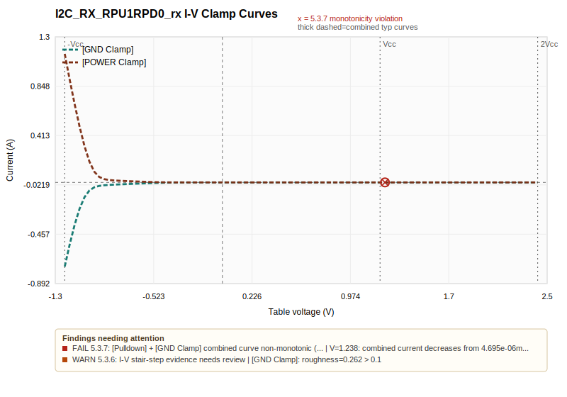
[Jump to I-V curves for I2C_RX_RPU1RPD0_rx](#curve-i2c-rx-rpu1rpd0-rx-iv)

### FAIL: 5.3.7 - I2C_TX_8mA_tx

- [Pulldown] + [GND Clamp] combined curve non-monotonic (18 violation(s))
- [Full check details](#check-5-3-7)
- V=1.725: combined current decreases from 43.22mA to 43.1mA
- V=1.762: combined current decreases from 43.1mA to 42.84mA
- V=1.8: combined current decreases from 42.84mA to 42.45mA
- V=1.837: combined current decreases from 42.45mA to 41.96mA
- V=1.913: combined current decreases from 41.96mA to 40.76mA
- V=1.95: combined current decreases from 40.76mA to 40.07mA
- V=1.988: combined current decreases from 40.07mA to 39.34mA
- V=2.025: combined current decreases from 39.34mA to 38.57mA
- V=2.062: combined current decreases from 38.57mA to 37.76mA
- V=2.1: combined current decreases from 37.76mA to 36.93mA

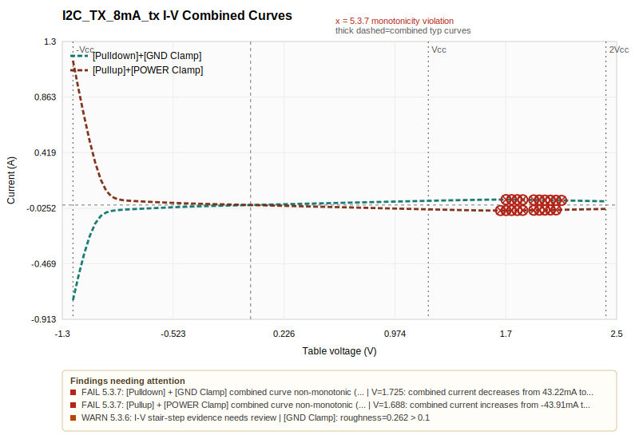
[Jump to I-V curves for I2C_TX_8mA_tx](#curve-i2c-tx-8ma-tx-iv)

### FAIL: 5.3.7 - I2C_TX_8mA_tx

- [Pullup] + [POWER Clamp] combined curve non-monotonic (19 violation(s))
- [Full check details](#check-5-3-7)
- V=1.688: combined current increases from -43.91mA to -43.9mA
- V=1.725: combined current increases from -43.9mA to -43.75mA
- V=1.762: combined current increases from -43.75mA to -43.49mA
- V=1.8: combined current increases from -43.49mA to -43.14mA
- V=1.837: combined current increases from -43.14mA to -42.69mA
- V=1.913: combined current increases from -42.69mA to -41.6mA
- V=1.95: combined current increases from -41.6mA to -40.97mA
- V=1.988: combined current increases from -40.97mA to -40.29mA
- V=2.025: combined current increases from -40.29mA to -39.58mA
- V=2.062: combined current increases from -39.58mA to -38.83mA


[Jump to I-V curves for I2C_TX_8mA_tx](#curve-i2c-tx-8ma-tx-iv)

### FAIL: 5.3.7 - I3C_RX_RPU0RPD0_rx

- [Pulldown] + [GND Clamp] combined curve non-monotonic (1 violation(s))
- [Full check details](#check-5-3-7)
- V=1.238: combined current decreases from 4.698e-06mA to 0mA

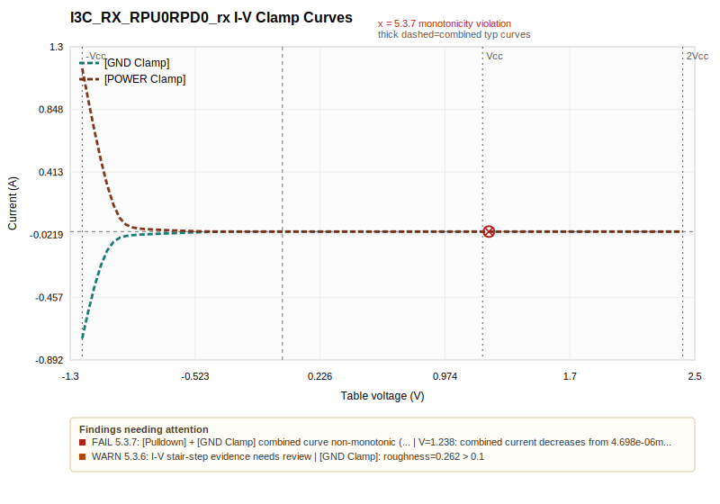
[Jump to I-V curves for I3C_RX_RPU0RPD0_rx](#curve-i3c-rx-rpu0rpd0-rx-iv)

### FAIL: 5.3.7 - I3C_TX_0p125mA_tx

- [Pulldown] + [GND Clamp] combined curve non-monotonic (17 violation(s))
- [Full check details](#check-5-3-7)
- V=1.762: combined current decreases from 1.128mA to 1.125mA
- V=1.8: combined current decreases from 1.125mA to 1.118mA
- V=1.837: combined current decreases from 1.118mA to 1.108mA
- V=1.913: combined current decreases from 1.108mA to 1.082mA
- V=1.95: combined current decreases from 1.082mA to 1.066mA
- V=1.988: combined current decreases from 1.066mA to 1.049mA
- V=2.025: combined current decreases from 1.049mA to 1.03mA
- V=2.062: combined current decreases from 1.03mA to 1.011mA
- V=2.1: combined current decreases from 1.011mA to 0.9903mA
- V=2.138: combined current decreases from 0.9903mA to 0.9691mA

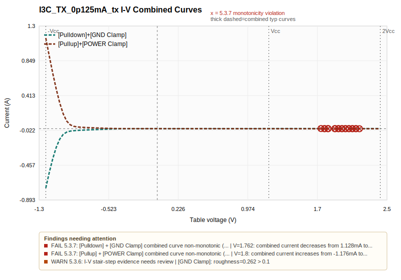
[Jump to I-V curves for I3C_TX_0p125mA_tx](#curve-i3c-tx-0p125ma-tx-iv)

### FAIL: 5.3.7 - I3C_TX_0p125mA_tx

- [Pullup] + [POWER Clamp] combined curve non-monotonic (16 violation(s))
- [Full check details](#check-5-3-7)
- V=1.8: combined current increases from -1.176mA to -1.174mA
- V=1.837: combined current increases from -1.174mA to -1.17mA
- V=1.913: combined current increases from -1.17mA to -1.154mA
- V=1.95: combined current increases from -1.154mA to -1.144mA
- V=1.988: combined current increases from -1.144mA to -1.131mA
- V=2.025: combined current increases from -1.131mA to -1.117mA
- V=2.062: combined current increases from -1.117mA to -1.102mA
- V=2.1: combined current increases from -1.102mA to -1.085mA
- V=2.138: combined current increases from -1.085mA to -1.067mA
- V=2.175: combined current increases from -1.067mA to -1.049mA


[Jump to I-V curves for I3C_TX_0p125mA_tx](#curve-i3c-tx-0p125ma-tx-iv)

### FAIL: 5.5.3 - I2C_TX_8mA_tx

- [Ramp] dV inconsistent with I-V load-line (2 corner(s))
- [Full check details](#check-5-5-3)
- Rise dV/max: ramp=0.5045V, expected≈0.4584V (10.0% error, limit 10.0%)
- Fall dV/max: ramp=0.5017V, expected≈0.4559V (10.0% error, limit 10.0%)
- Rise dV/typ: ramp=0.4248V, expected≈0.4248V from Vhigh=0.708V, Vlow=-1.728e-08V, error=0.0% (push-pull fixture=0V)
- Rise dV/min: ramp=0.3463V, expected≈0.3842V from Vhigh=0.6404V, Vlow=-1.686e-07V, error=9.9% (push-pull fixture=0V)
- Rise dV/max: ramp=0.5045V, expected≈0.4584V from Vhigh=0.7641V, Vlow=-3.562e-08V, error=10.0% (push-pull fixture=0V)
- Fall dV/typ: ramp=0.4214V, expected≈0.4214V from Vhigh=1.2V, Vlow=0.4976V, error=0.0% (push-pull fixture=1.2V)
- Fall dV/min: ramp=0.339V, expected≈0.3758V from Vhigh=1.2V, Vlow=0.5737V, error=9.8% (push-pull fixture=1.2V)
- Fall dV/max: ramp=0.5017V, expected≈0.4559V from Vhigh=1.2V, Vlow=0.4402V, error=10.0% (push-pull fixture=1.2V)

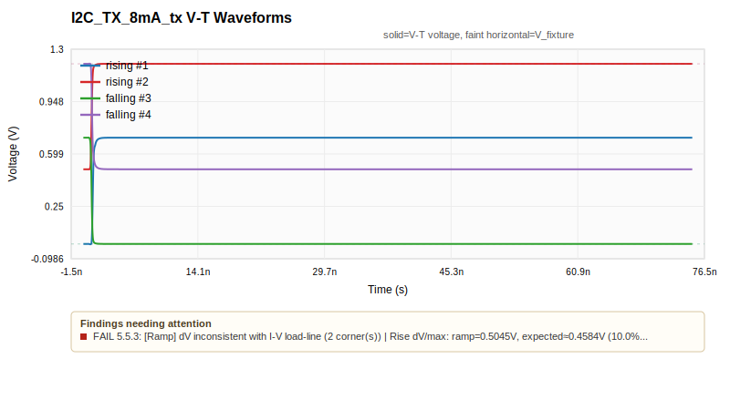
[Jump to V-T curves for I2C_TX_8mA_tx](#curve-i2c-tx-8ma-tx-waveform)

### FAIL: 5.5.3 - I3C_TX_0p125mA_tx

- [Ramp] dV inconsistent with I-V load-line (2 corner(s))
- [Full check details](#check-5-5-3)
- Rise dV/max: ramp=0.03503V, expected≈0.03171V (10.5% error, limit 10.0%)
- Fall dV/max: ramp=0.03401V, expected≈0.03081V (10.4% error, limit 10.0%)
- Rise dV/typ: ramp=0.02583V, expected≈0.02583V from Vhigh=0.04305V, Vlow=-1.152e-09V, error=0.0% (push-pull fixture=0V)
- Rise dV/min: ramp=0.01803V, expected≈0.01967V from Vhigh=0.03279V, Vlow=-9.733e-09V, error=8.3% (push-pull fixture=0V)
- Rise dV/max: ramp=0.03503V, expected≈0.03171V from Vhigh=0.05285V, Vlow=-2.663e-09V, error=10.5% (push-pull fixture=0V)
- Fall dV/typ: ramp=0.02493V, expected≈0.02493V from Vhigh=1.2V, Vlow=1.158V, error=0.0% (push-pull fixture=1.2V)
- Fall dV/min: ramp=0.01658V, expected≈0.01778V from Vhigh=1.2V, Vlow=1.17V, error=6.8% (push-pull fixture=1.2V)
- Fall dV/max: ramp=0.03401V, expected≈0.03081V from Vhigh=1.2V, Vlow=1.149V, error=10.4% (push-pull fixture=1.2V)

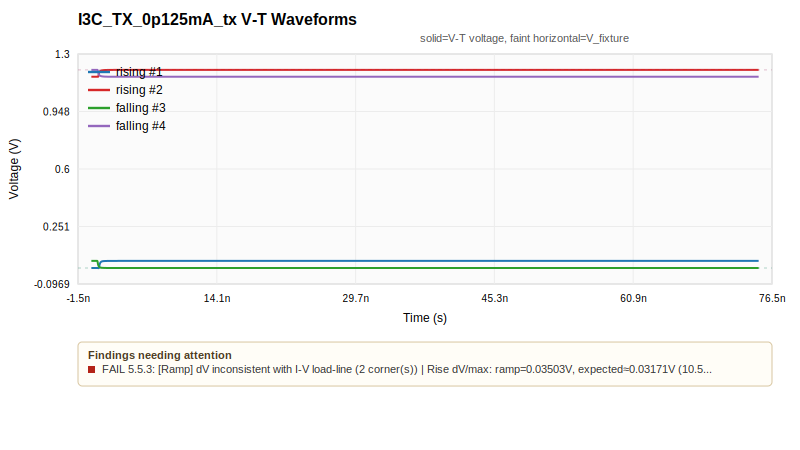
[Jump to V-T curves for I3C_TX_0p125mA_tx](#curve-i3c-tx-0p125ma-tx-waveform)

[Back to table of contents](#table-of-contents)

## Passed Items Per Level
<a id="passed-items-per-level"></a>

| Level | Required Items | Checked | Passed | NA | Needs Review | Failed | Error | Manual/External Review |
|---|---:|---:|---:|---:|---:|---:|---:|---:|
| LEVEL 1 | 1 | 1 | 1 | 0 | 0 | 0 | 0 | 0 |
| LEVEL 2 | 35 | 28 | 19 | 5 | 2 | 2 | 0 | 7 |
| LEVEL 3 | 14 | 4 | 1 | 3 | 0 | 0 | 0 | 10 |

## Zout Estimates
<a id="zout-estimates"></a>

Estimated output impedance is derived from Pullup/Pulldown I-V load-line intersections using Rload = 50 ohm. These values are characterization data for the model maker; they are not IQ PASS/FAIL checks.

- Models with estimates: 2 / 4
- Estimated table/corner points: 12

| Model | Type | Pulldown Zout typ/min/max | Pullup Zout typ/min/max | Load-line plot | Notes |
|---|---|---:|---:|---|---|
| I3C_RX_RPU0RPD0_rx | Input | NA / NA / NA | NA / NA / NA |  | No usable Pullup/Pulldown driver table. |
| I2C_RX_RPU1RPD0_rx | Input | NA / NA / NA | NA / NA / NA |  | No usable Pullup/Pulldown driver table. |
| I2C_TX_8mA_tx | I/O | 35.4 ohm / 45.6 ohm / 28.9 ohm | 34.8 ohm / 43.6 ohm / 28.5 ohm | [View plot](#curve-i2c-tx-8ma-tx-zout) | Estimated from available corners. |
| I3C_TX_0p125mA_tx | I/O | 1.39e+03 ohm / 1.9e+03 ohm / 1.11e+03 ohm | 1.34e+03 ohm / 1.75e+03 ohm / 1.08e+03 ohm | [View plot](#curve-i3c-tx-0p125ma-tx-zout) | Estimated from available corners. |

## Quality Check Results
<a id="quality-check-results"></a>

Rows are grouped by IQ level and then by check item. Each check item is summarized by result type so PASS, WARN, FAIL, NA, and manual/external-review status are visible in one place.

Source location note: this parser currently keeps the raw IBIS text but does not retain per-result IBIS source line numbers. The report identifies the affected scope, subject, and evidence; exact line references require parser metadata work.

### LEVEL 1 Check Results
<a id="level-1-check-results"></a>


#### 2.1 - IBIS file passes IBISCHK
<a id="check-2-1"></a>

- Automation class: `auto`
- Spec reference: Quality spec source line 303; section 2

| Type | Outcome | Pass | Warn | Fail | NA | Error | Review | Subjects | Visual Curves | Explanation / Details |
|---|---|---:|---:|---:|---:|---:|---:|---|---|---|
| File/Header | PASS | 3 | 0 | 0 | 0 | 0 | 0 | hibiki_iocl_i3c_i2c_ibis_20260211.ibs |  | No existing '\|IQ Score:' tag found inside the .ibs file. This is reported as a writeback note only; it does not fail the quality check because this tool is intended to help assign the score.<br>IBISCHK version not found documented inside the .ibs file. This is reported as a documentation note only; it does not block Level 1.<br>IBISCHK: 0 errors, 0 warning(s): IBISCHK executable: ibischk7_64.exe |

**IBISCHK execution summary**

| Field | Value |
|---|---|
| Executable | ibischk7_64.exe |
| Version | 7.2.1 |
| Return code | 0 |
| Errors | 0 |
| Warnings | 0 |
| Cautions | 0 |

**IBISCHK output excerpt**

```text
IBISCHK7 V7.2.1

Checking C:\Users\simom\Desktop\Projects\IBIS Files\Hibiki_IOCL_I3C_I2C_ibis_20260211.ibs for IBIS 4.2 Compatibility...

NOTE (line  116) - GND Clamp Minimum data is non-monotonic
NOTE (line  119) - GND Clamp Typical data is non-monotonic
NOTE (line  120) - GND Clamp Maximum data is non-monotonic
NOTE (line  308) - GND Clamp Minimum data is non-monotonic
NOTE (line  311) - GND Clamp Typical data is non-monotonic
NOTE (line  312) - GND Clamp Maximum data is non-monotonic
NOTE (line  506) - GND Clamp Minimum data is non-monotonic
NOTE (line  509) - GND Clamp Typical data is non-monotonic
NOTE (line  510) - GND Clamp Maximum data is non-monotonic
NOTE (line  688) - Pullup Minimum data is non-monotonic
NOTE (line  691) - Pullup Typical data is non-monotonic
NOTE (line  698) - Pullup Maximum data is non-monotonic
NOTE (line  775) - Pulldown Minimum data is non-monotonic
NOTE (line  780) - Pulldown Typical data is non-monotonic
NOTE (line  785) - Pulldown Maximum data is non-monotonic
NOTE (line 3965) - GND Clamp Minimum data is non-monotonic
NOTE (line 3968) - GND Clamp Typical data is non-monotonic
NOTE (line 3969) - GND Clamp Maximum data is non-monotonic
NOTE (line 4146) - Pullup Minimum data is non-monotonic
NOTE (line 4153) - Pullup Typical data is non-monotonic
NOTE (line 4162) - Pullup Maximum data is non-monotonic
```

[Back to table of contents](#table-of-contents)

### LEVEL 2 Check Results
<a id="level-2-check-results"></a>


#### 3.1.1 - [Package] must have typ/min/max values
<a id="check-3-1-1"></a>

- Automation class: `auto`
- Spec reference: Quality spec source line 347; section 3.1

| Type | Outcome | Pass | Warn | Fail | NA | Error | Review | Subjects | Visual Curves | Explanation / Details |
|---|---|---:|---:|---:|---:|---:|---:|---|---|---|
| Component | NA | 0 | 0 | 0 | 1 | 0 | 0 | A11486_IBIS-00001760 |  | Bare-die component — stub package values expected, check NA |

[Back to table of contents](#table-of-contents)

#### 3.1.2 - [Package] model values must be reasonable
<a id="check-3-1-2"></a>

- Automation class: `semi_auto`
- Spec reference: Quality spec source line 351; section 3.1

| Type | Outcome | Pass | Warn | Fail | NA | Error | Review | Subjects | Visual Curves | Explanation / Details |
|---|---|---:|---:|---:|---:|---:|---:|---|---|---|
| Component | NA | 0 | 0 | 0 | 1 | 0 | 0 | A11486_IBIS-00001760 |  | Bare-die component — package limits check NA |

[Back to table of contents](#table-of-contents)

#### 3.2.1 - [Pin] section complete
<a id="check-3-2-1"></a>

- Automation class: `semi_auto`
- Spec reference: Quality spec source line 422; section 3.2

| Type | Outcome | Pass | Warn | Fail | NA | Error | Review | Subjects | Visual Curves | Explanation / Details |
|---|---|---:|---:|---:|---:|---:|---:|---|---|---|
| Component | PASS | 1 | 0 | 0 | 0 | 0 | 0 | A11486_IBIS-00001760 |  | [Pin] has 2 complete entry/entries with resolvable model references |

[Back to table of contents](#table-of-contents)

#### 3.3.1 - [Diff Pin] referenced pin models match
<a id="check-3-3-1"></a>

- Automation class: `auto`
- Spec reference: Quality spec source line 459; section 3.3

| Type | Outcome | Pass | Warn | Fail | NA | Error | Review | Subjects | Visual Curves | Explanation / Details |
|---|---|---:|---:|---:|---:|---:|---:|---|---|---|
| Component | NA | 0 | 0 | 0 | 1 | 0 | 0 | A11486_IBIS-00001760 |  | No [Diff Pin] section — check NA |

[Back to table of contents](#table-of-contents)

#### 4.1 - [Model Selector] entries have reasonable descriptions
<a id="check-4-1"></a>

- Automation class: `semi_auto`
- Spec reference: Quality spec source line 493; section 4

| Type | Outcome | Pass | Warn | Fail | NA | Error | Review | Subjects | Visual Curves | Explanation / Details |
|---|---|---:|---:|---:|---:|---:|---:|---|---|---|
| File/Header | PASS | 1 | 0 | 0 | 0 | 0 | 0 | hibiki_iocl_i3c_i2c_ibis_20260211.ibs |  | [Model Selector] A11486_IBIS-00001760 has descriptions for 4 entry/entries |

[Back to table of contents](#table-of-contents)

#### 4.2 - Default [Model Selector] entries are consistent
<a id="check-4-2"></a>

- Automation class: `manual`
- Spec reference: Quality spec source line 497; section 4

| Type | Outcome | Pass | Warn | Fail | NA | Error | Review | Subjects | Visual Curves | Explanation / Details |
|---|---|---:|---:|---:|---:|---:|---:|---|---|---|
| Manual/External | MANUAL REVIEW | 0 | 0 | 0 | 0 | 0 | 1 | Applies where relevant |  | Not executed by the automated tool; this item needs model-maker or reviewer evidence. |

[Back to table of contents](#table-of-contents)

#### 5.1.1 - [Model] parameters have correct typ/min/max order
<a id="check-5-1-1"></a>

- Automation class: `semi_auto`
- Spec reference: Quality spec source line 511; section 5.1

| Type | Outcome | Pass | Warn | Fail | NA | Error | Review | Subjects | Visual Curves | Explanation / Details |
|---|---|---:|---:|---:|---:|---:|---:|---|---|---|
| Model | PASS | 4 | 0 | 0 | 0 | 0 | 0 | I3C_RX_RPU0RPD0_rx<br>I2C_RX_RPU1RPD0_rx<br>I2C_TX_8mA_tx<br>I3C_TX_0p125mA_tx |  | 4x 7 model parameter set(s) have typ/min/max order evidence: C_comp; Voltage Range |

[Back to table of contents](#table-of-contents)

#### 5.1.2 - [Model] C_comp is reasonable
<a id="check-5-1-2"></a>

- Automation class: `semi_auto`
- Spec reference: Quality spec source line 517; section 5.1

| Type | Outcome | Pass | Warn | Fail | NA | Error | Review | Subjects | Visual Curves | Explanation / Details |
|---|---|---:|---:|---:|---:|---:|---:|---|---|---|
| Model | PASS | 4 | 0 | 0 | 0 | 0 | 0 | I3C_RX_RPU0RPD0_rx<br>I2C_RX_RPU1RPD0_rx<br>I2C_TX_8mA_tx<br>I3C_TX_0p125mA_tx |  | 4x C_comp evidence is positive and within review threshold: C_comp |

[Back to table of contents](#table-of-contents)

#### 5.1.3 - [Temperature Range] is reasonable
<a id="check-5-1-3"></a>

- Automation class: `manual`
- Spec reference: Quality spec source line 547; section 5.1

| Type | Outcome | Pass | Warn | Fail | NA | Error | Review | Subjects | Visual Curves | Explanation / Details |
|---|---|---:|---:|---:|---:|---:|---:|---|---|---|
| Manual/External | MANUAL REVIEW | 0 | 0 | 0 | 0 | 0 | 1 | Applies where relevant |  | Not executed by the automated tool; this item needs model-maker or reviewer evidence. |

[Back to table of contents](#table-of-contents)

#### 5.1.4 - [Voltage Range] or [* Reference] is reasonable
<a id="check-5-1-4"></a>

- Automation class: `semi_auto`
- Spec reference: Quality spec source line 571; section 5.1

| Type | Outcome | Pass | Warn | Fail | NA | Error | Review | Subjects | Visual Curves | Explanation / Details |
|---|---|---:|---:|---:|---:|---:|---:|---|---|---|
| Model | PASS | 4 | 0 | 0 | 0 | 0 | 0 | I3C_RX_RPU0RPD0_rx<br>I2C_RX_RPU1RPD0_rx<br>I2C_TX_8mA_tx<br>I3C_TX_0p125mA_tx |  | 4x Voltage/reference evidence parsed, defaults resolved, and basic consistency looks reasonable: Voltage Range: typ=1.2V, min=1.08V, max=1.32V (explicit); Pullup Reference: typ=1.2V, min=1.08V, max=1.32V (explicit) |

[Back to table of contents](#table-of-contents)

#### 5.2.5 - [Model Spec] S_Overshoot subparameters complete and match data sheet
<a id="check-5-2-5"></a>

- Automation class: `manual`
- Spec reference: Quality spec source line 625; section 5.2

| Type | Outcome | Pass | Warn | Fail | NA | Error | Review | Subjects | Visual Curves | Explanation / Details |
|---|---|---:|---:|---:|---:|---:|---:|---|---|---|
| Manual/External | MANUAL REVIEW | 0 | 0 | 0 | 0 | 0 | 1 | Applies where relevant |  | Not executed by the automated tool; this item needs model-maker or reviewer evidence. |

[Back to table of contents](#table-of-contents)

#### 5.2.6 - [Model Spec] S_Overshoot subparameters track typ/min/max
<a id="check-5-2-6"></a>

- Automation class: `semi_auto`
- Spec reference: Quality spec source line 629; section 5.2

| Type | Outcome | Pass | Warn | Fail | NA | Error | Review | Subjects | Visual Curves | Explanation / Details |
|---|---|---:|---:|---:|---:|---:|---:|---|---|---|
| Model | NA | 0 | 0 | 0 | 4 | 0 | 0 | I3C_RX_RPU0RPD0_rx<br>I2C_RX_RPU1RPD0_rx<br>I2C_TX_8mA_tx<br>I3C_TX_0p125mA_tx |  | 2x No [Model Spec] S_Overshoot data parsed<br>2x No complete S_Overshoot typ/min/max values parsed |

[Back to table of contents](#table-of-contents)

#### 5.2.7 - [Model Spec] D_Overshoot_* subparameters complete and match data sheet
<a id="check-5-2-7"></a>

- Automation class: `manual`
- Spec reference: Quality spec source line 633; section 5.2

| Type | Outcome | Pass | Warn | Fail | NA | Error | Review | Subjects | Visual Curves | Explanation / Details |
|---|---|---:|---:|---:|---:|---:|---:|---|---|---|
| Manual/External | MANUAL REVIEW | 0 | 0 | 0 | 0 | 0 | 1 | Applies where relevant |  | Not executed by the automated tool; this item needs model-maker or reviewer evidence. |

[Back to table of contents](#table-of-contents)

#### 5.2.8 - [Model Spec] D_Overshoot_* subparameters track typ/min/max
<a id="check-5-2-8"></a>

- Automation class: `semi_auto`
- Spec reference: Quality spec source line 643; section 5.2

| Type | Outcome | Pass | Warn | Fail | NA | Error | Review | Subjects | Visual Curves | Explanation / Details |
|---|---|---:|---:|---:|---:|---:|---:|---|---|---|
| Model | NA | 0 | 0 | 0 | 4 | 0 | 0 | I3C_RX_RPU0RPD0_rx<br>I2C_RX_RPU1RPD0_rx<br>I2C_TX_8mA_tx<br>I3C_TX_0p125mA_tx |  | 2x No [Model Spec] D_Overshoot data parsed<br>2x No complete D_Overshoot typ/min/max values parsed |

[Back to table of contents](#table-of-contents)

#### 5.3.1 - I-V tables have correct typ/min/max order
<a id="check-5-3-1"></a>

- Automation class: `auto`
- Spec reference: Quality spec source line 705; section 5.3

| Type | Outcome | Pass | Warn | Fail | NA | Error | Review | Subjects | Visual Curves | Explanation / Details |
|---|---|---:|---:|---:|---:|---:|---:|---|---|---|
| Model | PASS | 12 | 0 | 0 | 0 | 0 | 0 | I3C_RX_RPU0RPD0_rx<br>I2C_RX_RPU1RPD0_rx<br>I2C_TX_8mA_tx<br>I3C_TX_0p125mA_tx |  | 4x [GND Clamp] rows are voltage/typ/min/max<br>4x [POWER Clamp] rows are voltage/typ/min/max<br>2x [Pulldown] rows are voltage/typ/min/max with expected active-region corner ordering<br>1 more evidence message(s) |

[Back to table of contents](#table-of-contents)

#### 5.3.2 - [Pullup] voltage sweep range is correct
<a id="check-5-3-2"></a>

- Automation class: `auto`
- Spec reference: Quality spec source line 715; section 5.3

| Type | Outcome | Pass | Warn | Fail | NA | Error | Review | Subjects | Visual Curves | Explanation / Details |
|---|---|---:|---:|---:|---:|---:|---:|---|---|---|
| Model | PASS | 2 | 0 | 0 | 2 | 0 | 0 | I3C_RX_RPU0RPD0_rx<br>I2C_RX_RPU1RPD0_rx<br>I2C_TX_8mA_tx<br>I3C_TX_0p125mA_tx |  | 2x Model_type=Input has no required [Pullup] table - NA<br>2x [Pullup] voltage sweep OK (-1.2V to 2.4V) |

[Back to table of contents](#table-of-contents)

#### 5.3.3 - [Pulldown] voltage sweep range is correct
<a id="check-5-3-3"></a>

- Automation class: `auto`
- Spec reference: Quality spec source line 719; section 5.3

| Type | Outcome | Pass | Warn | Fail | NA | Error | Review | Subjects | Visual Curves | Explanation / Details |
|---|---|---:|---:|---:|---:|---:|---:|---|---|---|
| Model | PASS | 2 | 0 | 0 | 2 | 0 | 0 | I3C_RX_RPU0RPD0_rx<br>I2C_RX_RPU1RPD0_rx<br>I2C_TX_8mA_tx<br>I3C_TX_0p125mA_tx |  | 2x Model_type=Input has no required [Pulldown] table - NA<br>2x [Pulldown] voltage sweep OK (-1.2V to 2.4V) |

[Back to table of contents](#table-of-contents)

#### 5.3.4 - [POWER Clamp] voltage sweep range is correct
<a id="check-5-3-4"></a>

- Automation class: `auto`
- Spec reference: Quality spec source line 723; section 5.3

| Type | Outcome | Pass | Warn | Fail | NA | Error | Review | Subjects | Visual Curves | Explanation / Details |
|---|---|---:|---:|---:|---:|---:|---:|---|---|---|
| Model | PASS | 4 | 0 | 0 | 0 | 0 | 0 | I3C_RX_RPU0RPD0_rx<br>I2C_RX_RPU1RPD0_rx<br>I2C_TX_8mA_tx<br>I3C_TX_0p125mA_tx |  | 4x [POWER Clamp] voltage sweep OK (-1.2V to 2.4V) |

[Back to table of contents](#table-of-contents)

#### 5.3.5 - [GND Clamp] voltage sweep range is correct
<a id="check-5-3-5"></a>

- Automation class: `auto`
- Spec reference: Quality spec source line 731; section 5.3

| Type | Outcome | Pass | Warn | Fail | NA | Error | Review | Subjects | Visual Curves | Explanation / Details |
|---|---|---:|---:|---:|---:|---:|---:|---|---|---|
| Model | PASS | 4 | 0 | 0 | 0 | 0 | 0 | I3C_RX_RPU0RPD0_rx<br>I2C_RX_RPU1RPD0_rx<br>I2C_TX_8mA_tx<br>I3C_TX_0p125mA_tx |  | 4x [GND Clamp] voltage sweep OK (-1.2V to 2.4V) |

[Back to table of contents](#table-of-contents)

#### 5.3.6 - I-V tables do not exhibit stair-stepping
<a id="check-5-3-6"></a>

- Automation class: `semi_auto`
- Spec reference: Quality spec source line 735; section 5.3

| Type | Outcome | Pass | Warn | Fail | NA | Error | Review | Subjects | Visual Curves | Explanation / Details |
|---|---|---:|---:|---:|---:|---:|---:|---|---|---|
| Model | WARN | 0 | 4 | 0 | 0 | 0 | 4 | I3C_RX_RPU0RPD0_rx<br>I2C_RX_RPU1RPD0_rx<br>I2C_TX_8mA_tx<br>I3C_TX_0p125mA_tx | [I3C_RX_RPU0RPD0_rx I-V curves](#curve-i3c-rx-rpu0rpd0-rx-iv)<br>[I2C_RX_RPU1RPD0_rx I-V curves](#curve-i2c-rx-rpu1rpd0-rx-iv)<br>[I2C_TX_8mA_tx I-V curves](#curve-i2c-tx-8ma-tx-iv)<br>[I3C_TX_0p125mA_tx I-V curves](#curve-i3c-tx-0p125ma-tx-iv) | 4x I-V stair-step evidence needs review: [GND Clamp]: roughness=0.262 > 0.1; [POWER Clamp]: roughness=0.2 > 0.1 |

[Back to table of contents](#table-of-contents)

#### 5.3.7 - Combined I-V tables are monotonic
<a id="check-5-3-7"></a>

- Automation class: `auto`
- Spec reference: Quality spec source line 741; section 5.3

| Type | Outcome | Pass | Warn | Fail | NA | Error | Review | Subjects | Visual Curves | Explanation / Details |
|---|---|---:|---:|---:|---:|---:|---:|---|---|---|
| Model | FAIL | 2 | 0 | 6 | 0 | 0 | 0 | I3C_RX_RPU0RPD0_rx<br>I2C_RX_RPU1RPD0_rx<br>I2C_TX_8mA_tx<br>I3C_TX_0p125mA_tx | [I3C_RX_RPU0RPD0_rx I-V curves](#curve-i3c-rx-rpu0rpd0-rx-iv)<br>[I2C_RX_RPU1RPD0_rx I-V curves](#curve-i2c-rx-rpu1rpd0-rx-iv)<br>[I2C_TX_8mA_tx I-V curves](#curve-i2c-tx-8ma-tx-iv)<br>[I3C_TX_0p125mA_tx I-V curves](#curve-i3c-tx-0p125ma-tx-iv) | [Pulldown] + [GND Clamp] combined curve non-monotonic (1 violation(s)): V=1.238: combined current decreases from 4.698e-06mA to 0mA<br>[Pulldown] + [GND Clamp] combined curve non-monotonic (1 violation(s)): V=1.238: combined current decreases from 4.695e-06mA to 0mA<br>[Pulldown] + [GND Clamp] combined curve non-monotonic (18 violation(s)): V=1.725: combined current decreases from 43.22mA to 43.1mA; V=1.762: combined current decreases from 43.1mA to 42.84mA<br>3 more evidence message(s) |

[Back to table of contents](#table-of-contents)

#### 5.3.8 - [Pulldown] I-V tables pass through zero/zero
<a id="check-5-3-8"></a>

- Automation class: `auto`
- Spec reference: Quality spec source line 749; section 5.3

| Type | Outcome | Pass | Warn | Fail | NA | Error | Review | Subjects | Visual Curves | Explanation / Details |
|---|---|---:|---:|---:|---:|---:|---:|---|---|---|
| Model | PASS | 2 | 0 | 0 | 2 | 0 | 0 | I3C_RX_RPU0RPD0_rx<br>I2C_RX_RPU1RPD0_rx<br>I2C_TX_8mA_tx<br>I3C_TX_0p125mA_tx |  | 2x Model_type=Input has no required [Pulldown] table - NA<br>2x [Pulldown] passes through near 0 at 0V (within +/-1uA) |

[Back to table of contents](#table-of-contents)

#### 5.3.9 - [Pullup] I-V tables pass through zero/zero
<a id="check-5-3-9"></a>

- Automation class: `auto`
- Spec reference: Quality spec source line 753; section 5.3

| Type | Outcome | Pass | Warn | Fail | NA | Error | Review | Subjects | Visual Curves | Explanation / Details |
|---|---|---:|---:|---:|---:|---:|---:|---|---|---|
| Model | PASS | 2 | 0 | 0 | 2 | 0 | 0 | I3C_RX_RPU0RPD0_rx<br>I2C_RX_RPU1RPD0_rx<br>I2C_TX_8mA_tx<br>I3C_TX_0p125mA_tx |  | 2x Model_type=Input has no required [Pullup] table - NA<br>2x [Pullup] passes through near 0 at 0V (within +/-1uA) |

[Back to table of contents](#table-of-contents)

#### 5.3.10 - No leakage current in clamp I-V tables
<a id="check-5-3-10"></a>

- Automation class: `semi_auto`
- Spec reference: Quality spec source line 757; section 5.3

| Type | Outcome | Pass | Warn | Fail | NA | Error | Review | Subjects | Visual Curves | Explanation / Details |
|---|---|---:|---:|---:|---:|---:|---:|---|---|---|
| Model | WARN | 3 | 1 | 0 | 0 | 0 | 1 | I3C_RX_RPU0RPD0_rx<br>I2C_RX_RPU1RPD0_rx<br>I2C_TX_8mA_tx<br>I3C_TX_0p125mA_tx | [I2C_RX_RPU1RPD0_rx I-V clamp detail](#curve-i2c-rx-rpu1rpd0-rx-iv-clamp) | Clamp leakage evidence needs review: [GND Clamp]: I(0V)=-17.8 uA |

[Back to table of contents](#table-of-contents)

#### 5.3.11 - I-V behavior not double-counted
<a id="check-5-3-11"></a>

- Automation class: `manual`
- Spec reference: Quality spec source line 767; section 5.3

| Type | Outcome | Pass | Warn | Fail | NA | Error | Review | Subjects | Visual Curves | Explanation / Details |
|---|---|---:|---:|---:|---:|---:|---:|---|---|---|
| Manual/External | MANUAL REVIEW | 0 | 0 | 0 | 0 | 0 | 1 | Applies where relevant |  | Not executed by the automated tool; this item needs model-maker or reviewer evidence. |

[Back to table of contents](#table-of-contents)

#### 5.3.12 - On-die termination modeling documented
<a id="check-5-3-12"></a>

- Automation class: `manual`
- Spec reference: Quality spec source line 773; section 5.3

| Type | Outcome | Pass | Warn | Fail | NA | Error | Review | Subjects | Visual Curves | Explanation / Details |
|---|---|---:|---:|---:|---:|---:|---:|---|---|---|
| Manual/External | MANUAL REVIEW | 0 | 0 | 0 | 0 | 0 | 1 | Applies where relevant |  | Not executed by the automated tool; this item needs model-maker or reviewer evidence. |

[Back to table of contents](#table-of-contents)

#### 5.3.13 - ECL models I-V tables swept from -Vcc to +2 * Vcc.
<a id="check-5-3-13"></a>

- Automation class: `auto`
- Spec reference: Quality spec source line 777; section 5.3

| Type | Outcome | Pass | Warn | Fail | NA | Error | Review | Subjects | Visual Curves | Explanation / Details |
|---|---|---:|---:|---:|---:|---:|---:|---|---|---|
| Manual/External | MANUAL REVIEW | 0 | 0 | 0 | 0 | 0 | 1 | Applies where relevant |  | Not executed by the automated tool; this item needs model-maker or reviewer evidence. |

[Back to table of contents](#table-of-contents)

#### 5.3.14 - Point distributions in I-V tables should be sufficient
<a id="check-5-3-14"></a>

- Automation class: `semi_auto`
- Spec reference: Quality spec source line 781; section 5.3

| Type | Outcome | Pass | Warn | Fail | NA | Error | Review | Subjects | Visual Curves | Explanation / Details |
|---|---|---:|---:|---:|---:|---:|---:|---|---|---|
| Model | PASS | 4 | 0 | 0 | 0 | 0 | 0 | I3C_RX_RPU0RPD0_rx<br>I2C_RX_RPU1RPD0_rx<br>I2C_TX_8mA_tx<br>I3C_TX_0p125mA_tx |  | 4x I-V point counts meet evidence threshold |

[Back to table of contents](#table-of-contents)

#### 5.4.1 - Output and I/O buffers have sufficient V-T tables
<a id="check-5-4-1"></a>

- Automation class: `semi_auto`
- Spec reference: Quality spec source line 787; section 5.4

| Type | Outcome | Pass | Warn | Fail | NA | Error | Review | Subjects | Visual Curves | Explanation / Details |
|---|---|---:|---:|---:|---:|---:|---:|---|---|---|
| Model | PASS | 2 | 0 | 0 | 2 | 0 | 0 | I3C_RX_RPU0RPD0_rx<br>I2C_RX_RPU1RPD0_rx<br>I2C_TX_8mA_tx<br>I3C_TX_0p125mA_tx |  | 2x No V-T waveform tables parsed<br>2x V-T waveform evidence includes 2 rising and 2 falling table(s) |

[Back to table of contents](#table-of-contents)

#### 5.4.2 - V-T tables have reasonable point distribution
<a id="check-5-4-2"></a>

- Automation class: `semi_auto`
- Spec reference: Quality spec source line 807; section 5.4

| Type | Outcome | Pass | Warn | Fail | NA | Error | Review | Subjects | Visual Curves | Explanation / Details |
|---|---|---:|---:|---:|---:|---:|---:|---|---|---|
| Model | PASS | 2 | 0 | 0 | 2 | 0 | 0 | I3C_RX_RPU0RPD0_rx<br>I2C_RX_RPU1RPD0_rx<br>I2C_TX_8mA_tx<br>I3C_TX_0p125mA_tx |  | 2x No V-T waveform tables parsed<br>2x V-T point counts meet evidence threshold |

[Back to table of contents](#table-of-contents)

#### 5.4.4 - V-T table endpoints match fixture voltages
<a id="check-5-4-4"></a>

- Automation class: `semi_auto`
- Spec reference: Quality spec source line 817; section 5.4

| Type | Outcome | Pass | Warn | Fail | NA | Error | Review | Subjects | Visual Curves | Explanation / Details |
|---|---|---:|---:|---:|---:|---:|---:|---|---|---|
| Model | PASS | 2 | 0 | 0 | 2 | 0 | 0 | I3C_RX_RPU0RPD0_rx<br>I2C_RX_RPU1RPD0_rx<br>I2C_TX_8mA_tx<br>I3C_TX_0p125mA_tx |  | 2x No V-T waveform tables parsed<br>2x V-T endpoint fixture evidence is within threshold |

[Back to table of contents](#table-of-contents)

#### 5.5.1 - [Ramp] R_load present if value other than 50 ohms
<a id="check-5-5-1"></a>

- Automation class: `auto`
- Spec reference: Quality spec source line 833; section 5.5

| Type | Outcome | Pass | Warn | Fail | NA | Error | Review | Subjects | Visual Curves | Explanation / Details |
|---|---|---:|---:|---:|---:|---:|---:|---|---|---|
| Model | PASS | 2 | 0 | 0 | 0 | 0 | 0 | I2C_TX_8mA_tx<br>I3C_TX_0p125mA_tx |  | 2x R_load = 50.0Ω documented |

[Back to table of contents](#table-of-contents)

#### 5.5.2 - [Ramp] typ/min/max order is correct
<a id="check-5-5-2"></a>

- Automation class: `semi_auto`
- Spec reference: Quality spec source line 837; section 5.5

| Type | Outcome | Pass | Warn | Fail | NA | Error | Review | Subjects | Visual Curves | Explanation / Details |
|---|---|---:|---:|---:|---:|---:|---:|---|---|---|
| Model | PASS | 2 | 0 | 0 | 2 | 0 | 0 | I3C_RX_RPU0RPD0_rx<br>I2C_RX_RPU1RPD0_rx<br>I2C_TX_8mA_tx<br>I3C_TX_0p125mA_tx |  | 2x No [Ramp] data parsed<br>2x Ramp typ/min/max slew order evidence is ordered: dV/dt_r; dV/dt_f |

[Back to table of contents](#table-of-contents)

#### 5.5.3 - [Ramp] dV value is consistent with I-V table calculations
<a id="check-5-5-3"></a>

- Automation class: `auto`
- Spec reference: Quality spec source line 841; section 5.5

| Type | Outcome | Pass | Warn | Fail | NA | Error | Review | Subjects | Visual Curves | Explanation / Details |
|---|---|---:|---:|---:|---:|---:|---:|---|---|---|
| Model | FAIL | 0 | 0 | 2 | 0 | 0 | 0 | I2C_TX_8mA_tx<br>I3C_TX_0p125mA_tx | [I2C_TX_8mA_tx V-T curves](#curve-i2c-tx-8ma-tx-waveform)<br>[I3C_TX_0p125mA_tx V-T curves](#curve-i3c-tx-0p125ma-tx-waveform) | [Ramp] dV inconsistent with I-V load-line (2 corner(s)): Rise dV/max: ramp=0.5045V, expected≈0.4584V (10.0% error, limit 10.0%); Fall dV/max: ramp=0.5017V, expected≈0.4559V (10.0% error, limit 10.0%)<br>[Ramp] dV inconsistent with I-V load-line (2 corner(s)): Rise dV/max: ramp=0.03503V, expected≈0.03171V (10.5% error, limit 10.0%); Fall dV/max: ramp=0.03401V, expected≈0.03081V (10.4% error, limit 10.0%) |

[Back to table of contents](#table-of-contents)

#### 5.5.4 - [Ramp] dt is consistent with 20%-80% crossing time
<a id="check-5-5-4"></a>

- Automation class: `semi_auto`
- Spec reference: Quality spec source line 845; section 5.5

| Type | Outcome | Pass | Warn | Fail | NA | Error | Review | Subjects | Visual Curves | Explanation / Details |
|---|---|---:|---:|---:|---:|---:|---:|---|---|---|
| Model | PASS | 2 | 0 | 0 | 2 | 0 | 0 | I3C_RX_RPU0RPD0_rx<br>I2C_RX_RPU1RPD0_rx<br>I2C_TX_8mA_tx<br>I3C_TX_0p125mA_tx |  | 2x Ramp or V-T waveform data absent<br>Ramp dt evidence is near V-T 20-80% crossing span: avg Ramp dt=1.644e-10s, avg V-T 20-80% span=1.581e-10s, diff=4.0%<br>Ramp dt evidence is near V-T 20-80% crossing span: avg Ramp dt=1.658e-10s, avg V-T 20-80% span=1.594e-10s, diff=4.0% |

[Back to table of contents](#table-of-contents)

### LEVEL 3 Check Results
<a id="level-3-check-results"></a>


#### 3.2.2 - [Pin] RLC values are present and reasonable
<a id="check-3-2-2"></a>

- Automation class: `auto`
- Spec reference: Quality spec source line 442; section 3.2

| Type | Outcome | Pass | Warn | Fail | NA | Error | Review | Subjects | Visual Curves | Explanation / Details |
|---|---|---:|---:|---:|---:|---:|---:|---|---|---|
| Component | NA | 0 | 0 | 0 | 1 | 0 | 0 | A11486_IBIS-00001760 |  | Bare-die component - per-pin package RLC completeness is not required |

[Back to table of contents](#table-of-contents)

#### 3.3.2 - [Diff Pin] Vdiff and Tdelay_* complete and reasonable
<a id="check-3-3-2"></a>

- Automation class: `auto`
- Spec reference: Quality spec source line 463; section 3.3

| Type | Outcome | Pass | Warn | Fail | NA | Error | Review | Subjects | Visual Curves | Explanation / Details |
|---|---|---:|---:|---:|---:|---:|---:|---|---|---|
| Component | NA | 0 | 0 | 0 | 1 | 0 | 0 | A11486_IBIS-00001760 |  | No [Diff Pin] section — check NA |

[Back to table of contents](#table-of-contents)

#### 5.2.1 - [Model] Vinl and Vinh reasonable
<a id="check-5-2-1"></a>

- Automation class: `manual`
- Spec reference: Quality spec source line 599; section 5.2

| Type | Outcome | Pass | Warn | Fail | NA | Error | Review | Subjects | Visual Curves | Explanation / Details |
|---|---|---:|---:|---:|---:|---:|---:|---|---|---|
| Manual/External | MANUAL REVIEW | 0 | 0 | 0 | 0 | 0 | 1 | Applies where relevant |  | Not executed by the automated tool; this item needs model-maker or reviewer evidence. |

[Back to table of contents](#table-of-contents)

#### 5.2.2 - [Model Spec] Vinl and Vinh reasonable
<a id="check-5-2-2"></a>

- Automation class: `manual`
- Spec reference: Quality spec source line 605; section 5.2

| Type | Outcome | Pass | Warn | Fail | NA | Error | Review | Subjects | Visual Curves | Explanation / Details |
|---|---|---:|---:|---:|---:|---:|---:|---|---|---|
| Manual/External | MANUAL REVIEW | 0 | 0 | 0 | 0 | 0 | 1 | Applies where relevant |  | Not executed by the automated tool; this item needs model-maker or reviewer evidence. |

[Back to table of contents](#table-of-contents)

#### 5.2.3 - [Model Spec] Vinl+/- and Vinh+/- complete and reasonable
<a id="check-5-2-3"></a>

- Automation class: `manual`
- Spec reference: Quality spec source line 615; section 5.2

| Type | Outcome | Pass | Warn | Fail | NA | Error | Review | Subjects | Visual Curves | Explanation / Details |
|---|---|---:|---:|---:|---:|---:|---:|---|---|---|
| Manual/External | MANUAL REVIEW | 0 | 0 | 0 | 0 | 0 | 1 | Applies where relevant |  | Not executed by the automated tool; this item needs model-maker or reviewer evidence. |

[Back to table of contents](#table-of-contents)

#### 5.2.9 - [Receiver Thresholds] Vth present and matches data sheet, if needed
<a id="check-5-2-9"></a>

- Automation class: `manual`
- Spec reference: Quality spec source line 647; section 5.2

| Type | Outcome | Pass | Warn | Fail | NA | Error | Review | Subjects | Visual Curves | Explanation / Details |
|---|---|---:|---:|---:|---:|---:|---:|---|---|---|
| Manual/External | MANUAL REVIEW | 0 | 0 | 0 | 0 | 0 | 1 | Applies where relevant |  | Not executed by the automated tool; this item needs model-maker or reviewer evidence. |

[Back to table of contents](#table-of-contents)

#### 5.2.10 - [Receiver Thresholds] Vth_min and Vth_max present and match data sheet, if needed
<a id="check-5-2-10"></a>

- Automation class: `manual`
- Spec reference: Quality spec source line 653; section 5.2

| Type | Outcome | Pass | Warn | Fail | NA | Error | Review | Subjects | Visual Curves | Explanation / Details |
|---|---|---:|---:|---:|---:|---:|---:|---|---|---|
| Manual/External | MANUAL REVIEW | 0 | 0 | 0 | 0 | 0 | 1 | Applies where relevant |  | Not executed by the automated tool; this item needs model-maker or reviewer evidence. |

[Back to table of contents](#table-of-contents)

#### 5.2.11 - [Receiver Thresholds] Vinh_ac, Vinl_ac present and match data sheet, if needed
<a id="check-5-2-11"></a>

- Automation class: `manual`
- Spec reference: Quality spec source line 663; section 5.2

| Type | Outcome | Pass | Warn | Fail | NA | Error | Review | Subjects | Visual Curves | Explanation / Details |
|---|---|---:|---:|---:|---:|---:|---:|---|---|---|
| Manual/External | MANUAL REVIEW | 0 | 0 | 0 | 0 | 0 | 1 | Applies where relevant |  | Not executed by the automated tool; this item needs model-maker or reviewer evidence. |

[Back to table of contents](#table-of-contents)

#### 5.2.12 - [Receiver Thresholds] Vinh_dc, Vinl_dc present and match data sheet, if needed
<a id="check-5-2-12"></a>

- Automation class: `manual`
- Spec reference: Quality spec source line 673; section 5.2

| Type | Outcome | Pass | Warn | Fail | NA | Error | Review | Subjects | Visual Curves | Explanation / Details |
|---|---|---:|---:|---:|---:|---:|---:|---|---|---|
| Manual/External | MANUAL REVIEW | 0 | 0 | 0 | 0 | 0 | 1 | Applies where relevant |  | Not executed by the automated tool; this item needs model-maker or reviewer evidence. |

[Back to table of contents](#table-of-contents)

#### 5.2.13 - [Receiver Thresholds] Tslew_ac/Tdiffslew_ac present and match data sheet, if needed
<a id="check-5-2-13"></a>

- Automation class: `manual`
- Spec reference: Quality spec source line 679; section 5.2

| Type | Outcome | Pass | Warn | Fail | NA | Error | Review | Subjects | Visual Curves | Explanation / Details |
|---|---|---:|---:|---:|---:|---:|---:|---|---|---|
| Manual/External | MANUAL REVIEW | 0 | 0 | 0 | 0 | 0 | 1 | Applies where relevant |  | Not executed by the automated tool; this item needs model-maker or reviewer evidence. |

[Back to table of contents](#table-of-contents)

#### 5.2.14 - [Receiver Thresholds] Threshold_sensitivity and Ext_ref present and match data sheet, if needed
<a id="check-5-2-14"></a>

- Automation class: `manual`
- Spec reference: Quality spec source line 685; section 5.2

| Type | Outcome | Pass | Warn | Fail | NA | Error | Review | Subjects | Visual Curves | Explanation / Details |
|---|---|---:|---:|---:|---:|---:|---:|---|---|---|
| Manual/External | MANUAL REVIEW | 0 | 0 | 0 | 0 | 0 | 1 | Applies where relevant |  | Not executed by the automated tool; this item needs model-maker or reviewer evidence. |

[Back to table of contents](#table-of-contents)

#### 5.4.3 - V-T table duration is not excessive
<a id="check-5-4-3"></a>

- Automation class: `semi_auto`
- Spec reference: Quality spec source line 813; section 5.4

| Type | Outcome | Pass | Warn | Fail | NA | Error | Review | Subjects | Visual Curves | Explanation / Details |
|---|---|---:|---:|---:|---:|---:|---:|---|---|---|
| Model | PASS | 2 | 0 | 0 | 2 | 0 | 0 | I3C_RX_RPU0RPD0_rx<br>I2C_RX_RPU1RPD0_rx<br>I2C_TX_8mA_tx<br>I3C_TX_0p125mA_tx |  | 2x No V-T waveform tables parsed<br>2x V-T duration evidence is within threshold |

[Back to table of contents](#table-of-contents)

#### 5.6.1 - [Model Spec] Vmeas and Vref used if typ/min/max variation
<a id="check-5-6-1"></a>

- Automation class: `manual`
- Spec reference: Quality spec source line 861; section 5.6

| Type | Outcome | Pass | Warn | Fail | NA | Error | Review | Subjects | Visual Curves | Explanation / Details |
|---|---|---:|---:|---:|---:|---:|---:|---|---|---|
| Manual/External | MANUAL REVIEW | 0 | 0 | 0 | 0 | 0 | 1 | Applies where relevant |  | Not executed by the automated tool; this item needs model-maker or reviewer evidence. |

[Back to table of contents](#table-of-contents)

#### 5.6.2 - Vref consistent for Open-drain, Open-source, and ECL Model_types
<a id="check-5-6-2"></a>

- Automation class: `semi_auto`
- Spec reference: Quality spec source line 865; section 5.6

| Type | Outcome | Pass | Warn | Fail | NA | Error | Review | Subjects | Visual Curves | Explanation / Details |
|---|---|---:|---:|---:|---:|---:|---:|---|---|---|
| Model | NA | 0 | 0 | 0 | 4 | 0 | 0 | I3C_RX_RPU0RPD0_rx<br>I2C_RX_RPU1RPD0_rx<br>I2C_TX_8mA_tx<br>I3C_TX_0p125mA_tx |  | 2x Model_type=Input does not require this Vref consistency evidence<br>2x Model_type=I/O does not require this Vref consistency evidence |

[Back to table of contents](#table-of-contents)

## Visual Curves by Model
<a id="visual-curves-by-model"></a>

Figures provide curve/table context for the linked QA items. The quality-check tables above remain the authoritative status summary.
### Model: `I3C_RX_RPU0RPD0_rx`

- Candidate model score from model-scoped checked items: IQ1
- Model type: Input
- Waveform tables: 0


#### Visual Curves

##### I-V Clamp Curves
<a id="curve-i3c-rx-rpu0rpd0-rx-iv"></a>

Related WARN/FAIL QA items: [5.3.6](#check-5-3-6), [5.3.7](#check-5-3-7)


##### I-V clamp detail
<a id="curve-i3c-rx-rpu0rpd0-rx-iv-clamp"></a>

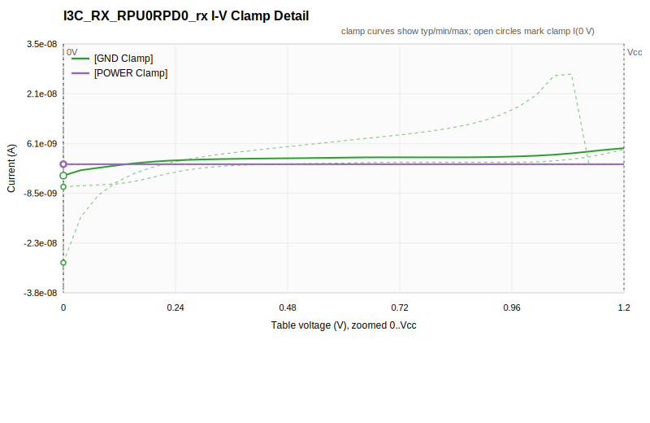

##### I-V clamp sweep range
<a id="curve-i3c-rx-rpu0rpd0-rx-iv-clamp-sweep"></a>


### Model: `I2C_RX_RPU1RPD0_rx`

- Candidate model score from model-scoped checked items: IQ1
- Model type: Input
- Waveform tables: 0


#### Visual Curves

##### I-V Clamp Curves
<a id="curve-i2c-rx-rpu1rpd0-rx-iv"></a>

Related WARN/FAIL QA items: [5.3.6](#check-5-3-6), [5.3.7](#check-5-3-7)


##### I-V clamp detail
<a id="curve-i2c-rx-rpu1rpd0-rx-iv-clamp"></a>

Related WARN/FAIL QA items: [5.3.10](#check-5-3-10)

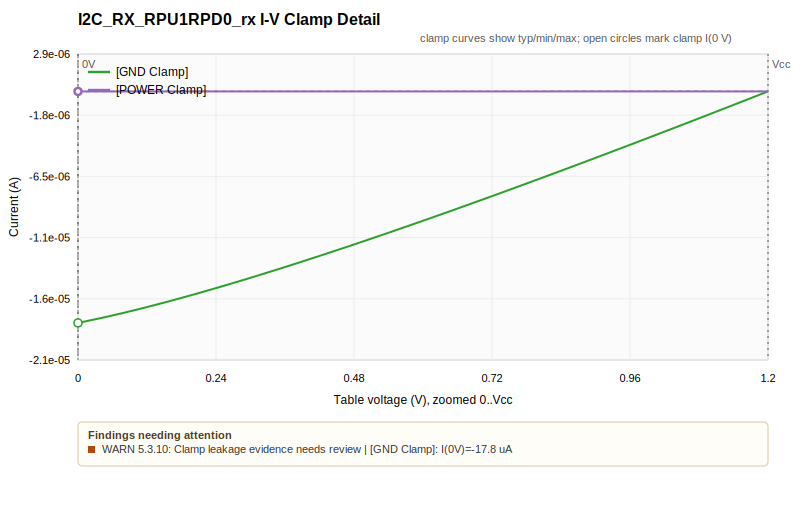

##### I-V clamp sweep range
<a id="curve-i2c-rx-rpu1rpd0-rx-iv-clamp-sweep"></a>

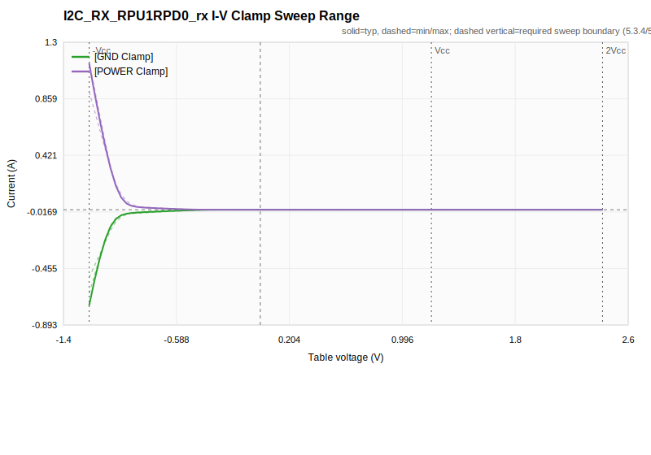


### Model: `I2C_TX_8mA_tx`

- Candidate model score from model-scoped checked items: IQ1
- Model type: I/O
- Waveform tables: 4


#### Visual Curves

##### I-V Combined Curves
<a id="curve-i2c-tx-8ma-tx-iv"></a>

Related WARN/FAIL QA items: [5.3.6](#check-5-3-6), [5.3.7](#check-5-3-7)


##### I-V clamp detail
<a id="curve-i2c-tx-8ma-tx-iv-clamp"></a>

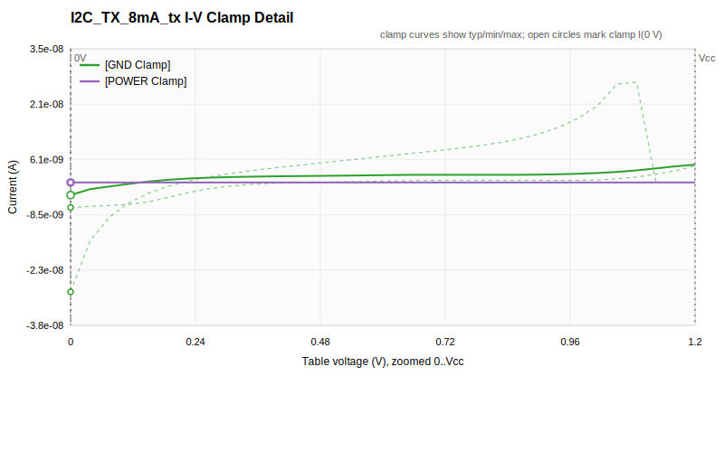

##### I-V pullup/pulldown 0 V detail
<a id="curve-i2c-tx-8ma-tx-iv-zero"></a>

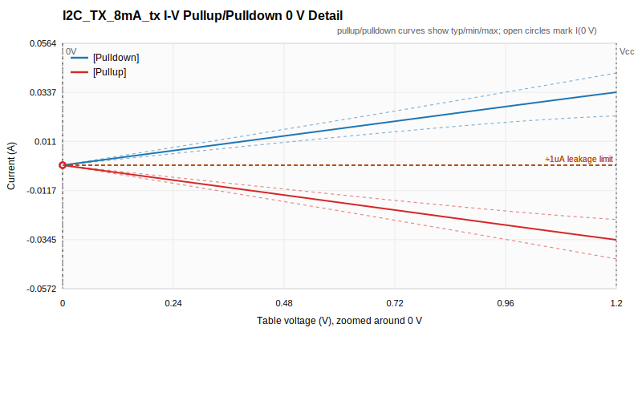

##### I-V clamp sweep range
<a id="curve-i2c-tx-8ma-tx-iv-clamp-sweep"></a>

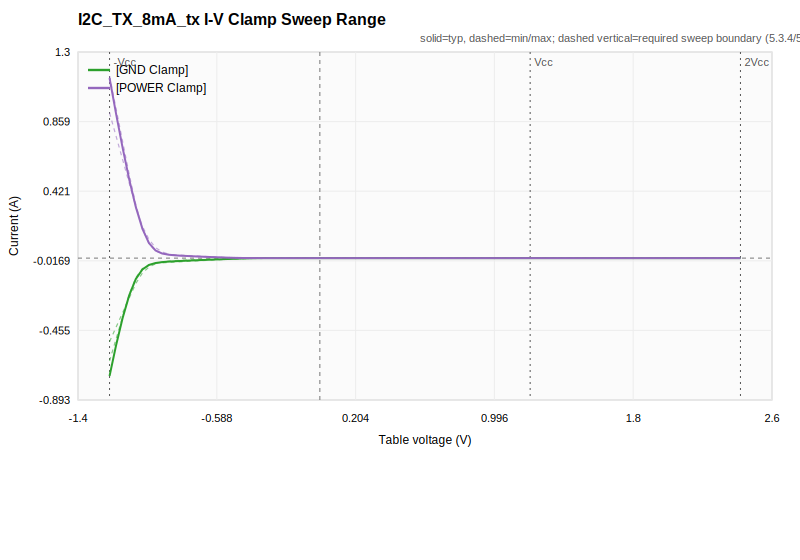

##### Zout load-line curves
<a id="curve-i2c-tx-8ma-tx-zout"></a>

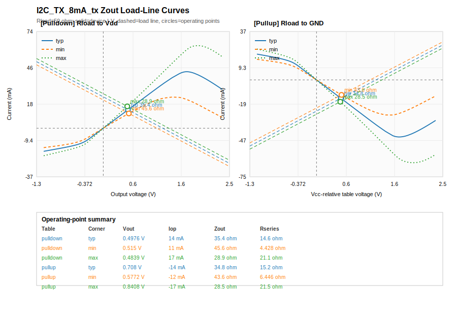

##### V-T waveforms
<a id="curve-i2c-tx-8ma-tx-waveform"></a>

Related WARN/FAIL QA items: [5.5.3](#check-5-5-3)


### Model: `I3C_TX_0p125mA_tx`

- Candidate model score from model-scoped checked items: IQ1
- Model type: I/O
- Waveform tables: 4


#### Visual Curves

##### I-V Combined Curves
<a id="curve-i3c-tx-0p125ma-tx-iv"></a>

Related WARN/FAIL QA items: [5.3.6](#check-5-3-6), [5.3.7](#check-5-3-7)


##### I-V clamp detail
<a id="curve-i3c-tx-0p125ma-tx-iv-clamp"></a>

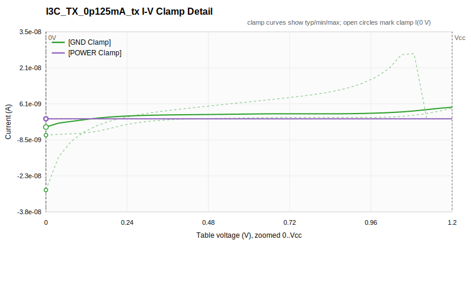

##### I-V pullup/pulldown 0 V detail
<a id="curve-i3c-tx-0p125ma-tx-iv-zero"></a>

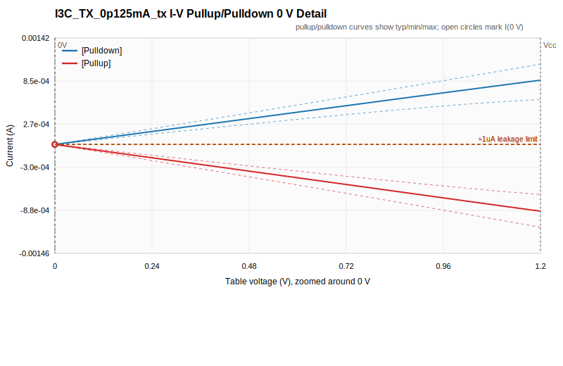

##### I-V clamp sweep range
<a id="curve-i3c-tx-0p125ma-tx-iv-clamp-sweep"></a>


##### Zout load-line curves
<a id="curve-i3c-tx-0p125ma-tx-zout"></a>

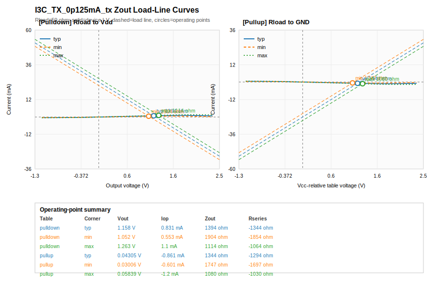

##### V-T waveforms
<a id="curve-i3c-tx-0p125ma-tx-waveform"></a>

Related WARN/FAIL QA items: [5.5.3](#check-5-5-3)


## Manual Review Items
<a id="manual-review-items"></a>

Manual items require external evidence such as datasheets, extraction notes, SPICE/measurement data, package files, or model-maker documentation.

| Level | Check | Scope | Subject | Decision | Evidence / Reference | Comment / Action |
|---|---|---|---|---|---|---|
| LEVEL 2 | 4.2 - Default [Model Selector] entries are consistent | Component | A11486_IBIS-00001760 | Pending | Default model selector consistency depends on product configuration and likely use cases. |  |
| LEVEL 2 | 5.1.3 - [Temperature Range] is reasonable | Model | I2C_RX_RPU1RPD0_rx | Pending | Requires extraction conditions, technology behavior, and datasheet operating temperature comparison. |  |
| LEVEL 2 | 5.1.3 - [Temperature Range] is reasonable | Model | I2C_TX_8mA_tx | Pending | Requires extraction conditions, technology behavior, and datasheet operating temperature comparison. |  |
| LEVEL 2 | 5.1.3 - [Temperature Range] is reasonable | Model | I3C_RX_RPU0RPD0_rx | Pending | Requires extraction conditions, technology behavior, and datasheet operating temperature comparison. |  |
| LEVEL 2 | 5.1.3 - [Temperature Range] is reasonable | Model | I3C_TX_0p125mA_tx | Pending | Requires extraction conditions, technology behavior, and datasheet operating temperature comparison. |  |
| LEVEL 2 | 5.2.5 - [Model Spec] S_Overshoot subparameters complete and match data sheet | Model | I2C_RX_RPU1RPD0_rx | Pending | Requires datasheet functional overshoot limits. |  |
| LEVEL 2 | 5.2.5 - [Model Spec] S_Overshoot subparameters complete and match data sheet | Model | I2C_TX_8mA_tx | Pending | Requires datasheet functional overshoot limits. |  |
| LEVEL 2 | 5.2.5 - [Model Spec] S_Overshoot subparameters complete and match data sheet | Model | I3C_RX_RPU0RPD0_rx | Pending | Requires datasheet functional overshoot limits. |  |
| LEVEL 2 | 5.2.5 - [Model Spec] S_Overshoot subparameters complete and match data sheet | Model | I3C_TX_0p125mA_tx | Pending | Requires datasheet functional overshoot limits. |  |
| LEVEL 2 | 5.2.7 - [Model Spec] D_Overshoot_* subparameters complete and match data sheet | Model | I2C_RX_RPU1RPD0_rx | Pending | Requires datasheet dynamic overshoot limits and documented conversion method. |  |
| LEVEL 2 | 5.2.7 - [Model Spec] D_Overshoot_* subparameters complete and match data sheet | Model | I2C_TX_8mA_tx | Pending | Requires datasheet dynamic overshoot limits and documented conversion method. |  |
| LEVEL 2 | 5.2.7 - [Model Spec] D_Overshoot_* subparameters complete and match data sheet | Model | I3C_RX_RPU0RPD0_rx | Pending | Requires datasheet dynamic overshoot limits and documented conversion method. |  |
| LEVEL 2 | 5.2.7 - [Model Spec] D_Overshoot_* subparameters complete and match data sheet | Model | I3C_TX_0p125mA_tx | Pending | Requires datasheet dynamic overshoot limits and documented conversion method. |  |
| LEVEL 2 | 5.3.11 - I-V behavior not double-counted | Model | I2C_RX_RPU1RPD0_rx | Pending | Double-counting of clamp, driver, and termination behavior needs curve/context review. |  |
| LEVEL 2 | 5.3.11 - I-V behavior not double-counted | Model | I2C_TX_8mA_tx | Pending | Double-counting of clamp, driver, and termination behavior needs curve/context review. |  |
| LEVEL 2 | 5.3.11 - I-V behavior not double-counted | Model | I3C_RX_RPU0RPD0_rx | Pending | Double-counting of clamp, driver, and termination behavior needs curve/context review. |  |
| LEVEL 2 | 5.3.11 - I-V behavior not double-counted | Model | I3C_TX_0p125mA_tx | Pending | Double-counting of clamp, driver, and termination behavior needs curve/context review. |  |
| LEVEL 2 | 5.3.12 - On-die termination modeling documented | Model | I2C_RX_RPU1RPD0_rx | Pending | Requires documentation review for on-die termination modeling method. |  |
| LEVEL 2 | 5.3.12 - On-die termination modeling documented | Model | I2C_TX_8mA_tx | Pending | Requires documentation review for on-die termination modeling method. |  |
| LEVEL 2 | 5.3.12 - On-die termination modeling documented | Model | I3C_RX_RPU0RPD0_rx | Pending | Requires documentation review for on-die termination modeling method. |  |
| LEVEL 2 | 5.3.12 - On-die termination modeling documented | Model | I3C_TX_0p125mA_tx | Pending | Requires documentation review for on-die termination modeling method. |  |
| LEVEL 3 | 5.2.1 - [Model] Vinl and Vinh reasonable | Model | I2C_RX_RPU1RPD0_rx | Pending | Requires comparing thresholds against datasheet and Vmeas intent. |  |
| LEVEL 3 | 5.2.1 - [Model] Vinl and Vinh reasonable | Model | I2C_TX_8mA_tx | Pending | Requires comparing thresholds against datasheet and Vmeas intent. |  |
| LEVEL 3 | 5.2.1 - [Model] Vinl and Vinh reasonable | Model | I3C_RX_RPU0RPD0_rx | Pending | Requires comparing thresholds against datasheet and Vmeas intent. |  |
| LEVEL 3 | 5.2.1 - [Model] Vinl and Vinh reasonable | Model | I3C_TX_0p125mA_tx | Pending | Requires comparing thresholds against datasheet and Vmeas intent. |  |
| LEVEL 3 | 5.2.2 - [Model Spec] Vinl and Vinh reasonable | Model | I2C_RX_RPU1RPD0_rx | Pending | Requires datasheet threshold ranges and supply variation interpretation. |  |
| LEVEL 3 | 5.2.2 - [Model Spec] Vinl and Vinh reasonable | Model | I2C_TX_8mA_tx | Pending | Requires datasheet threshold ranges and supply variation interpretation. |  |
| LEVEL 3 | 5.2.2 - [Model Spec] Vinl and Vinh reasonable | Model | I3C_RX_RPU0RPD0_rx | Pending | Requires datasheet threshold ranges and supply variation interpretation. |  |
| LEVEL 3 | 5.2.2 - [Model Spec] Vinl and Vinh reasonable | Model | I3C_TX_0p125mA_tx | Pending | Requires datasheet threshold ranges and supply variation interpretation. |  |
| LEVEL 3 | 5.2.3 - [Model Spec] Vinl+/- and Vinh+/- complete and reasonable | Model | I2C_RX_RPU1RPD0_rx | Pending | Requires datasheet/hysteresis intent plus comment review for exceptions. |  |
| LEVEL 3 | 5.2.3 - [Model Spec] Vinl+/- and Vinh+/- complete and reasonable | Model | I2C_TX_8mA_tx | Pending | Requires datasheet/hysteresis intent plus comment review for exceptions. |  |
| LEVEL 3 | 5.2.3 - [Model Spec] Vinl+/- and Vinh+/- complete and reasonable | Model | I3C_RX_RPU0RPD0_rx | Pending | Requires datasheet/hysteresis intent plus comment review for exceptions. |  |
| LEVEL 3 | 5.2.3 - [Model Spec] Vinl+/- and Vinh+/- complete and reasonable | Model | I3C_TX_0p125mA_tx | Pending | Requires datasheet/hysteresis intent plus comment review for exceptions. |  |
| LEVEL 3 | 5.2.9 - [Receiver Thresholds] Vth present and matches data sheet, if needed | Model | I2C_RX_RPU1RPD0_rx | Pending | Requires datasheet timing threshold and receiver-threshold applicability. |  |
| LEVEL 3 | 5.2.9 - [Receiver Thresholds] Vth present and matches data sheet, if needed | Model | I2C_TX_8mA_tx | Pending | Requires datasheet timing threshold and receiver-threshold applicability. |  |
| LEVEL 3 | 5.2.9 - [Receiver Thresholds] Vth present and matches data sheet, if needed | Model | I3C_RX_RPU0RPD0_rx | Pending | Requires datasheet timing threshold and receiver-threshold applicability. |  |
| LEVEL 3 | 5.2.9 - [Receiver Thresholds] Vth present and matches data sheet, if needed | Model | I3C_TX_0p125mA_tx | Pending | Requires datasheet timing threshold and receiver-threshold applicability. |  |
| LEVEL 3 | 5.2.10 - [Receiver Thresholds] Vth_min and Vth_max present and match data sheet, if needed | Model | I2C_RX_RPU1RPD0_rx | Pending | Requires datasheet Vth tolerance interpretation. |  |
| LEVEL 3 | 5.2.10 - [Receiver Thresholds] Vth_min and Vth_max present and match data sheet, if needed | Model | I2C_TX_8mA_tx | Pending | Requires datasheet Vth tolerance interpretation. |  |
| LEVEL 3 | 5.2.10 - [Receiver Thresholds] Vth_min and Vth_max present and match data sheet, if needed | Model | I3C_RX_RPU0RPD0_rx | Pending | Requires datasheet Vth tolerance interpretation. |  |
| LEVEL 3 | 5.2.10 - [Receiver Thresholds] Vth_min and Vth_max present and match data sheet, if needed | Model | I3C_TX_0p125mA_tx | Pending | Requires datasheet Vth tolerance interpretation. |  |
| LEVEL 3 | 5.2.11 - [Receiver Thresholds] Vinh_ac, Vinl_ac present and match data sheet, if needed | Model | I2C_RX_RPU1RPD0_rx | Pending | Requires datasheet AC threshold values and offset conversion review. |  |
| LEVEL 3 | 5.2.11 - [Receiver Thresholds] Vinh_ac, Vinl_ac present and match data sheet, if needed | Model | I2C_TX_8mA_tx | Pending | Requires datasheet AC threshold values and offset conversion review. |  |
| LEVEL 3 | 5.2.11 - [Receiver Thresholds] Vinh_ac, Vinl_ac present and match data sheet, if needed | Model | I3C_RX_RPU0RPD0_rx | Pending | Requires datasheet AC threshold values and offset conversion review. |  |
| LEVEL 3 | 5.2.11 - [Receiver Thresholds] Vinh_ac, Vinl_ac present and match data sheet, if needed | Model | I3C_TX_0p125mA_tx | Pending | Requires datasheet AC threshold values and offset conversion review. |  |
| LEVEL 3 | 5.2.12 - [Receiver Thresholds] Vinh_dc, Vinl_dc present and match data sheet, if needed | Model | I2C_RX_RPU1RPD0_rx | Pending | Requires datasheet DC threshold values and offset conversion review. |  |
| LEVEL 3 | 5.2.12 - [Receiver Thresholds] Vinh_dc, Vinl_dc present and match data sheet, if needed | Model | I2C_TX_8mA_tx | Pending | Requires datasheet DC threshold values and offset conversion review. |  |
| LEVEL 3 | 5.2.12 - [Receiver Thresholds] Vinh_dc, Vinl_dc present and match data sheet, if needed | Model | I3C_RX_RPU0RPD0_rx | Pending | Requires datasheet DC threshold values and offset conversion review. |  |
| LEVEL 3 | 5.2.12 - [Receiver Thresholds] Vinh_dc, Vinl_dc present and match data sheet, if needed | Model | I3C_TX_0p125mA_tx | Pending | Requires datasheet DC threshold values and offset conversion review. |  |
| LEVEL 3 | 5.2.13 - [Receiver Thresholds] Tslew_ac/Tdiffslew_ac present and match data sheet, if needed | Model | I2C_RX_RPU1RPD0_rx | Pending | Requires datasheet slew-limit values and differential/single-ended applicability. |  |
| LEVEL 3 | 5.2.13 - [Receiver Thresholds] Tslew_ac/Tdiffslew_ac present and match data sheet, if needed | Model | I2C_TX_8mA_tx | Pending | Requires datasheet slew-limit values and differential/single-ended applicability. |  |
| LEVEL 3 | 5.2.13 - [Receiver Thresholds] Tslew_ac/Tdiffslew_ac present and match data sheet, if needed | Model | I3C_RX_RPU0RPD0_rx | Pending | Requires datasheet slew-limit values and differential/single-ended applicability. |  |
| LEVEL 3 | 5.2.13 - [Receiver Thresholds] Tslew_ac/Tdiffslew_ac present and match data sheet, if needed | Model | I3C_TX_0p125mA_tx | Pending | Requires datasheet slew-limit values and differential/single-ended applicability. |  |
| LEVEL 3 | 5.2.14 - [Receiver Thresholds] Threshold_sensitivity and Ext_ref present and match data sheet, if needed | Model | I2C_RX_RPU1RPD0_rx | Pending | Requires datasheet/reference-supply behavior. |  |
| LEVEL 3 | 5.2.14 - [Receiver Thresholds] Threshold_sensitivity and Ext_ref present and match data sheet, if needed | Model | I2C_TX_8mA_tx | Pending | Requires datasheet/reference-supply behavior. |  |
| LEVEL 3 | 5.2.14 - [Receiver Thresholds] Threshold_sensitivity and Ext_ref present and match data sheet, if needed | Model | I3C_RX_RPU0RPD0_rx | Pending | Requires datasheet/reference-supply behavior. |  |
| LEVEL 3 | 5.2.14 - [Receiver Thresholds] Threshold_sensitivity and Ext_ref present and match data sheet, if needed | Model | I3C_TX_0p125mA_tx | Pending | Requires datasheet/reference-supply behavior. |  |
| LEVEL 3 | 5.6.1 - [Model Spec] Vmeas and Vref used if typ/min/max variation | Model | I2C_RX_RPU1RPD0_rx | Pending | Requires deciding whether Vmeas/Vref variation exists across corners. |  |
| LEVEL 3 | 5.6.1 - [Model Spec] Vmeas and Vref used if typ/min/max variation | Model | I2C_TX_8mA_tx | Pending | Requires deciding whether Vmeas/Vref variation exists across corners. |  |
| LEVEL 3 | 5.6.1 - [Model Spec] Vmeas and Vref used if typ/min/max variation | Model | I3C_RX_RPU0RPD0_rx | Pending | Requires deciding whether Vmeas/Vref variation exists across corners. |  |
| LEVEL 3 | 5.6.1 - [Model Spec] Vmeas and Vref used if typ/min/max variation | Model | I3C_TX_0p125mA_tx | Pending | Requires deciding whether Vmeas/Vref variation exists across corners. |  |

## Appendix A: IQ Levels
<a id="appendix-a-iq-levels"></a>

| Level | Name | Meaning |
|---|---|---|
| IQ0 | Not Checked | No documented quality checking has been performed. |
| IQ1 | Passes IBISCHK | IBISCHK has been run with zero errors and documented handling of warnings. |
| IQ2 | Suitable for Waveform Simulation | IQ1 plus all LEVEL 2 checks for basic waveform simulation data. |
| IQ3 | Suitable for Timing Analysis | IQ2 plus all LEVEL 3 checks for timing analysis data. |

## Appendix B: Special Designators
<a id="appendix-b-special-designators"></a>

Special letters may be appended to the IQ score when the supporting evidence is documented.

| Designator | Name | Meaning |
|---|---|---|
| G | Contains Golden Waveforms | The file contains golden waveform data using [Test Data] and [Test Load] or equivalent external documentation. |
| M | Measurement Correlated | IBIS simulation has been correlated against hardware measurements with documented methods/results. |
| S | Simulation Correlated | IBIS simulation has been correlated against a reference simulation such as SPICE with documented methods/results. |
| X | Exceptions | One or more checks require documented exceptions in [Notes] or comments. |

## Appendix C: Scoring Notes
<a id="appendix-c-scoring-notes"></a>

- Base level: The summary IQ number is the highest level for which all required checks at that level and below pass, are NA, or are accepted exceptions.
- Optional checks: OPTIONAL checks are good practice but do not change the summary IQ number.
- Correlation designators: Append M, S, and/or G when measurement correlation, simulation correlation, and/or golden waveform evidence is documented for a reasonable set of models.
- Exception designator: Append X when any check passes only by documented exception or any remaining parser warning needs user attention.
- Writeback: The summary IQ score must be written into the IBIS file, preferably in [Notes]; detailed per-check status is better stored in a quality report.

