# IBIS QA Report

## File Summary

- Generated: 2026-06-03T10:26:20-05:00
- IBIS file: `z41c.ibs`
- Target level: IQ3
- IBIS version: 5.0
- File revision: 2.3
- IBIS file date: 6/19/2022
- IQ score in file: (not found)
- Components: 6
- Models: 42
- Package models: 2
- Zout estimates: 7 model(s), 39 table/corner point(s)

## Table of Contents
<a id="table-of-contents"></a>

- [Score Assessment](#score-assessment)
- [Result Summary](#result-summary)
- [Passed Items Per Level](#passed-items-per-level)
- [Zout Estimates](#zout-estimates)
- [Quality Check Results](#quality-check-results)

**LEVEL 1 Checks**

- [LEVEL 1 check results](#level-1-check-results)
- [2.1 - IBIS file passes IBISCHK](#check-2-1)

**LEVEL 2 Checks**

- [LEVEL 2 check results](#level-2-check-results)
- [3.1.1 - (Package) must have typ/min/max values](#check-3-1-1)
- [3.1.2 - (Package) model values must be reasonable](#check-3-1-2)
- [3.2.1 - (Pin) section complete](#check-3-2-1)
- [3.3.1 - (Diff Pin) referenced pin models match](#check-3-3-1)
- [4.1 - (Model Selector) entries have reasonable descriptions](#check-4-1)
- [4.2 - Default (Model Selector) entries are consistent](#check-4-2)
- [5.1.1 - (Model) parameters have correct typ/min/max order](#check-5-1-1)
- [5.1.2 - (Model) C_comp is reasonable](#check-5-1-2)
- [5.1.3 - (Temperature Range) is reasonable](#check-5-1-3)
- [5.1.4 - (Voltage Range) or (* Reference) is reasonable](#check-5-1-4)
- [5.2.5 - (Model Spec) S_Overshoot subparameters complete and match data sheet](#check-5-2-5)
- [5.2.6 - (Model Spec) S_Overshoot subparameters track typ/min/max](#check-5-2-6)
- [5.2.7 - (Model Spec) D_Overshoot_* subparameters complete and match data sheet](#check-5-2-7)
- [5.2.8 - (Model Spec) D_Overshoot_* subparameters track typ/min/max](#check-5-2-8)
- [5.3.1 - I-V tables have correct typ/min/max order](#check-5-3-1)
- [5.3.2 - (Pullup) voltage sweep range is correct](#check-5-3-2)
- [5.3.3 - (Pulldown) voltage sweep range is correct](#check-5-3-3)
- [5.3.4 - (POWER Clamp) voltage sweep range is correct](#check-5-3-4)
- [5.3.5 - (GND Clamp) voltage sweep range is correct](#check-5-3-5)
- [5.3.6 - I-V tables do not exhibit stair-stepping](#check-5-3-6)
- [5.3.7 - Combined I-V tables are monotonic](#check-5-3-7)
- [5.3.8 - (Pulldown) I-V tables pass through zero/zero](#check-5-3-8)
- [5.3.9 - (Pullup) I-V tables pass through zero/zero](#check-5-3-9)
- [5.3.10 - No leakage current in clamp I-V tables](#check-5-3-10)
- [5.3.11 - I-V behavior not double-counted](#check-5-3-11)
- [5.3.12 - On-die termination modeling documented](#check-5-3-12)
- [5.3.13 - ECL models I-V tables swept from -Vcc to +2 * Vcc.](#check-5-3-13)
- [5.3.14 - Point distributions in I-V tables should be sufficient](#check-5-3-14)
- [5.4.1 - Output and I/O buffers have sufficient V-T tables](#check-5-4-1)
- [5.4.2 - V-T tables have reasonable point distribution](#check-5-4-2)
- [5.4.4 - V-T table endpoints match fixture voltages](#check-5-4-4)
- [5.5.1 - (Ramp) R_load present if value other than 50 ohms](#check-5-5-1)
- [5.5.2 - (Ramp) typ/min/max order is correct](#check-5-5-2)
- [5.5.3 - (Ramp) dV value is consistent with I-V table calculations](#check-5-5-3)
- [5.5.4 - (Ramp) dt is consistent with 20%-80% crossing time](#check-5-5-4)

**LEVEL 3 Checks**

- [LEVEL 3 check results](#level-3-check-results)
- [3.2.2 - (Pin) RLC values are present and reasonable](#check-3-2-2)
- [3.3.2 - (Diff Pin) Vdiff and Tdelay_* complete and reasonable](#check-3-3-2)
- [5.2.1 - (Model) Vinl and Vinh reasonable](#check-5-2-1)
- [5.2.2 - (Model Spec) Vinl and Vinh reasonable](#check-5-2-2)
- [5.2.3 - (Model Spec) Vinl+/- and Vinh+/- complete and reasonable](#check-5-2-3)
- [5.2.9 - (Receiver Thresholds) Vth present and matches data sheet, if needed](#check-5-2-9)
- [5.2.10 - (Receiver Thresholds) Vth_min and Vth_max present and match data sheet, if needed](#check-5-2-10)
- [5.2.11 - (Receiver Thresholds) Vinh_ac, Vinl_ac present and match data sheet, if needed](#check-5-2-11)
- [5.2.12 - (Receiver Thresholds) Vinh_dc, Vinl_dc present and match data sheet, if needed](#check-5-2-12)
- [5.2.13 - (Receiver Thresholds) Tslew_ac/Tdiffslew_ac present and match data sheet, if needed](#check-5-2-13)
- [5.2.14 - (Receiver Thresholds) Threshold_sensitivity and Ext_ref present and match data sheet, if needed](#check-5-2-14)
- [5.4.3 - V-T table duration is not excessive](#check-5-4-3)
- [5.6.1 - (Model Spec) Vmeas and Vref used if typ/min/max variation](#check-5-6-1)
- [5.6.2 - Vref consistent for Open-drain, Open-source, and ECL Model_types](#check-5-6-2)

- [Visual Curves by Model](#visual-curves-by-model)
- [Appendix A: IQ Levels](#appendix-a-iq-levels)
- [Appendix B: Special Designators](#appendix-b-special-designators)

## Score Assessment
<a id="score-assessment"></a>

| Field | Value |
|---|---|
| Final IQ score | To be assigned by the model maker after resolving or documenting findings |
| Candidate level from checked items | IQ3 |
| Tool comments | Candidate IQ3; no implemented checked item has FAIL/ERROR, but WARN and review-required items still need model-maker review. |
| Note | Candidate level is the highest implemented level without FAIL or ERROR. WARN/review items, manual checks, accepted exceptions, and correlation designators still require model-maker documentation before final IQ assignment. |

## Result Summary
<a id="result-summary"></a>

| Status | Count |
|---|---:|
| PASS | 560 |
| FAIL | 0 |
| WARN | 107 |
| NA | 454 |
| ERROR | 0 |
| Total | 1121 |

## Passed Items Per Level
<a id="passed-items-per-level"></a>

| Level | Required Items | Checked | Passed | NA | Needs Review | Failed | Error | Manual/External Review |
|---|---:|---:|---:|---:|---:|---:|---:|---:|
| LEVEL 1 | 1 | 1 | 1 | 0 | 0 | 0 | 0 | 0 |
| LEVEL 2 | 35 | 28 | 22 | 1 | 5 | 0 | 0 | 7 |
| LEVEL 3 | 14 | 4 | 4 | 0 | 0 | 0 | 0 | 10 |

## Zout Estimates
<a id="zout-estimates"></a>

Estimated output impedance is derived from Pullup/Pulldown I-V load-line intersections using Rload = 50 ohm. These values are characterization data for the model maker; they are not IQ PASS/FAIL checks.

- Models with estimates: 7 / 42
- Estimated table/corner points: 39

| Model | Type | Pulldown Zout typ/min/max | Pullup Zout typ/min/max | Load-line plot | Notes |
|---|---|---:|---:|---|---|
| DQ_34_3200 | I/O | 25.6 ohm / 27.7 ohm / 25.1 ohm | 37.8 ohm / 40 ohm / 35.4 ohm | [View plot](#curve-dq-34-3200-zout) | Estimated from available corners. |
| DQ_40_3200 | I/O | 30.1 ohm / 32.6 ohm / 29.5 ohm | 44.8 ohm / 47.6 ohm / 41.8 ohm | [View plot](#curve-dq-40-3200-zout) | Estimated from available corners. |
| DQ_48_3200 | I/O | 36.5 ohm / 39.5 ohm / 35.7 ohm | 54.8 ohm / 58.5 ohm / 51 ohm | [View plot](#curve-dq-48-3200-zout) | Estimated from available corners. |
| DQ_IN_ODTOFF_3200 | Input | NA / NA / NA | NA / NA / NA |  | No usable Pullup/Pulldown driver table. |
| DQ_IN_ODT34_3200 | Input | NA / NA / NA | NA / NA / NA |  | No usable Pullup/Pulldown driver table. |
| DQ_IN_ODT40_3200 | Input | NA / NA / NA | NA / NA / NA |  | No usable Pullup/Pulldown driver table. |
| DQ_IN_ODT48_3200 | Input | NA / NA / NA | NA / NA / NA |  | No usable Pullup/Pulldown driver table. |
| DQ_IN_ODT60_3200 | Input | NA / NA / NA | NA / NA / NA |  | No usable Pullup/Pulldown driver table. |
| DQ_IN_ODT80_3200 | Input | NA / NA / NA | NA / NA / NA |  | No usable Pullup/Pulldown driver table. |
| DQ_IN_ODT120_3200 | Input | NA / NA / NA | NA / NA / NA |  | No usable Pullup/Pulldown driver table. |
| DQ_IN_ODT240_3200 | Input | NA / NA / NA | NA / NA / NA |  | No usable Pullup/Pulldown driver table. |
| DQS_34_3200 | I/O | 25.6 ohm / 27.7 ohm / 25.1 ohm | 37.8 ohm / 40 ohm / 35.4 ohm | [View plot](#curve-dqs-34-3200-zout) | Estimated from available corners. |
| DQS_40_3200 | I/O | 30.1 ohm / 32.6 ohm / 29.5 ohm | 44.8 ohm / 47.6 ohm / 41.8 ohm | [View plot](#curve-dqs-40-3200-zout) | Estimated from available corners. |
| DQS_48_3200 | I/O | 36.5 ohm / 39.5 ohm / 35.7 ohm | 54.8 ohm / 58.5 ohm / 51 ohm | [View plot](#curve-dqs-48-3200-zout) | Estimated from available corners. |
| DQS_IN_ODTOFF_3200 | Input | NA / NA / NA | NA / NA / NA |  | No usable Pullup/Pulldown driver table. |
| DQS_IN_ODT34_3200 | Input | NA / NA / NA | NA / NA / NA |  | No usable Pullup/Pulldown driver table. |
| DQS_IN_ODT40_3200 | Input | NA / NA / NA | NA / NA / NA |  | No usable Pullup/Pulldown driver table. |
| DQS_IN_ODT48_3200 | Input | NA / NA / NA | NA / NA / NA |  | No usable Pullup/Pulldown driver table. |
| DQS_IN_ODT60_3200 | Input | NA / NA / NA | NA / NA / NA |  | No usable Pullup/Pulldown driver table. |
| DQS_IN_ODT80_3200 | Input | NA / NA / NA | NA / NA / NA |  | No usable Pullup/Pulldown driver table. |
| DQS_IN_ODT120_3200 | Input | NA / NA / NA | NA / NA / NA |  | No usable Pullup/Pulldown driver table. |
| DQS_IN_ODT240_3200 | Input | NA / NA / NA | NA / NA / NA |  | No usable Pullup/Pulldown driver table. |
| DM_ODTOFF_3200 | Input | NA / NA / NA | NA / NA / NA |  | No usable Pullup/Pulldown driver table. |
| DM_ODT34_3200 | Input | NA / NA / NA | NA / NA / NA |  | No usable Pullup/Pulldown driver table. |
| DM_ODT40_3200 | Input | NA / NA / NA | NA / NA / NA |  | No usable Pullup/Pulldown driver table. |
| DM_ODT48_3200 | Input | NA / NA / NA | NA / NA / NA |  | No usable Pullup/Pulldown driver table. |
| DM_ODT60_3200 | Input | NA / NA / NA | NA / NA / NA |  | No usable Pullup/Pulldown driver table. |
| DM_ODT80_3200 | Input | NA / NA / NA | NA / NA / NA |  | No usable Pullup/Pulldown driver table. |
| DM_ODT120_3200 | Input | NA / NA / NA | NA / NA / NA |  | No usable Pullup/Pulldown driver table. |
| DM_ODT240_3200 | Input | NA / NA / NA | NA / NA / NA |  | No usable Pullup/Pulldown driver table. |
| TDQS_ODTOFF_3200 | Terminator | NA / NA / NA | NA / NA / NA |  | No usable Pullup/Pulldown driver table. |
| TDQS_ODT34_3200 | Terminator | NA / NA / NA | NA / NA / NA |  | No usable Pullup/Pulldown driver table. |
| TDQS_ODT40_3200 | Terminator | NA / NA / NA | NA / NA / NA |  | No usable Pullup/Pulldown driver table. |
| TDQS_ODT48_3200 | Terminator | NA / NA / NA | NA / NA / NA |  | No usable Pullup/Pulldown driver table. |
| TDQS_ODT60_3200 | Terminator | NA / NA / NA | NA / NA / NA |  | No usable Pullup/Pulldown driver table. |
| TDQS_ODT80_3200 | Terminator | NA / NA / NA | NA / NA / NA |  | No usable Pullup/Pulldown driver table. |
| TDQS_ODT120_3200 | Terminator | NA / NA / NA | NA / NA / NA |  | No usable Pullup/Pulldown driver table. |
| TDQS_ODT240_3200 | Terminator | NA / NA / NA | NA / NA / NA |  | No usable Pullup/Pulldown driver table. |
| INPUT | Input | NA / NA / NA | NA / NA / NA |  | No usable Pullup/Pulldown driver table. |
| CLKIN | Input | NA / NA / NA | NA / NA / NA |  | No usable Pullup/Pulldown driver table. |
| ALERT | Open_sink | 25.9 ohm / 28 ohm / 24.7 ohm | NA / NA / NA | [View plot](#curve-alert-zout) | No usable [Pullup] table for Zout estimate |
| NF_DQ | Terminator | NA / NA / NA | NA / NA / NA |  | No usable Pullup/Pulldown driver table. |

## Quality Check Results
<a id="quality-check-results"></a>

Rows are grouped by IQ level and then by check item. Each check item is summarized by result type so PASS, WARN, FAIL, NA, and manual/external-review status are visible in one place.

Source location note: this parser currently keeps the raw IBIS text but does not retain per-result IBIS source line numbers. The report identifies the affected scope, subject, and evidence; exact line references require parser metadata work.

### LEVEL 1 Check Results
<a id="level-1-check-results"></a>


#### 2.1 - IBIS file passes IBISCHK
<a id="check-2-1"></a>

- Automation class: `auto`
- Spec reference: Quality spec source line 303; section 2

| Type | Outcome | Pass | Warn | Fail | NA | Error | Review | Subjects | Visual Curves | Explanation / Details |
|---|---|---:|---:|---:|---:|---:|---:|---|---|---|
| File/Header | PASS | 3 | 0 | 0 | 0 | 0 | 0 | z41c.ibs |  | No existing '\|IQ Score:' tag found inside the .ibs file. This is reported as a writeback note only; it does not fail the quality check because this tool is intended to help assign the score.<br>IBISCHK version documented in file: 4.2.1<br>IBISCHK: 0 errors, 0 warning(s): IBISCHK executable: ibischk7_64.exe |

**IBISCHK execution summary**

| Field | Value |
|---|---|
| Executable | ibischk7_64.exe |
| Version | 7.2.1 |
| Return code | 0 |
| Errors | 0 |
| Warnings | 0 |
| Cautions | 0 |

**IBISCHK output excerpt**

```text
IBISCHK7 V7.2.1

Checking Micron\z41c-ibis\z41c.ibs for IBIS 5.1 Compatibility...

Errors  : 0

File Passed
```

[Back to table of contents](#table-of-contents)

### LEVEL 2 Check Results
<a id="level-2-check-results"></a>


#### 3.1.1 - [Package] must have typ/min/max values
<a id="check-3-1-1"></a>

- Automation class: `auto`
- Spec reference: Quality spec source line 347; section 3.1

| Type | Outcome | Pass | Warn | Fail | NA | Error | Review | Subjects | Visual Curves | Explanation / Details |
|---|---|---:|---:|---:|---:|---:|---:|---|---|---|
| Component | PASS | 3 | 0 | 0 | 3 | 0 | 0 | MT40A2G4SA<br>MT40A1G8SA<br>MT40A512M16TB<br>MT40A2G4Z41C<br>MT40A1G8Z41C<br>MT40A512M16Z41C |  | 3x All [Package] R/L/C have typ, min, and max values<br>3x Bare-die component — stub package values expected, check NA |

[Back to table of contents](#table-of-contents)

#### 3.1.2 - [Package] model values must be reasonable
<a id="check-3-1-2"></a>

- Automation class: `semi_auto`
- Spec reference: Quality spec source line 351; section 3.1

| Type | Outcome | Pass | Warn | Fail | NA | Error | Review | Subjects | Visual Curves | Explanation / Details |
|---|---|---:|---:|---:|---:|---:|---:|---|---|---|
| Component | PASS | 3 | 0 | 0 | 3 | 0 | 0 | MT40A2G4SA<br>MT40A1G8SA<br>MT40A512M16TB<br>MT40A2G4Z41C<br>MT40A1G8Z41C<br>MT40A512M16Z41C |  | 3x Package values within limits and min≤typ≤max<br>3x Bare-die component — package limits check NA |

[Back to table of contents](#table-of-contents)

#### 3.2.1 - [Pin] section complete
<a id="check-3-2-1"></a>

- Automation class: `semi_auto`
- Spec reference: Quality spec source line 422; section 3.2

| Type | Outcome | Pass | Warn | Fail | NA | Error | Review | Subjects | Visual Curves | Explanation / Details |
|---|---|---:|---:|---:|---:|---:|---:|---|---|---|
| Component | PASS | 6 | 0 | 0 | 0 | 0 | 0 | MT40A2G4SA<br>MT40A1G8SA<br>MT40A512M16TB<br>MT40A2G4Z41C<br>MT40A1G8Z41C<br>MT40A512M16Z41C |  | 3x [Pin] has 118 complete entry/entries with resolvable model references<br>2x [Pin] has 78 complete entry/entries with resolvable model references<br>[Pin] has 96 complete entry/entries with resolvable model references |

[Back to table of contents](#table-of-contents)

#### 3.3.1 - [Diff Pin] referenced pin models match
<a id="check-3-3-1"></a>

- Automation class: `auto`
- Spec reference: Quality spec source line 459; section 3.3

| Type | Outcome | Pass | Warn | Fail | NA | Error | Review | Subjects | Visual Curves | Explanation / Details |
|---|---|---:|---:|---:|---:|---:|---:|---|---|---|
| Component | PASS | 6 | 0 | 0 | 0 | 0 | 0 | MT40A2G4SA<br>MT40A1G8SA<br>MT40A512M16TB<br>MT40A2G4Z41C<br>MT40A1G8Z41C<br>MT40A512M16Z41C |  | 6x All [Diff Pin] model names match or have explanatory comments |

[Back to table of contents](#table-of-contents)

#### 4.1 - [Model Selector] entries have reasonable descriptions
<a id="check-4-1"></a>

- Automation class: `semi_auto`
- Spec reference: Quality spec source line 493; section 4

| Type | Outcome | Pass | Warn | Fail | NA | Error | Review | Subjects | Visual Curves | Explanation / Details |
|---|---|---:|---:|---:|---:|---:|---:|---|---|---|
| File/Header | PASS | 5 | 0 | 0 | 0 | 0 | 0 | z41c.ibs |  | [Model Selector] DQ has descriptions for 11 entry/entries<br>[Model Selector] DQS has descriptions for 11 entry/entries<br>[Model Selector] DM_DBI has descriptions for 20 entry/entries<br>2 more evidence message(s) |

[Back to table of contents](#table-of-contents)

#### 4.2 - Default [Model Selector] entries are consistent
<a id="check-4-2"></a>

- Automation class: `manual`
- Spec reference: Quality spec source line 497; section 4

| Type | Outcome | Pass | Warn | Fail | NA | Error | Review | Subjects | Visual Curves | Explanation / Details |
|---|---|---:|---:|---:|---:|---:|---:|---|---|---|
| Manual/External | MANUAL REVIEW | 0 | 0 | 0 | 0 | 0 | 1 | Applies where relevant |  | Not executed by the automated tool; this item needs model-maker or reviewer evidence. |

[Back to table of contents](#table-of-contents)

#### 5.1.1 - [Model] parameters have correct typ/min/max order
<a id="check-5-1-1"></a>

- Automation class: `semi_auto`
- Spec reference: Quality spec source line 511; section 5.1

| Type | Outcome | Pass | Warn | Fail | NA | Error | Review | Subjects | Visual Curves | Explanation / Details |
|---|---|---:|---:|---:|---:|---:|---:|---|---|---|
| Model | PASS | 42 | 0 | 0 | 0 | 0 | 0 | DQ_34_3200<br>DQ_40_3200<br>DQ_48_3200<br>DQ_IN_ODTOFF_3200<br>DQ_IN_ODT34_3200<br>DQ_IN_ODT40_3200<br>36 more |  | 33x 4 model parameter set(s) have typ/min/max order evidence: C_comp_power_clamp; C_comp_gnd_clamp<br>6x 4 model parameter set(s) have typ/min/max order evidence: C_comp_pullup; C_comp_pulldown<br>2x 5 model parameter set(s) have typ/min/max order evidence: C_comp_power_clamp; C_comp_gnd_clamp<br>1 more evidence message(s) |

[Back to table of contents](#table-of-contents)

#### 5.1.2 - [Model] C_comp is reasonable
<a id="check-5-1-2"></a>

- Automation class: `semi_auto`
- Spec reference: Quality spec source line 517; section 5.1

| Type | Outcome | Pass | Warn | Fail | NA | Error | Review | Subjects | Visual Curves | Explanation / Details |
|---|---|---:|---:|---:|---:|---:|---:|---|---|---|
| Model | PASS | 42 | 0 | 0 | 0 | 0 | 0 | DQ_34_3200<br>DQ_40_3200<br>DQ_48_3200<br>DQ_IN_ODTOFF_3200<br>DQ_IN_ODT34_3200<br>DQ_IN_ODT40_3200<br>36 more |  | 35x C_comp evidence is positive and within review threshold: C_comp_power_clamp; C_comp_gnd_clamp<br>6x C_comp evidence is positive and within review threshold: C_comp_pullup; C_comp_pulldown<br>C_comp evidence is positive and within review threshold: C_comp_pulldown |

[Back to table of contents](#table-of-contents)

#### 5.1.3 - [Temperature Range] is reasonable
<a id="check-5-1-3"></a>

- Automation class: `manual`
- Spec reference: Quality spec source line 547; section 5.1

| Type | Outcome | Pass | Warn | Fail | NA | Error | Review | Subjects | Visual Curves | Explanation / Details |
|---|---|---:|---:|---:|---:|---:|---:|---|---|---|
| Manual/External | MANUAL REVIEW | 0 | 0 | 0 | 0 | 0 | 1 | Applies where relevant |  | Not executed by the automated tool; this item needs model-maker or reviewer evidence. |

[Back to table of contents](#table-of-contents)

#### 5.1.4 - [Voltage Range] or [* Reference] is reasonable
<a id="check-5-1-4"></a>

- Automation class: `semi_auto`
- Spec reference: Quality spec source line 571; section 5.1

| Type | Outcome | Pass | Warn | Fail | NA | Error | Review | Subjects | Visual Curves | Explanation / Details |
|---|---|---:|---:|---:|---:|---:|---:|---|---|---|
| Model | PASS | 42 | 0 | 0 | 0 | 0 | 0 | DQ_34_3200<br>DQ_40_3200<br>DQ_48_3200<br>DQ_IN_ODTOFF_3200<br>DQ_IN_ODT34_3200<br>DQ_IN_ODT40_3200<br>36 more |  | 42x Voltage/reference evidence parsed, defaults resolved, and basic consistency looks reasonable: Voltage Range: typ=1.2V, min=1.14V, max=1.26V (explicit); Pullup Reference: typ=1.2V, min=1.14V, max=1.26V (default from Voltage Range) |

[Back to table of contents](#table-of-contents)

#### 5.2.5 - [Model Spec] S_Overshoot subparameters complete and match data sheet
<a id="check-5-2-5"></a>

- Automation class: `manual`
- Spec reference: Quality spec source line 625; section 5.2

| Type | Outcome | Pass | Warn | Fail | NA | Error | Review | Subjects | Visual Curves | Explanation / Details |
|---|---|---:|---:|---:|---:|---:|---:|---|---|---|
| Manual/External | MANUAL REVIEW | 0 | 0 | 0 | 0 | 0 | 1 | Applies where relevant |  | Not executed by the automated tool; this item needs model-maker or reviewer evidence. |

[Back to table of contents](#table-of-contents)

#### 5.2.6 - [Model Spec] S_Overshoot subparameters track typ/min/max
<a id="check-5-2-6"></a>

- Automation class: `semi_auto`
- Spec reference: Quality spec source line 629; section 5.2

| Type | Outcome | Pass | Warn | Fail | NA | Error | Review | Subjects | Visual Curves | Explanation / Details |
|---|---|---:|---:|---:|---:|---:|---:|---|---|---|
| Model | NA | 0 | 0 | 0 | 42 | 0 | 0 | DQ_34_3200<br>DQ_40_3200<br>DQ_48_3200<br>DQ_IN_ODTOFF_3200<br>DQ_IN_ODT34_3200<br>DQ_IN_ODT40_3200<br>36 more |  | 24x No parsed or commented [Model Spec] overshoot evidence found<br>9x No complete S_Overshoot typ/min/max values parsed<br>9x No [Model Spec] S_Overshoot data parsed |

[Back to table of contents](#table-of-contents)

#### 5.2.7 - [Model Spec] D_Overshoot_* subparameters complete and match data sheet
<a id="check-5-2-7"></a>

- Automation class: `manual`
- Spec reference: Quality spec source line 633; section 5.2

| Type | Outcome | Pass | Warn | Fail | NA | Error | Review | Subjects | Visual Curves | Explanation / Details |
|---|---|---:|---:|---:|---:|---:|---:|---|---|---|
| Manual/External | MANUAL REVIEW | 0 | 0 | 0 | 0 | 0 | 1 | Applies where relevant |  | Not executed by the automated tool; this item needs model-maker or reviewer evidence. |

[Back to table of contents](#table-of-contents)

#### 5.2.8 - [Model Spec] D_Overshoot_* subparameters track typ/min/max
<a id="check-5-2-8"></a>

- Automation class: `semi_auto`
- Spec reference: Quality spec source line 643; section 5.2

| Type | Outcome | Pass | Warn | Fail | NA | Error | Review | Subjects | Visual Curves | Explanation / Details |
|---|---|---:|---:|---:|---:|---:|---:|---|---|---|
| Model | WARN | 0 | 32 | 0 | 10 | 0 | 32 | DQ_34_3200<br>DQ_40_3200<br>DQ_48_3200<br>DQ_IN_ODTOFF_3200<br>DQ_IN_ODT34_3200<br>DQ_IN_ODT40_3200<br>36 more |  | 32x Only commented D_Overshoot [Model Spec] rows were found: d_overshoot_ampl_h: commented row found; reviewer must confirm it is intentional documentation; d_overshoot_ampl_l: commented row found; reviewer must confirm it is intentional documentation |

[Back to table of contents](#table-of-contents)

#### 5.3.1 - I-V tables have correct typ/min/max order
<a id="check-5-3-1"></a>

- Automation class: `auto`
- Spec reference: Quality spec source line 705; section 5.3

| Type | Outcome | Pass | Warn | Fail | NA | Error | Review | Subjects | Visual Curves | Explanation / Details |
|---|---|---:|---:|---:|---:|---:|---:|---|---|---|
| Model | PASS | 97 | 0 | 0 | 0 | 0 | 0 | DQ_34_3200<br>DQ_40_3200<br>DQ_48_3200<br>DQ_IN_ODTOFF_3200<br>DQ_IN_ODT34_3200<br>DQ_IN_ODT40_3200<br>36 more |  | 42x [GND Clamp] rows are voltage/typ/min/max<br>42x [POWER Clamp] rows are voltage/typ/min/max<br>7x [Pulldown] rows are voltage/typ/min/max with expected active-region corner ordering<br>1 more evidence message(s) |

[Back to table of contents](#table-of-contents)

#### 5.3.2 - [Pullup] voltage sweep range is correct
<a id="check-5-3-2"></a>

- Automation class: `auto`
- Spec reference: Quality spec source line 715; section 5.3

| Type | Outcome | Pass | Warn | Fail | NA | Error | Review | Subjects | Visual Curves | Explanation / Details |
|---|---|---:|---:|---:|---:|---:|---:|---|---|---|
| Model | PASS | 6 | 0 | 0 | 36 | 0 | 0 | DQ_34_3200<br>DQ_40_3200<br>DQ_48_3200<br>DQ_IN_ODTOFF_3200<br>DQ_IN_ODT34_3200<br>DQ_IN_ODT40_3200<br>36 more |  | 26x Model_type=Input has no required [Pullup] table - NA<br>9x Model_type=Terminator has no required [Pullup] table - NA<br>6x [Pullup] voltage sweep OK (-1.2V to 2.4V)<br>1 more evidence message(s) |

[Back to table of contents](#table-of-contents)

#### 5.3.3 - [Pulldown] voltage sweep range is correct
<a id="check-5-3-3"></a>

- Automation class: `auto`
- Spec reference: Quality spec source line 719; section 5.3

| Type | Outcome | Pass | Warn | Fail | NA | Error | Review | Subjects | Visual Curves | Explanation / Details |
|---|---|---:|---:|---:|---:|---:|---:|---|---|---|
| Model | PASS | 7 | 0 | 0 | 35 | 0 | 0 | DQ_34_3200<br>DQ_40_3200<br>DQ_48_3200<br>DQ_IN_ODTOFF_3200<br>DQ_IN_ODT34_3200<br>DQ_IN_ODT40_3200<br>36 more |  | 26x Model_type=Input has no required [Pulldown] table - NA<br>9x Model_type=Terminator has no required [Pulldown] table - NA<br>7x [Pulldown] voltage sweep OK (-1.2V to 2.4V) |

[Back to table of contents](#table-of-contents)

#### 5.3.4 - [POWER Clamp] voltage sweep range is correct
<a id="check-5-3-4"></a>

- Automation class: `auto`
- Spec reference: Quality spec source line 723; section 5.3

| Type | Outcome | Pass | Warn | Fail | NA | Error | Review | Subjects | Visual Curves | Explanation / Details |
|---|---|---:|---:|---:|---:|---:|---:|---|---|---|
| Model | PASS | 42 | 0 | 0 | 0 | 0 | 0 | DQ_34_3200<br>DQ_40_3200<br>DQ_48_3200<br>DQ_IN_ODTOFF_3200<br>DQ_IN_ODT34_3200<br>DQ_IN_ODT40_3200<br>36 more |  | 42x [POWER Clamp] voltage sweep OK (-1.2V to 2.4V) |

[Back to table of contents](#table-of-contents)

#### 5.3.5 - [GND Clamp] voltage sweep range is correct
<a id="check-5-3-5"></a>

- Automation class: `auto`
- Spec reference: Quality spec source line 731; section 5.3

| Type | Outcome | Pass | Warn | Fail | NA | Error | Review | Subjects | Visual Curves | Explanation / Details |
|---|---|---:|---:|---:|---:|---:|---:|---|---|---|
| Model | PASS | 42 | 0 | 0 | 0 | 0 | 0 | DQ_34_3200<br>DQ_40_3200<br>DQ_48_3200<br>DQ_IN_ODTOFF_3200<br>DQ_IN_ODT34_3200<br>DQ_IN_ODT40_3200<br>36 more |  | 42x [GND Clamp] voltage sweep OK (-1.2V to 2.4V) |

[Back to table of contents](#table-of-contents)

#### 5.3.6 - I-V tables do not exhibit stair-stepping
<a id="check-5-3-6"></a>

- Automation class: `semi_auto`
- Spec reference: Quality spec source line 735; section 5.3

| Type | Outcome | Pass | Warn | Fail | NA | Error | Review | Subjects | Visual Curves | Explanation / Details |
|---|---|---:|---:|---:|---:|---:|---:|---|---|---|
| Model | WARN | 6 | 36 | 0 | 0 | 0 | 36 | DQ_34_3200<br>DQ_40_3200<br>DQ_48_3200<br>DQ_IN_ODTOFF_3200<br>DQ_IN_ODT34_3200<br>DQ_IN_ODT40_3200<br>36 more | [DQ_34_3200 I-V curves](#curve-dq-34-3200-iv)<br>[DQ_40_3200 I-V curves](#curve-dq-40-3200-iv)<br>[DQ_IN_ODTOFF_3200 I-V curves](#curve-dq-in-odtoff-3200-iv)<br>[DQ_IN_ODT34_3200 I-V curves](#curve-dq-in-odt34-3200-iv)<br>32 more | 36x I-V stair-step evidence needs review: [POWER Clamp]: roughness=0.105 > 0.1 |

[Back to table of contents](#table-of-contents)

#### 5.3.7 - Combined I-V tables are monotonic
<a id="check-5-3-7"></a>

- Automation class: `auto`
- Spec reference: Quality spec source line 741; section 5.3

| Type | Outcome | Pass | Warn | Fail | NA | Error | Review | Subjects | Visual Curves | Explanation / Details |
|---|---|---:|---:|---:|---:|---:|---:|---|---|---|
| Model | PASS | 84 | 0 | 0 | 0 | 0 | 0 | DQ_34_3200<br>DQ_40_3200<br>DQ_48_3200<br>DQ_IN_ODTOFF_3200<br>DQ_IN_ODT34_3200<br>DQ_IN_ODT40_3200<br>36 more |  | 33x [Pulldown] + [GND Clamp] combined curve monotonicity OK (nondecreasing, 98 sample point(s))<br>32x [Pullup] + [POWER Clamp] combined curve monotonicity OK (nonincreasing, 97 sample point(s))<br>4x [Pullup] + [POWER Clamp] combined curve monotonicity OK (nonincreasing, 178 sample point(s))<br>10 more evidence message(s) |

[Back to table of contents](#table-of-contents)

#### 5.3.8 - [Pulldown] I-V tables pass through zero/zero
<a id="check-5-3-8"></a>

- Automation class: `auto`
- Spec reference: Quality spec source line 749; section 5.3

| Type | Outcome | Pass | Warn | Fail | NA | Error | Review | Subjects | Visual Curves | Explanation / Details |
|---|---|---:|---:|---:|---:|---:|---:|---|---|---|
| Model | WARN | 6 | 1 | 0 | 35 | 0 | 1 | DQ_34_3200<br>DQ_40_3200<br>DQ_48_3200<br>DQ_IN_ODTOFF_3200<br>DQ_IN_ODT34_3200<br>DQ_IN_ODT40_3200<br>36 more | [ALERT I-V pullup/pulldown 0 V detail](#curve-alert-iv-zero) | [Pulldown] zero-current condition at 0V needs review: col 3: -1.16uA, pass limit +/-1uA |

[Back to table of contents](#table-of-contents)

#### 5.3.9 - [Pullup] I-V tables pass through zero/zero
<a id="check-5-3-9"></a>

- Automation class: `auto`
- Spec reference: Quality spec source line 753; section 5.3

| Type | Outcome | Pass | Warn | Fail | NA | Error | Review | Subjects | Visual Curves | Explanation / Details |
|---|---|---:|---:|---:|---:|---:|---:|---|---|---|
| Model | WARN | 4 | 2 | 0 | 36 | 0 | 2 | DQ_34_3200<br>DQ_40_3200<br>DQ_48_3200<br>DQ_IN_ODTOFF_3200<br>DQ_IN_ODT34_3200<br>DQ_IN_ODT40_3200<br>36 more | [DQ_40_3200 I-V pullup/pulldown 0 V detail](#curve-dq-40-3200-iv-zero)<br>[DQS_40_3200 I-V pullup/pulldown 0 V detail](#curve-dqs-40-3200-iv-zero) | 2x [Pullup] zero-current condition at 0V needs review: col 1: 1.06uA, pass limit +/-1uA; col 3: 1.32uA, pass limit +/-1uA |

[Back to table of contents](#table-of-contents)

#### 5.3.10 - No leakage current in clamp I-V tables
<a id="check-5-3-10"></a>

- Automation class: `semi_auto`
- Spec reference: Quality spec source line 757; section 5.3

| Type | Outcome | Pass | Warn | Fail | NA | Error | Review | Subjects | Visual Curves | Explanation / Details |
|---|---|---:|---:|---:|---:|---:|---:|---|---|---|
| Model | WARN | 6 | 36 | 0 | 0 | 0 | 36 | DQ_34_3200<br>DQ_40_3200<br>DQ_48_3200<br>DQ_IN_ODTOFF_3200<br>DQ_IN_ODT34_3200<br>DQ_IN_ODT40_3200<br>36 more | [DQ_34_3200 I-V clamp detail](#curve-dq-34-3200-iv-clamp)<br>[DQ_40_3200 I-V clamp detail](#curve-dq-40-3200-iv-clamp)<br>[DQ_IN_ODTOFF_3200 I-V clamp detail](#curve-dq-in-odtoff-3200-iv-clamp)<br>[DQ_IN_ODT34_3200 I-V clamp detail](#curve-dq-in-odt34-3200-iv-clamp)<br>32 more | 34x Clamp leakage evidence needs review: [POWER Clamp]: I(0V)=5.72 uA<br>2x Clamp leakage evidence needs review: [GND Clamp]: I(0V)=-2.65 uA; [POWER Clamp]: I(0V)=1.6 uA |

[Back to table of contents](#table-of-contents)

#### 5.3.11 - I-V behavior not double-counted
<a id="check-5-3-11"></a>

- Automation class: `manual`
- Spec reference: Quality spec source line 767; section 5.3

| Type | Outcome | Pass | Warn | Fail | NA | Error | Review | Subjects | Visual Curves | Explanation / Details |
|---|---|---:|---:|---:|---:|---:|---:|---|---|---|
| Manual/External | MANUAL REVIEW | 0 | 0 | 0 | 0 | 0 | 1 | Applies where relevant |  | Not executed by the automated tool; this item needs model-maker or reviewer evidence. |

[Back to table of contents](#table-of-contents)

#### 5.3.12 - On-die termination modeling documented
<a id="check-5-3-12"></a>

- Automation class: `manual`
- Spec reference: Quality spec source line 773; section 5.3

| Type | Outcome | Pass | Warn | Fail | NA | Error | Review | Subjects | Visual Curves | Explanation / Details |
|---|---|---:|---:|---:|---:|---:|---:|---|---|---|
| Manual/External | MANUAL REVIEW | 0 | 0 | 0 | 0 | 0 | 1 | Applies where relevant |  | Not executed by the automated tool; this item needs model-maker or reviewer evidence. |

[Back to table of contents](#table-of-contents)

#### 5.3.13 - ECL models I-V tables swept from -Vcc to +2 * Vcc.
<a id="check-5-3-13"></a>

- Automation class: `auto`
- Spec reference: Quality spec source line 777; section 5.3

| Type | Outcome | Pass | Warn | Fail | NA | Error | Review | Subjects | Visual Curves | Explanation / Details |
|---|---|---:|---:|---:|---:|---:|---:|---|---|---|
| Manual/External | MANUAL REVIEW | 0 | 0 | 0 | 0 | 0 | 1 | Applies where relevant |  | Not executed by the automated tool; this item needs model-maker or reviewer evidence. |

[Back to table of contents](#table-of-contents)

#### 5.3.14 - Point distributions in I-V tables should be sufficient
<a id="check-5-3-14"></a>

- Automation class: `semi_auto`
- Spec reference: Quality spec source line 781; section 5.3

| Type | Outcome | Pass | Warn | Fail | NA | Error | Review | Subjects | Visual Curves | Explanation / Details |
|---|---|---:|---:|---:|---:|---:|---:|---|---|---|
| Model | PASS | 42 | 0 | 0 | 0 | 0 | 0 | DQ_34_3200<br>DQ_40_3200<br>DQ_48_3200<br>DQ_IN_ODTOFF_3200<br>DQ_IN_ODT34_3200<br>DQ_IN_ODT40_3200<br>36 more |  | 42x I-V point counts meet evidence threshold |

[Back to table of contents](#table-of-contents)

#### 5.4.1 - Output and I/O buffers have sufficient V-T tables
<a id="check-5-4-1"></a>

- Automation class: `semi_auto`
- Spec reference: Quality spec source line 787; section 5.4

| Type | Outcome | Pass | Warn | Fail | NA | Error | Review | Subjects | Visual Curves | Explanation / Details |
|---|---|---:|---:|---:|---:|---:|---:|---|---|---|
| Model | PASS | 7 | 0 | 0 | 35 | 0 | 0 | DQ_34_3200<br>DQ_40_3200<br>DQ_48_3200<br>DQ_IN_ODTOFF_3200<br>DQ_IN_ODT34_3200<br>DQ_IN_ODT40_3200<br>36 more |  | 35x No V-T waveform tables parsed<br>6x V-T waveform evidence includes 2 rising and 2 falling table(s)<br>V-T waveform evidence includes 1 rising and 1 falling table(s) |

[Back to table of contents](#table-of-contents)

#### 5.4.2 - V-T tables have reasonable point distribution
<a id="check-5-4-2"></a>

- Automation class: `semi_auto`
- Spec reference: Quality spec source line 807; section 5.4

| Type | Outcome | Pass | Warn | Fail | NA | Error | Review | Subjects | Visual Curves | Explanation / Details |
|---|---|---:|---:|---:|---:|---:|---:|---|---|---|
| Model | PASS | 7 | 0 | 0 | 35 | 0 | 0 | DQ_34_3200<br>DQ_40_3200<br>DQ_48_3200<br>DQ_IN_ODTOFF_3200<br>DQ_IN_ODT34_3200<br>DQ_IN_ODT40_3200<br>36 more |  | 35x No V-T waveform tables parsed<br>7x V-T point counts meet evidence threshold |

[Back to table of contents](#table-of-contents)

#### 5.4.4 - V-T table endpoints match fixture voltages
<a id="check-5-4-4"></a>

- Automation class: `semi_auto`
- Spec reference: Quality spec source line 817; section 5.4

| Type | Outcome | Pass | Warn | Fail | NA | Error | Review | Subjects | Visual Curves | Explanation / Details |
|---|---|---:|---:|---:|---:|---:|---:|---|---|---|
| Model | PASS | 7 | 0 | 0 | 35 | 0 | 0 | DQ_34_3200<br>DQ_40_3200<br>DQ_48_3200<br>DQ_IN_ODTOFF_3200<br>DQ_IN_ODT34_3200<br>DQ_IN_ODT40_3200<br>36 more |  | 35x No V-T waveform tables parsed<br>7x V-T endpoint fixture evidence is within threshold |

[Back to table of contents](#table-of-contents)

#### 5.5.1 - [Ramp] R_load present if value other than 50 ohms
<a id="check-5-5-1"></a>

- Automation class: `auto`
- Spec reference: Quality spec source line 833; section 5.5

| Type | Outcome | Pass | Warn | Fail | NA | Error | Review | Subjects | Visual Curves | Explanation / Details |
|---|---|---:|---:|---:|---:|---:|---:|---|---|---|
| Model | PASS | 7 | 0 | 0 | 0 | 0 | 0 | DQ_34_3200<br>DQ_40_3200<br>DQ_48_3200<br>DQS_34_3200<br>DQS_40_3200<br>DQS_48_3200<br>1 more |  | 7x R_load = 50.0Ω documented |

[Back to table of contents](#table-of-contents)

#### 5.5.2 - [Ramp] typ/min/max order is correct
<a id="check-5-5-2"></a>

- Automation class: `semi_auto`
- Spec reference: Quality spec source line 837; section 5.5

| Type | Outcome | Pass | Warn | Fail | NA | Error | Review | Subjects | Visual Curves | Explanation / Details |
|---|---|---:|---:|---:|---:|---:|---:|---|---|---|
| Model | PASS | 7 | 0 | 0 | 35 | 0 | 0 | DQ_34_3200<br>DQ_40_3200<br>DQ_48_3200<br>DQ_IN_ODTOFF_3200<br>DQ_IN_ODT34_3200<br>DQ_IN_ODT40_3200<br>36 more |  | 35x No [Ramp] data parsed<br>7x Ramp typ/min/max slew order evidence is ordered: dV/dt_r; dV/dt_f |

[Back to table of contents](#table-of-contents)

#### 5.5.3 - [Ramp] dV value is consistent with I-V table calculations
<a id="check-5-5-3"></a>

- Automation class: `auto`
- Spec reference: Quality spec source line 841; section 5.5

| Type | Outcome | Pass | Warn | Fail | NA | Error | Review | Subjects | Visual Curves | Explanation / Details |
|---|---|---:|---:|---:|---:|---:|---:|---|---|---|
| Model | PASS | 7 | 0 | 0 | 0 | 0 | 0 | DQ_34_3200<br>DQ_40_3200<br>DQ_48_3200<br>DQS_34_3200<br>DQS_40_3200<br>DQS_48_3200<br>1 more |  | 2x [Ramp] rising/falling dV values are consistent with per-corner I-V load-line estimates: Rise dV/typ: ramp=0.4102V, expected≈0.4101V from Vhigh=0.6835V, Vlow=1.627e-06V, error=0.0% (push-pull fixture=0V); Rise dV/min: ramp=0.3801V, expected≈0.398V from Vhigh=0.6633V, Vlow=1.368e-06V, error=4.5% (push-pull fixture=0V)<br>2x [Ramp] rising/falling dV values are consistent with per-corner I-V load-line estimates: Rise dV/typ: ramp=0.3799V, expected≈0.3799V from Vhigh=0.6331V, Vlow=9.498e-06V, error=0.0% (push-pull fixture=0V); Rise dV/min: ramp=0.3506V, expected≈0.3666V from Vhigh=0.6109V, Vlow=1.589e-06V, error=4.4% (push-pull fixture=0V)<br>2x [Ramp] rising/falling dV values are consistent with per-corner I-V load-line estimates: Rise dV/typ: ramp=0.3437V, expected≈0.3437V from Vhigh=0.5728V, Vlow=6.967e-06V, error=0.0% (push-pull fixture=0V); Rise dV/min: ramp=0.3153V, expected≈0.329V from Vhigh=0.5484V, Vlow=1.298e-05V, error=4.2% (push-pull fixture=0V)<br>1 more evidence message(s) |

[Back to table of contents](#table-of-contents)

#### 5.5.4 - [Ramp] dt is consistent with 20%-80% crossing time
<a id="check-5-5-4"></a>

- Automation class: `semi_auto`
- Spec reference: Quality spec source line 845; section 5.5

| Type | Outcome | Pass | Warn | Fail | NA | Error | Review | Subjects | Visual Curves | Explanation / Details |
|---|---|---:|---:|---:|---:|---:|---:|---|---|---|
| Model | PASS | 7 | 0 | 0 | 35 | 0 | 0 | DQ_34_3200<br>DQ_40_3200<br>DQ_48_3200<br>DQ_IN_ODTOFF_3200<br>DQ_IN_ODT34_3200<br>DQ_IN_ODT40_3200<br>36 more |  | 35x Ramp or V-T waveform data absent<br>2x Ramp dt evidence is near V-T 20-80% crossing span: avg Ramp dt=4.828e-11s, avg V-T 20-80% span=4.702e-11s, diff=2.7%<br>2x Ramp dt evidence is near V-T 20-80% crossing span: avg Ramp dt=4.807e-11s, avg V-T 20-80% span=4.673e-11s, diff=2.9%<br>2 more evidence message(s) |

[Back to table of contents](#table-of-contents)

### LEVEL 3 Check Results
<a id="level-3-check-results"></a>


#### 3.2.2 - [Pin] RLC values are present and reasonable
<a id="check-3-2-2"></a>

- Automation class: `auto`
- Spec reference: Quality spec source line 442; section 3.2

| Type | Outcome | Pass | Warn | Fail | NA | Error | Review | Subjects | Visual Curves | Explanation / Details |
|---|---|---:|---:|---:|---:|---:|---:|---|---|---|
| Component | PASS | 3 | 0 | 0 | 3 | 0 | 0 | MT40A2G4SA<br>MT40A1G8SA<br>MT40A512M16TB<br>MT40A2G4Z41C<br>MT40A1G8Z41C<br>MT40A512M16Z41C |  | 3x All signal pin RLC values present and within TD/Z0 limits<br>3x Bare-die component - per-pin package RLC completeness is not required |

[Back to table of contents](#table-of-contents)

#### 3.3.2 - [Diff Pin] Vdiff and Tdelay_* complete and reasonable
<a id="check-3-3-2"></a>

- Automation class: `auto`
- Spec reference: Quality spec source line 463; section 3.3

| Type | Outcome | Pass | Warn | Fail | NA | Error | Review | Subjects | Visual Curves | Explanation / Details |
|---|---|---:|---:|---:|---:|---:|---:|---|---|---|
| Component | PASS | 6 | 0 | 0 | 0 | 0 | 0 | MT40A2G4SA<br>MT40A1G8SA<br>MT40A512M16TB<br>MT40A2G4Z41C<br>MT40A1G8Z41C<br>MT40A512M16Z41C |  | 6x All [Diff Pin] Vdiff/Tdelay values consistent with model type |

[Back to table of contents](#table-of-contents)

#### 5.2.1 - [Model] Vinl and Vinh reasonable
<a id="check-5-2-1"></a>

- Automation class: `manual`
- Spec reference: Quality spec source line 599; section 5.2

| Type | Outcome | Pass | Warn | Fail | NA | Error | Review | Subjects | Visual Curves | Explanation / Details |
|---|---|---:|---:|---:|---:|---:|---:|---|---|---|
| Manual/External | MANUAL REVIEW | 0 | 0 | 0 | 0 | 0 | 1 | Applies where relevant |  | Not executed by the automated tool; this item needs model-maker or reviewer evidence. |

[Back to table of contents](#table-of-contents)

#### 5.2.2 - [Model Spec] Vinl and Vinh reasonable
<a id="check-5-2-2"></a>

- Automation class: `manual`
- Spec reference: Quality spec source line 605; section 5.2

| Type | Outcome | Pass | Warn | Fail | NA | Error | Review | Subjects | Visual Curves | Explanation / Details |
|---|---|---:|---:|---:|---:|---:|---:|---|---|---|
| Manual/External | MANUAL REVIEW | 0 | 0 | 0 | 0 | 0 | 1 | Applies where relevant |  | Not executed by the automated tool; this item needs model-maker or reviewer evidence. |

[Back to table of contents](#table-of-contents)

#### 5.2.3 - [Model Spec] Vinl+/- and Vinh+/- complete and reasonable
<a id="check-5-2-3"></a>

- Automation class: `manual`
- Spec reference: Quality spec source line 615; section 5.2

| Type | Outcome | Pass | Warn | Fail | NA | Error | Review | Subjects | Visual Curves | Explanation / Details |
|---|---|---:|---:|---:|---:|---:|---:|---|---|---|
| Manual/External | MANUAL REVIEW | 0 | 0 | 0 | 0 | 0 | 1 | Applies where relevant |  | Not executed by the automated tool; this item needs model-maker or reviewer evidence. |

[Back to table of contents](#table-of-contents)

#### 5.2.9 - [Receiver Thresholds] Vth present and matches data sheet, if needed
<a id="check-5-2-9"></a>

- Automation class: `manual`
- Spec reference: Quality spec source line 647; section 5.2

| Type | Outcome | Pass | Warn | Fail | NA | Error | Review | Subjects | Visual Curves | Explanation / Details |
|---|---|---:|---:|---:|---:|---:|---:|---|---|---|
| Manual/External | MANUAL REVIEW | 0 | 0 | 0 | 0 | 0 | 1 | Applies where relevant |  | Not executed by the automated tool; this item needs model-maker or reviewer evidence. |

[Back to table of contents](#table-of-contents)

#### 5.2.10 - [Receiver Thresholds] Vth_min and Vth_max present and match data sheet, if needed
<a id="check-5-2-10"></a>

- Automation class: `manual`
- Spec reference: Quality spec source line 653; section 5.2

| Type | Outcome | Pass | Warn | Fail | NA | Error | Review | Subjects | Visual Curves | Explanation / Details |
|---|---|---:|---:|---:|---:|---:|---:|---|---|---|
| Manual/External | MANUAL REVIEW | 0 | 0 | 0 | 0 | 0 | 1 | Applies where relevant |  | Not executed by the automated tool; this item needs model-maker or reviewer evidence. |

[Back to table of contents](#table-of-contents)

#### 5.2.11 - [Receiver Thresholds] Vinh_ac, Vinl_ac present and match data sheet, if needed
<a id="check-5-2-11"></a>

- Automation class: `manual`
- Spec reference: Quality spec source line 663; section 5.2

| Type | Outcome | Pass | Warn | Fail | NA | Error | Review | Subjects | Visual Curves | Explanation / Details |
|---|---|---:|---:|---:|---:|---:|---:|---|---|---|
| Manual/External | MANUAL REVIEW | 0 | 0 | 0 | 0 | 0 | 1 | Applies where relevant |  | Not executed by the automated tool; this item needs model-maker or reviewer evidence. |

[Back to table of contents](#table-of-contents)

#### 5.2.12 - [Receiver Thresholds] Vinh_dc, Vinl_dc present and match data sheet, if needed
<a id="check-5-2-12"></a>

- Automation class: `manual`
- Spec reference: Quality spec source line 673; section 5.2

| Type | Outcome | Pass | Warn | Fail | NA | Error | Review | Subjects | Visual Curves | Explanation / Details |
|---|---|---:|---:|---:|---:|---:|---:|---|---|---|
| Manual/External | MANUAL REVIEW | 0 | 0 | 0 | 0 | 0 | 1 | Applies where relevant |  | Not executed by the automated tool; this item needs model-maker or reviewer evidence. |

[Back to table of contents](#table-of-contents)

#### 5.2.13 - [Receiver Thresholds] Tslew_ac/Tdiffslew_ac present and match data sheet, if needed
<a id="check-5-2-13"></a>

- Automation class: `manual`
- Spec reference: Quality spec source line 679; section 5.2

| Type | Outcome | Pass | Warn | Fail | NA | Error | Review | Subjects | Visual Curves | Explanation / Details |
|---|---|---:|---:|---:|---:|---:|---:|---|---|---|
| Manual/External | MANUAL REVIEW | 0 | 0 | 0 | 0 | 0 | 1 | Applies where relevant |  | Not executed by the automated tool; this item needs model-maker or reviewer evidence. |

[Back to table of contents](#table-of-contents)

#### 5.2.14 - [Receiver Thresholds] Threshold_sensitivity and Ext_ref present and match data sheet, if needed
<a id="check-5-2-14"></a>

- Automation class: `manual`
- Spec reference: Quality spec source line 685; section 5.2

| Type | Outcome | Pass | Warn | Fail | NA | Error | Review | Subjects | Visual Curves | Explanation / Details |
|---|---|---:|---:|---:|---:|---:|---:|---|---|---|
| Manual/External | MANUAL REVIEW | 0 | 0 | 0 | 0 | 0 | 1 | Applies where relevant |  | Not executed by the automated tool; this item needs model-maker or reviewer evidence. |

[Back to table of contents](#table-of-contents)

#### 5.4.3 - V-T table duration is not excessive
<a id="check-5-4-3"></a>

- Automation class: `semi_auto`
- Spec reference: Quality spec source line 813; section 5.4

| Type | Outcome | Pass | Warn | Fail | NA | Error | Review | Subjects | Visual Curves | Explanation / Details |
|---|---|---:|---:|---:|---:|---:|---:|---|---|---|
| Model | PASS | 7 | 0 | 0 | 35 | 0 | 0 | DQ_34_3200<br>DQ_40_3200<br>DQ_48_3200<br>DQ_IN_ODTOFF_3200<br>DQ_IN_ODT34_3200<br>DQ_IN_ODT40_3200<br>36 more |  | 35x No V-T waveform tables parsed<br>7x V-T duration evidence is within threshold |

[Back to table of contents](#table-of-contents)

#### 5.6.1 - [Model Spec] Vmeas and Vref used if typ/min/max variation
<a id="check-5-6-1"></a>

- Automation class: `manual`
- Spec reference: Quality spec source line 861; section 5.6

| Type | Outcome | Pass | Warn | Fail | NA | Error | Review | Subjects | Visual Curves | Explanation / Details |
|---|---|---:|---:|---:|---:|---:|---:|---|---|---|
| Manual/External | MANUAL REVIEW | 0 | 0 | 0 | 0 | 0 | 1 | Applies where relevant |  | Not executed by the automated tool; this item needs model-maker or reviewer evidence. |

[Back to table of contents](#table-of-contents)

#### 5.6.2 - Vref consistent for Open-drain, Open-source, and ECL Model_types
<a id="check-5-6-2"></a>

- Automation class: `semi_auto`
- Spec reference: Quality spec source line 865; section 5.6

| Type | Outcome | Pass | Warn | Fail | NA | Error | Review | Subjects | Visual Curves | Explanation / Details |
|---|---|---:|---:|---:|---:|---:|---:|---|---|---|
| Model | PASS | 1 | 0 | 0 | 41 | 0 | 0 | DQ_34_3200<br>DQ_40_3200<br>DQ_48_3200<br>DQ_IN_ODTOFF_3200<br>DQ_IN_ODT34_3200<br>DQ_IN_ODT40_3200<br>36 more |  | 26x Model_type=Input does not require this Vref consistency evidence<br>9x Model_type=Terminator does not require this Vref consistency evidence<br>6x Model_type=I/O does not require this Vref consistency evidence<br>1 more evidence message(s) |

[Back to table of contents](#table-of-contents)

## Visual Curves by Model
<a id="visual-curves-by-model"></a>

Figures provide curve/table context for the linked QA items. The quality-check tables above remain the authoritative status summary.
### Model: `DQ_34_3200`

- Candidate model score from model-scoped checked items: IQ3
- Model type: I/O
- Waveform tables: 4


#### Visual Curves

##### I-V Combined Curves
<a id="curve-dq-34-3200-iv"></a>

Related WARN/FAIL QA items: [5.3.6](#check-5-3-6)

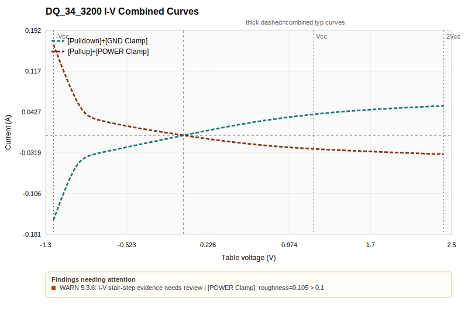

##### I-V clamp detail
<a id="curve-dq-34-3200-iv-clamp"></a>

Related WARN/FAIL QA items: [5.3.10](#check-5-3-10)

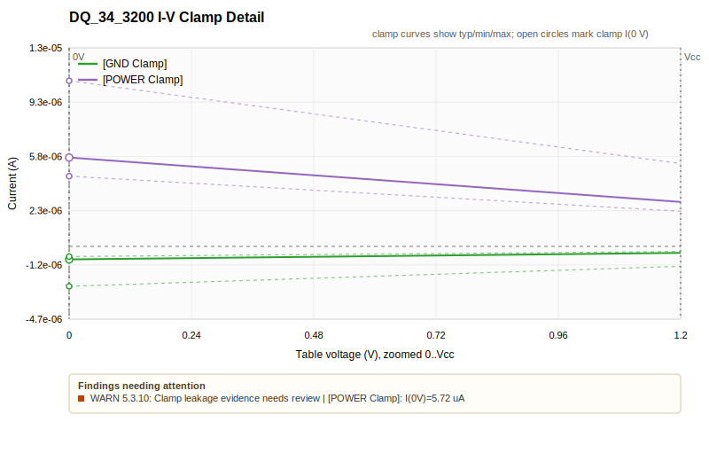

##### I-V pullup/pulldown 0 V detail
<a id="curve-dq-34-3200-iv-zero"></a>

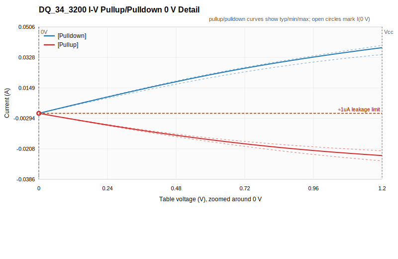

##### Zout load-line curves
<a id="curve-dq-34-3200-zout"></a>


##### V-T waveforms
<a id="curve-dq-34-3200-waveform"></a>


### Model: `DQ_40_3200`

- Candidate model score from model-scoped checked items: IQ3
- Model type: I/O
- Waveform tables: 4


#### Visual Curves

##### I-V Combined Curves
<a id="curve-dq-40-3200-iv"></a>

Related WARN/FAIL QA items: [5.3.6](#check-5-3-6)


##### I-V clamp detail
<a id="curve-dq-40-3200-iv-clamp"></a>

Related WARN/FAIL QA items: [5.3.10](#check-5-3-10)

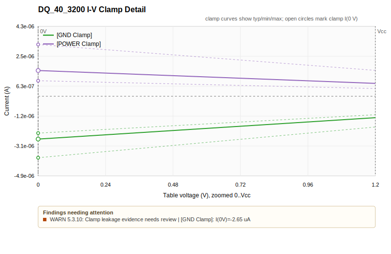

##### I-V pullup/pulldown 0 V detail
<a id="curve-dq-40-3200-iv-zero"></a>

Related WARN/FAIL QA items: [5.3.9](#check-5-3-9)

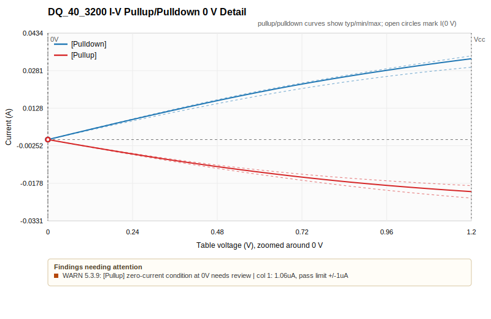

##### Zout load-line curves
<a id="curve-dq-40-3200-zout"></a>

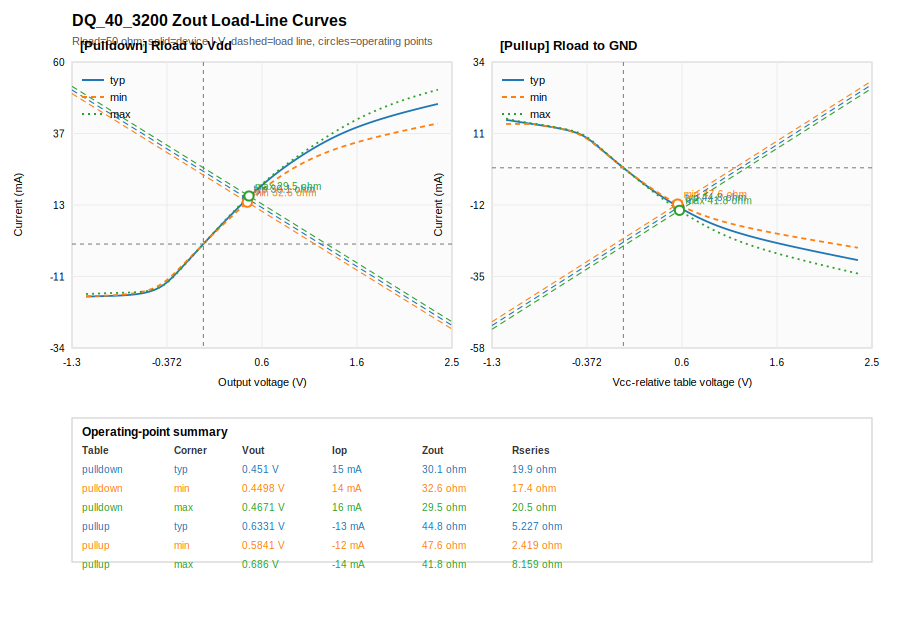

##### V-T waveforms
<a id="curve-dq-40-3200-waveform"></a>

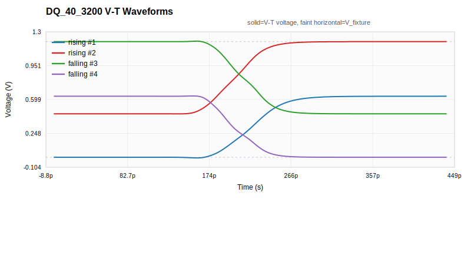


### Model: `DQ_48_3200`

- Candidate model score from model-scoped checked items: IQ3
- Model type: I/O
- Waveform tables: 4


#### Visual Curves

##### I-V Combined Curves
<a id="curve-dq-48-3200-iv"></a>

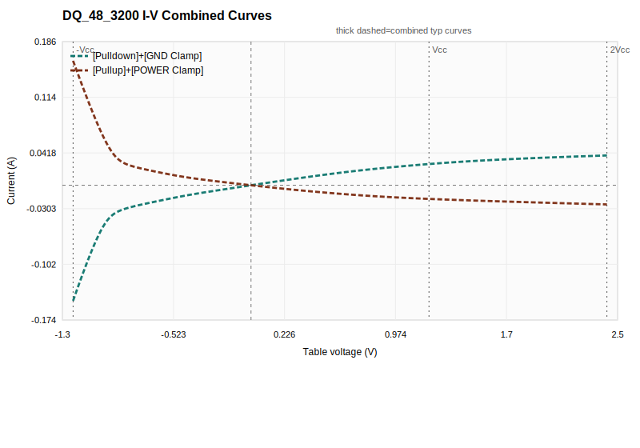

##### I-V clamp detail
<a id="curve-dq-48-3200-iv-clamp"></a>


##### I-V pullup/pulldown 0 V detail
<a id="curve-dq-48-3200-iv-zero"></a>


##### Zout load-line curves
<a id="curve-dq-48-3200-zout"></a>

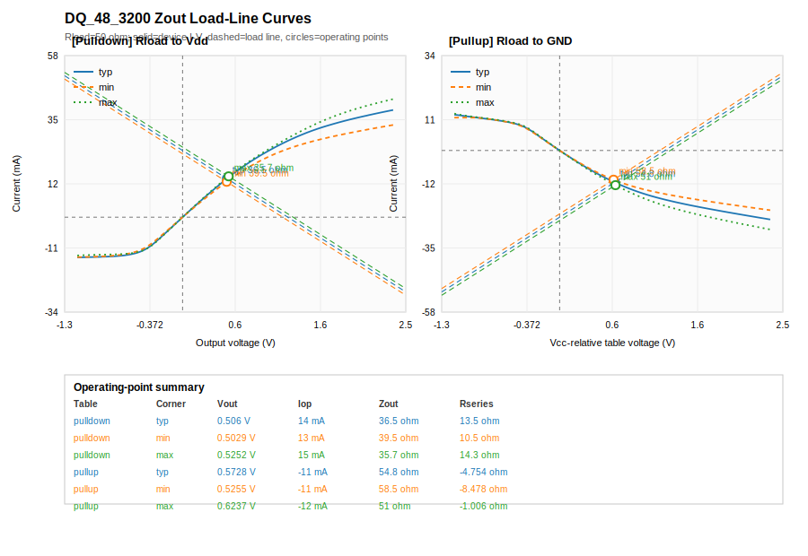

##### V-T waveforms
<a id="curve-dq-48-3200-waveform"></a>

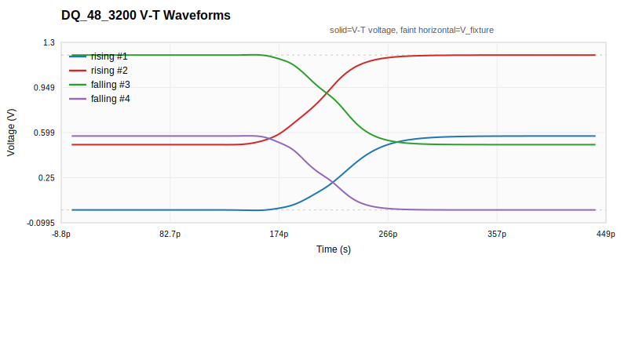


### Model: `DQ_IN_ODTOFF_3200`

- Candidate model score from model-scoped checked items: IQ3
- Model type: Input
- Waveform tables: 0


#### Visual Curves

##### I-V Clamp Curves
<a id="curve-dq-in-odtoff-3200-iv"></a>

Related WARN/FAIL QA items: [5.3.6](#check-5-3-6)

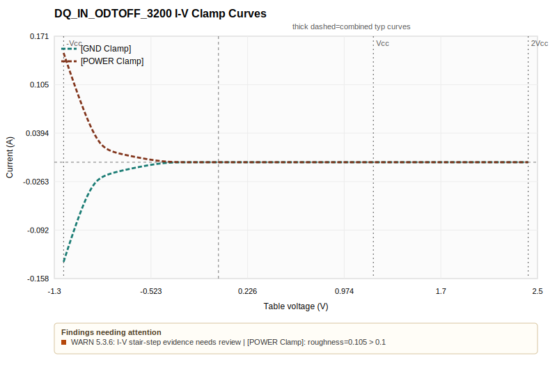

##### I-V clamp detail
<a id="curve-dq-in-odtoff-3200-iv-clamp"></a>

Related WARN/FAIL QA items: [5.3.10](#check-5-3-10)


### Model: `DQ_IN_ODT34_3200`

- Candidate model score from model-scoped checked items: IQ3
- Model type: Input
- Waveform tables: 0


#### Visual Curves

##### I-V Clamp Curves
<a id="curve-dq-in-odt34-3200-iv"></a>

Related WARN/FAIL QA items: [5.3.6](#check-5-3-6)


##### I-V clamp detail
<a id="curve-dq-in-odt34-3200-iv-clamp"></a>

Related WARN/FAIL QA items: [5.3.10](#check-5-3-10)


### Model: `DQ_IN_ODT40_3200`

- Candidate model score from model-scoped checked items: IQ3
- Model type: Input
- Waveform tables: 0


#### Visual Curves

##### I-V Clamp Curves
<a id="curve-dq-in-odt40-3200-iv"></a>

Related WARN/FAIL QA items: [5.3.6](#check-5-3-6)


##### I-V clamp detail
<a id="curve-dq-in-odt40-3200-iv-clamp"></a>

Related WARN/FAIL QA items: [5.3.10](#check-5-3-10)


### Model: `DQ_IN_ODT48_3200`

- Candidate model score from model-scoped checked items: IQ3
- Model type: Input
- Waveform tables: 0


#### Visual Curves

##### I-V Clamp Curves
<a id="curve-dq-in-odt48-3200-iv"></a>

Related WARN/FAIL QA items: [5.3.6](#check-5-3-6)


##### I-V clamp detail
<a id="curve-dq-in-odt48-3200-iv-clamp"></a>

Related WARN/FAIL QA items: [5.3.10](#check-5-3-10)


### Model: `DQ_IN_ODT60_3200`

- Candidate model score from model-scoped checked items: IQ3
- Model type: Input
- Waveform tables: 0


#### Visual Curves

##### I-V Clamp Curves
<a id="curve-dq-in-odt60-3200-iv"></a>

Related WARN/FAIL QA items: [5.3.6](#check-5-3-6)


##### I-V clamp detail
<a id="curve-dq-in-odt60-3200-iv-clamp"></a>

Related WARN/FAIL QA items: [5.3.10](#check-5-3-10)


### Model: `DQ_IN_ODT80_3200`

- Candidate model score from model-scoped checked items: IQ3
- Model type: Input
- Waveform tables: 0


#### Visual Curves

##### I-V Clamp Curves
<a id="curve-dq-in-odt80-3200-iv"></a>

Related WARN/FAIL QA items: [5.3.6](#check-5-3-6)


##### I-V clamp detail
<a id="curve-dq-in-odt80-3200-iv-clamp"></a>

Related WARN/FAIL QA items: [5.3.10](#check-5-3-10)


### Model: `DQ_IN_ODT120_3200`

- Candidate model score from model-scoped checked items: IQ3
- Model type: Input
- Waveform tables: 0


#### Visual Curves

##### I-V Clamp Curves
<a id="curve-dq-in-odt120-3200-iv"></a>

Related WARN/FAIL QA items: [5.3.6](#check-5-3-6)


##### I-V clamp detail
<a id="curve-dq-in-odt120-3200-iv-clamp"></a>

Related WARN/FAIL QA items: [5.3.10](#check-5-3-10)


### Model: `DQ_IN_ODT240_3200`

- Candidate model score from model-scoped checked items: IQ3
- Model type: Input
- Waveform tables: 0


#### Visual Curves

##### I-V Clamp Curves
<a id="curve-dq-in-odt240-3200-iv"></a>

Related WARN/FAIL QA items: [5.3.6](#check-5-3-6)


##### I-V clamp detail
<a id="curve-dq-in-odt240-3200-iv-clamp"></a>

Related WARN/FAIL QA items: [5.3.10](#check-5-3-10)


### Model: `DQS_34_3200`

- Candidate model score from model-scoped checked items: IQ3
- Model type: I/O
- Waveform tables: 4


#### Visual Curves

##### I-V Combined Curves
<a id="curve-dqs-34-3200-iv"></a>

Related WARN/FAIL QA items: [5.3.6](#check-5-3-6)


##### I-V clamp detail
<a id="curve-dqs-34-3200-iv-clamp"></a>

Related WARN/FAIL QA items: [5.3.10](#check-5-3-10)

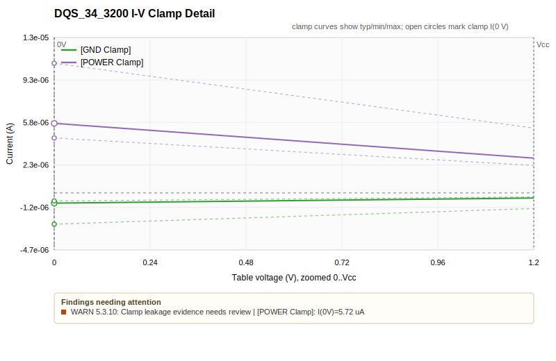

##### I-V pullup/pulldown 0 V detail
<a id="curve-dqs-34-3200-iv-zero"></a>

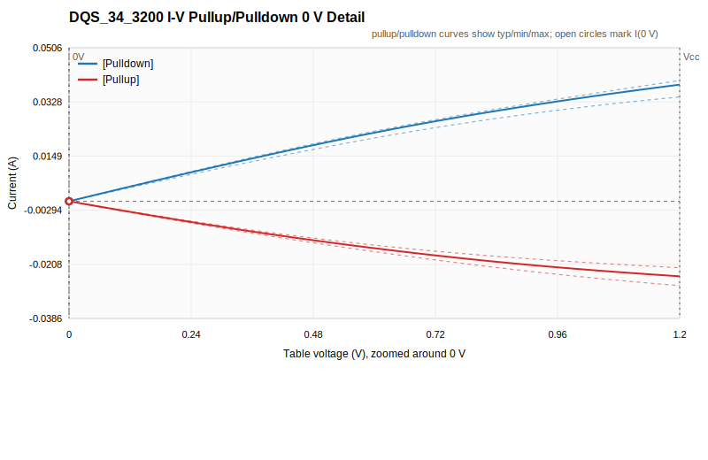

##### Zout load-line curves
<a id="curve-dqs-34-3200-zout"></a>

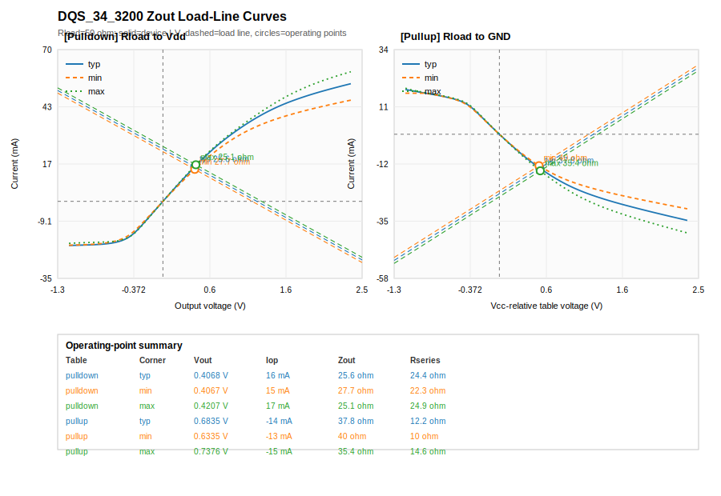

##### V-T waveforms
<a id="curve-dqs-34-3200-waveform"></a>

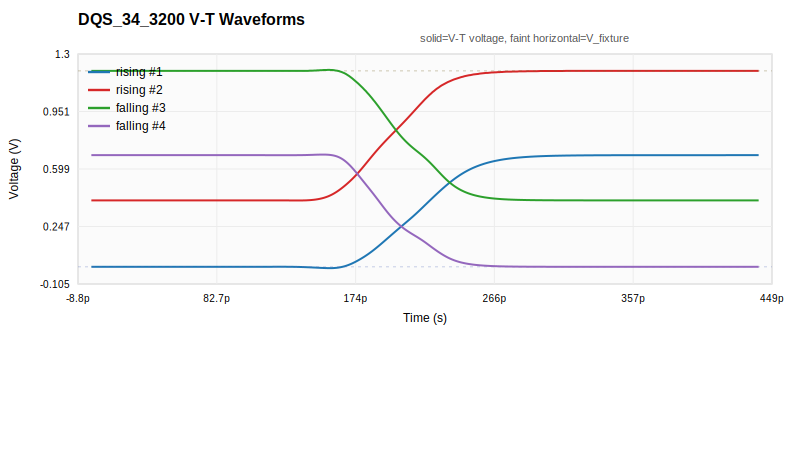


### Model: `DQS_40_3200`

- Candidate model score from model-scoped checked items: IQ3
- Model type: I/O
- Waveform tables: 4


#### Visual Curves

##### I-V Combined Curves
<a id="curve-dqs-40-3200-iv"></a>

Related WARN/FAIL QA items: [5.3.6](#check-5-3-6)


##### I-V clamp detail
<a id="curve-dqs-40-3200-iv-clamp"></a>

Related WARN/FAIL QA items: [5.3.10](#check-5-3-10)

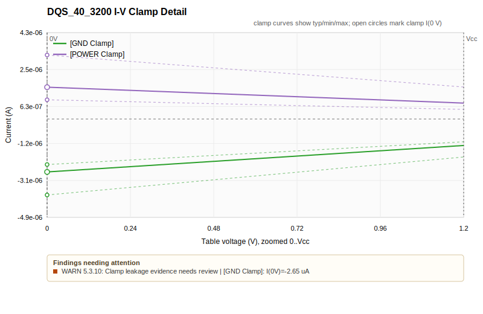

##### I-V pullup/pulldown 0 V detail
<a id="curve-dqs-40-3200-iv-zero"></a>

Related WARN/FAIL QA items: [5.3.9](#check-5-3-9)

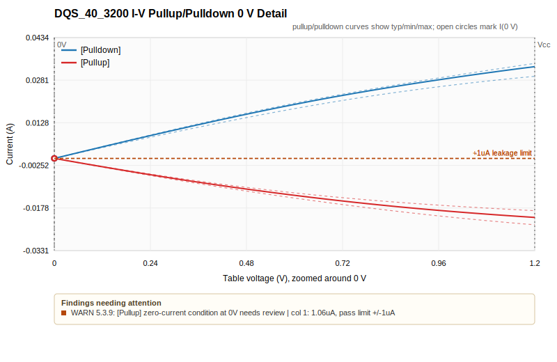

##### Zout load-line curves
<a id="curve-dqs-40-3200-zout"></a>


##### V-T waveforms
<a id="curve-dqs-40-3200-waveform"></a>

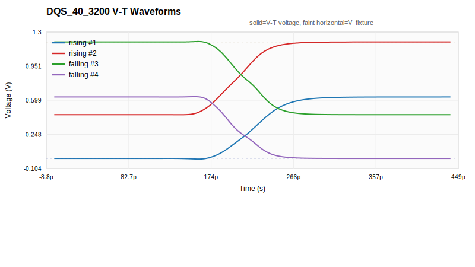


### Model: `DQS_48_3200`

- Candidate model score from model-scoped checked items: IQ3
- Model type: I/O
- Waveform tables: 4


#### Visual Curves

##### I-V Combined Curves
<a id="curve-dqs-48-3200-iv"></a>

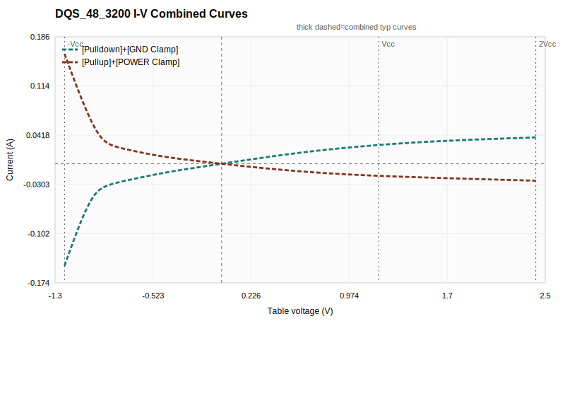

##### I-V clamp detail
<a id="curve-dqs-48-3200-iv-clamp"></a>

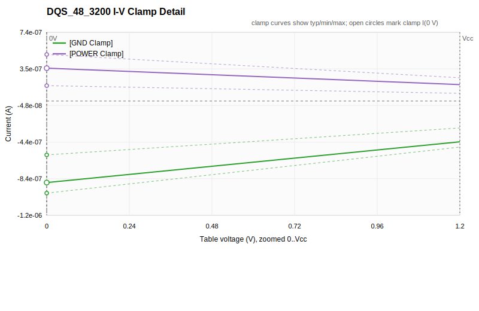

##### I-V pullup/pulldown 0 V detail
<a id="curve-dqs-48-3200-iv-zero"></a>

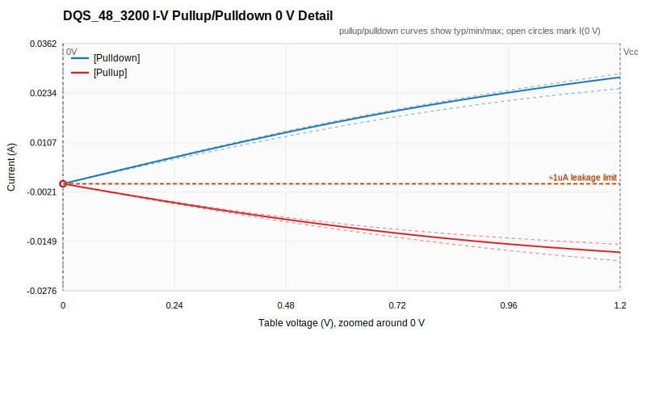

##### Zout load-line curves
<a id="curve-dqs-48-3200-zout"></a>

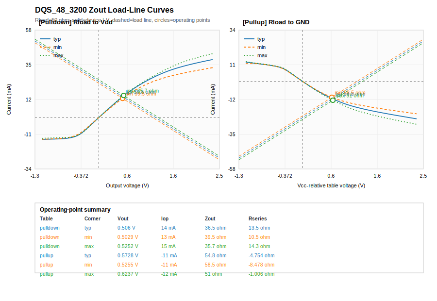

##### V-T waveforms
<a id="curve-dqs-48-3200-waveform"></a>


### Model: `DQS_IN_ODTOFF_3200`

- Candidate model score from model-scoped checked items: IQ3
- Model type: Input
- Waveform tables: 0


#### Visual Curves

##### I-V Clamp Curves
<a id="curve-dqs-in-odtoff-3200-iv"></a>

Related WARN/FAIL QA items: [5.3.6](#check-5-3-6)

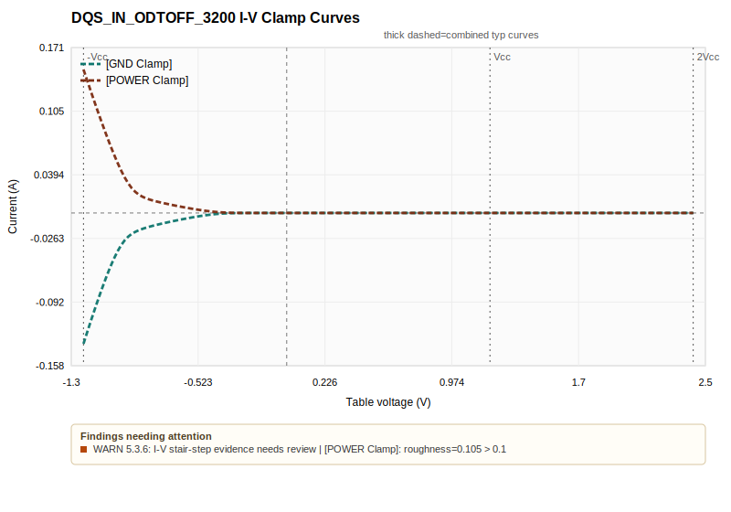

##### I-V clamp detail
<a id="curve-dqs-in-odtoff-3200-iv-clamp"></a>

Related WARN/FAIL QA items: [5.3.10](#check-5-3-10)

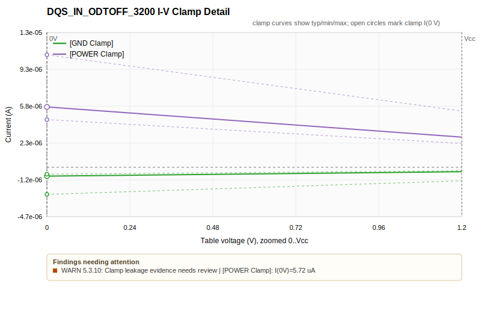


### Model: `DQS_IN_ODT34_3200`

- Candidate model score from model-scoped checked items: IQ3
- Model type: Input
- Waveform tables: 0


#### Visual Curves

##### I-V Clamp Curves
<a id="curve-dqs-in-odt34-3200-iv"></a>

Related WARN/FAIL QA items: [5.3.6](#check-5-3-6)


##### I-V clamp detail
<a id="curve-dqs-in-odt34-3200-iv-clamp"></a>

Related WARN/FAIL QA items: [5.3.10](#check-5-3-10)


### Model: `DQS_IN_ODT40_3200`

- Candidate model score from model-scoped checked items: IQ3
- Model type: Input
- Waveform tables: 0


#### Visual Curves

##### I-V Clamp Curves
<a id="curve-dqs-in-odt40-3200-iv"></a>

Related WARN/FAIL QA items: [5.3.6](#check-5-3-6)


##### I-V clamp detail
<a id="curve-dqs-in-odt40-3200-iv-clamp"></a>

Related WARN/FAIL QA items: [5.3.10](#check-5-3-10)

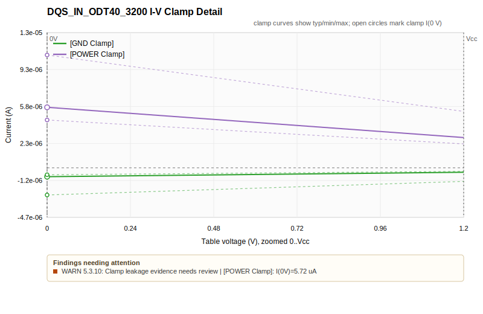


### Model: `DQS_IN_ODT48_3200`

- Candidate model score from model-scoped checked items: IQ3
- Model type: Input
- Waveform tables: 0


#### Visual Curves

##### I-V Clamp Curves
<a id="curve-dqs-in-odt48-3200-iv"></a>

Related WARN/FAIL QA items: [5.3.6](#check-5-3-6)

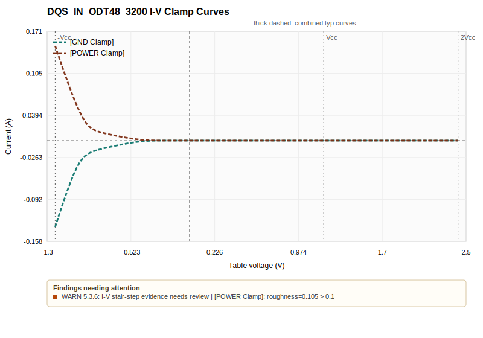

##### I-V clamp detail
<a id="curve-dqs-in-odt48-3200-iv-clamp"></a>

Related WARN/FAIL QA items: [5.3.10](#check-5-3-10)


### Model: `DQS_IN_ODT60_3200`

- Candidate model score from model-scoped checked items: IQ3
- Model type: Input
- Waveform tables: 0


#### Visual Curves

##### I-V Clamp Curves
<a id="curve-dqs-in-odt60-3200-iv"></a>

Related WARN/FAIL QA items: [5.3.6](#check-5-3-6)


##### I-V clamp detail
<a id="curve-dqs-in-odt60-3200-iv-clamp"></a>

Related WARN/FAIL QA items: [5.3.10](#check-5-3-10)


### Model: `DQS_IN_ODT80_3200`

- Candidate model score from model-scoped checked items: IQ3
- Model type: Input
- Waveform tables: 0


#### Visual Curves

##### I-V Clamp Curves
<a id="curve-dqs-in-odt80-3200-iv"></a>

Related WARN/FAIL QA items: [5.3.6](#check-5-3-6)


##### I-V clamp detail
<a id="curve-dqs-in-odt80-3200-iv-clamp"></a>

Related WARN/FAIL QA items: [5.3.10](#check-5-3-10)


### Model: `DQS_IN_ODT120_3200`

- Candidate model score from model-scoped checked items: IQ3
- Model type: Input
- Waveform tables: 0


#### Visual Curves

##### I-V Clamp Curves
<a id="curve-dqs-in-odt120-3200-iv"></a>

Related WARN/FAIL QA items: [5.3.6](#check-5-3-6)


##### I-V clamp detail
<a id="curve-dqs-in-odt120-3200-iv-clamp"></a>

Related WARN/FAIL QA items: [5.3.10](#check-5-3-10)


### Model: `DQS_IN_ODT240_3200`

- Candidate model score from model-scoped checked items: IQ3
- Model type: Input
- Waveform tables: 0


#### Visual Curves

##### I-V Clamp Curves
<a id="curve-dqs-in-odt240-3200-iv"></a>

Related WARN/FAIL QA items: [5.3.6](#check-5-3-6)


##### I-V clamp detail
<a id="curve-dqs-in-odt240-3200-iv-clamp"></a>

Related WARN/FAIL QA items: [5.3.10](#check-5-3-10)

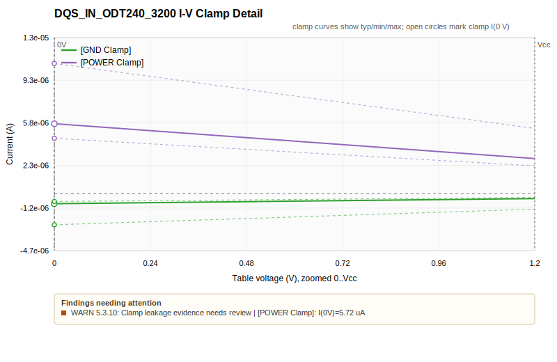


### Model: `DM_ODTOFF_3200`

- Candidate model score from model-scoped checked items: IQ3
- Model type: Input
- Waveform tables: 0


#### Visual Curves

##### I-V Clamp Curves
<a id="curve-dm-odtoff-3200-iv"></a>

Related WARN/FAIL QA items: [5.3.6](#check-5-3-6)


##### I-V clamp detail
<a id="curve-dm-odtoff-3200-iv-clamp"></a>

Related WARN/FAIL QA items: [5.3.10](#check-5-3-10)


### Model: `DM_ODT34_3200`

- Candidate model score from model-scoped checked items: IQ3
- Model type: Input
- Waveform tables: 0


#### Visual Curves

##### I-V Clamp Curves
<a id="curve-dm-odt34-3200-iv"></a>

Related WARN/FAIL QA items: [5.3.6](#check-5-3-6)

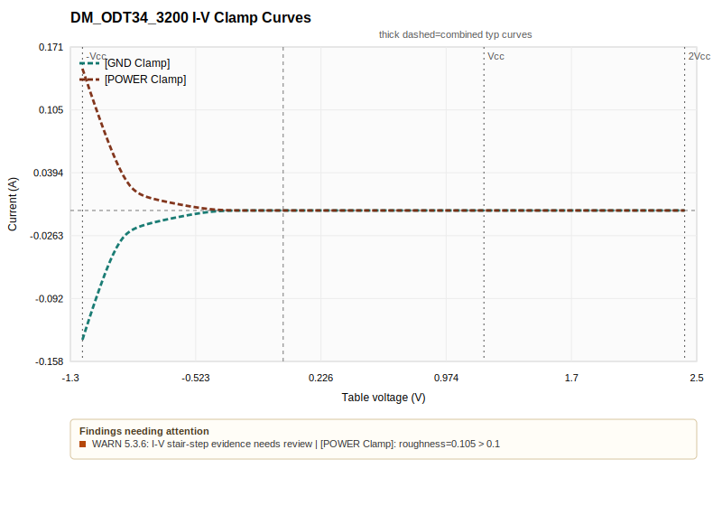

##### I-V clamp detail
<a id="curve-dm-odt34-3200-iv-clamp"></a>

Related WARN/FAIL QA items: [5.3.10](#check-5-3-10)


### Model: `DM_ODT40_3200`

- Candidate model score from model-scoped checked items: IQ3
- Model type: Input
- Waveform tables: 0


#### Visual Curves

##### I-V Clamp Curves
<a id="curve-dm-odt40-3200-iv"></a>

Related WARN/FAIL QA items: [5.3.6](#check-5-3-6)


##### I-V clamp detail
<a id="curve-dm-odt40-3200-iv-clamp"></a>

Related WARN/FAIL QA items: [5.3.10](#check-5-3-10)


### Model: `DM_ODT48_3200`

- Candidate model score from model-scoped checked items: IQ3
- Model type: Input
- Waveform tables: 0


#### Visual Curves

##### I-V Clamp Curves
<a id="curve-dm-odt48-3200-iv"></a>

Related WARN/FAIL QA items: [5.3.6](#check-5-3-6)


##### I-V clamp detail
<a id="curve-dm-odt48-3200-iv-clamp"></a>

Related WARN/FAIL QA items: [5.3.10](#check-5-3-10)


### Model: `DM_ODT60_3200`

- Candidate model score from model-scoped checked items: IQ3
- Model type: Input
- Waveform tables: 0


#### Visual Curves

##### I-V Clamp Curves
<a id="curve-dm-odt60-3200-iv"></a>

Related WARN/FAIL QA items: [5.3.6](#check-5-3-6)


##### I-V clamp detail
<a id="curve-dm-odt60-3200-iv-clamp"></a>

Related WARN/FAIL QA items: [5.3.10](#check-5-3-10)


### Model: `DM_ODT80_3200`

- Candidate model score from model-scoped checked items: IQ3
- Model type: Input
- Waveform tables: 0


#### Visual Curves

##### I-V Clamp Curves
<a id="curve-dm-odt80-3200-iv"></a>

Related WARN/FAIL QA items: [5.3.6](#check-5-3-6)


##### I-V clamp detail
<a id="curve-dm-odt80-3200-iv-clamp"></a>

Related WARN/FAIL QA items: [5.3.10](#check-5-3-10)

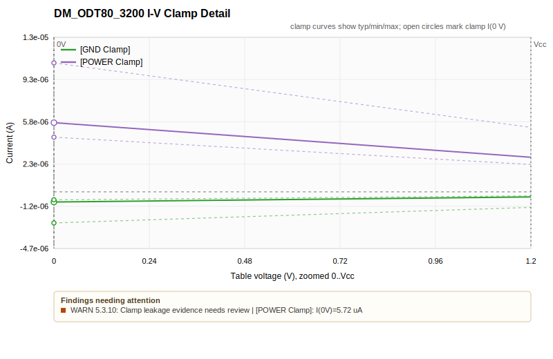


### Model: `DM_ODT120_3200`

- Candidate model score from model-scoped checked items: IQ3
- Model type: Input
- Waveform tables: 0


#### Visual Curves

##### I-V Clamp Curves
<a id="curve-dm-odt120-3200-iv"></a>

Related WARN/FAIL QA items: [5.3.6](#check-5-3-6)


##### I-V clamp detail
<a id="curve-dm-odt120-3200-iv-clamp"></a>

Related WARN/FAIL QA items: [5.3.10](#check-5-3-10)


### Model: `DM_ODT240_3200`

- Candidate model score from model-scoped checked items: IQ3
- Model type: Input
- Waveform tables: 0


#### Visual Curves

##### I-V Clamp Curves
<a id="curve-dm-odt240-3200-iv"></a>

Related WARN/FAIL QA items: [5.3.6](#check-5-3-6)


##### I-V clamp detail
<a id="curve-dm-odt240-3200-iv-clamp"></a>

Related WARN/FAIL QA items: [5.3.10](#check-5-3-10)


### Model: `TDQS_ODTOFF_3200`

- Candidate model score from model-scoped checked items: IQ3
- Model type: Terminator
- Waveform tables: 0


#### Visual Curves

##### I-V Clamp Curves
<a id="curve-tdqs-odtoff-3200-iv"></a>

Related WARN/FAIL QA items: [5.3.6](#check-5-3-6)


##### I-V clamp detail
<a id="curve-tdqs-odtoff-3200-iv-clamp"></a>

Related WARN/FAIL QA items: [5.3.10](#check-5-3-10)


### Model: `TDQS_ODT34_3200`

- Candidate model score from model-scoped checked items: IQ3
- Model type: Terminator
- Waveform tables: 0


#### Visual Curves

##### I-V Clamp Curves
<a id="curve-tdqs-odt34-3200-iv"></a>

Related WARN/FAIL QA items: [5.3.6](#check-5-3-6)


##### I-V clamp detail
<a id="curve-tdqs-odt34-3200-iv-clamp"></a>

Related WARN/FAIL QA items: [5.3.10](#check-5-3-10)


### Model: `TDQS_ODT40_3200`

- Candidate model score from model-scoped checked items: IQ3
- Model type: Terminator
- Waveform tables: 0


#### Visual Curves

##### I-V Clamp Curves
<a id="curve-tdqs-odt40-3200-iv"></a>

Related WARN/FAIL QA items: [5.3.6](#check-5-3-6)

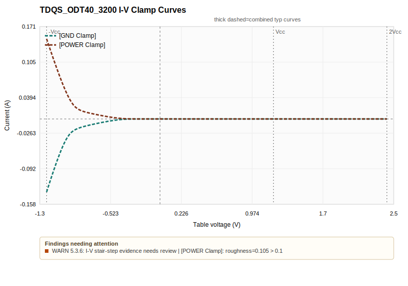

##### I-V clamp detail
<a id="curve-tdqs-odt40-3200-iv-clamp"></a>

Related WARN/FAIL QA items: [5.3.10](#check-5-3-10)


### Model: `TDQS_ODT48_3200`

- Candidate model score from model-scoped checked items: IQ3
- Model type: Terminator
- Waveform tables: 0


#### Visual Curves

##### I-V Clamp Curves
<a id="curve-tdqs-odt48-3200-iv"></a>

Related WARN/FAIL QA items: [5.3.6](#check-5-3-6)


##### I-V clamp detail
<a id="curve-tdqs-odt48-3200-iv-clamp"></a>

Related WARN/FAIL QA items: [5.3.10](#check-5-3-10)


### Model: `TDQS_ODT60_3200`

- Candidate model score from model-scoped checked items: IQ3
- Model type: Terminator
- Waveform tables: 0


#### Visual Curves

##### I-V Clamp Curves
<a id="curve-tdqs-odt60-3200-iv"></a>

Related WARN/FAIL QA items: [5.3.6](#check-5-3-6)


##### I-V clamp detail
<a id="curve-tdqs-odt60-3200-iv-clamp"></a>

Related WARN/FAIL QA items: [5.3.10](#check-5-3-10)


### Model: `TDQS_ODT80_3200`

- Candidate model score from model-scoped checked items: IQ3
- Model type: Terminator
- Waveform tables: 0


#### Visual Curves

##### I-V Clamp Curves
<a id="curve-tdqs-odt80-3200-iv"></a>

Related WARN/FAIL QA items: [5.3.6](#check-5-3-6)


##### I-V clamp detail
<a id="curve-tdqs-odt80-3200-iv-clamp"></a>

Related WARN/FAIL QA items: [5.3.10](#check-5-3-10)


### Model: `TDQS_ODT120_3200`

- Candidate model score from model-scoped checked items: IQ3
- Model type: Terminator
- Waveform tables: 0


#### Visual Curves

##### I-V Clamp Curves
<a id="curve-tdqs-odt120-3200-iv"></a>

Related WARN/FAIL QA items: [5.3.6](#check-5-3-6)

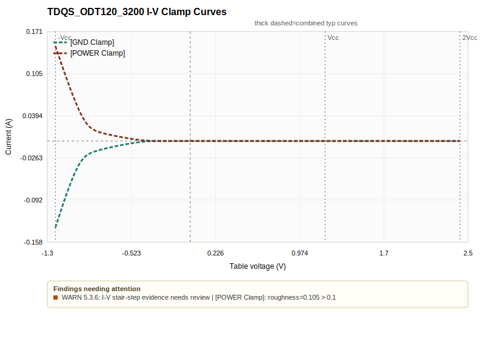

##### I-V clamp detail
<a id="curve-tdqs-odt120-3200-iv-clamp"></a>

Related WARN/FAIL QA items: [5.3.10](#check-5-3-10)


### Model: `TDQS_ODT240_3200`

- Candidate model score from model-scoped checked items: IQ3
- Model type: Terminator
- Waveform tables: 0


#### Visual Curves

##### I-V Clamp Curves
<a id="curve-tdqs-odt240-3200-iv"></a>

Related WARN/FAIL QA items: [5.3.6](#check-5-3-6)


##### I-V clamp detail
<a id="curve-tdqs-odt240-3200-iv-clamp"></a>

Related WARN/FAIL QA items: [5.3.10](#check-5-3-10)


### Model: `INPUT`

- Candidate model score from model-scoped checked items: IQ3
- Model type: Input
- Waveform tables: 0


#### Visual Curves

##### I-V Clamp Curves
<a id="curve-input-iv"></a>


##### I-V clamp detail
<a id="curve-input-iv-clamp"></a>

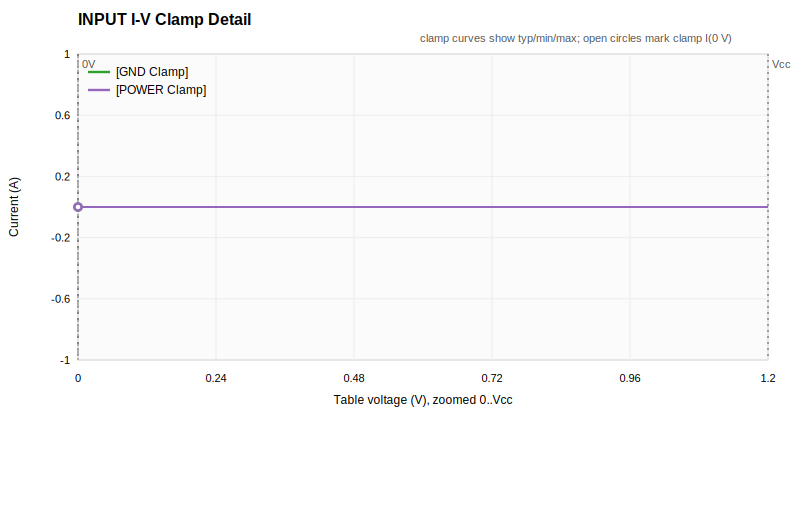


### Model: `CLKIN`

- Candidate model score from model-scoped checked items: IQ3
- Model type: Input
- Waveform tables: 0


#### Visual Curves

##### I-V Clamp Curves
<a id="curve-clkin-iv"></a>

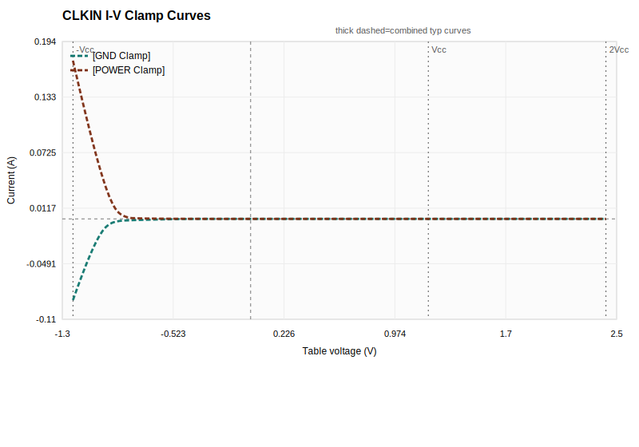

##### I-V clamp detail
<a id="curve-clkin-iv-clamp"></a>


### Model: `ALERT`

- Candidate model score from model-scoped checked items: IQ3
- Model type: Open_sink
- Waveform tables: 2


#### Visual Curves

##### I-V Combined Curves
<a id="curve-alert-iv"></a>

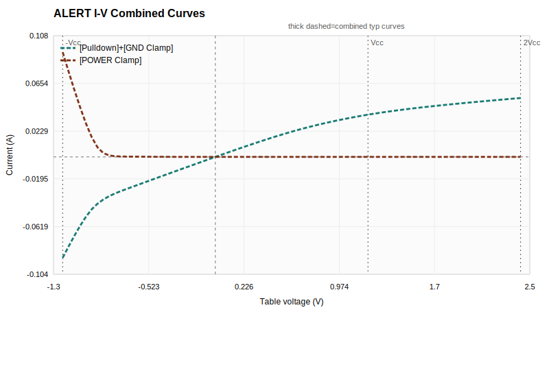

##### I-V clamp detail
<a id="curve-alert-iv-clamp"></a>

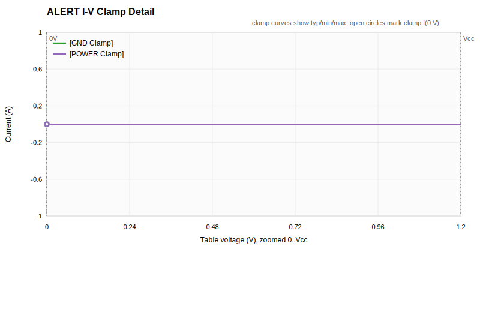

##### I-V pullup/pulldown 0 V detail
<a id="curve-alert-iv-zero"></a>

Related WARN/FAIL QA items: [5.3.8](#check-5-3-8)

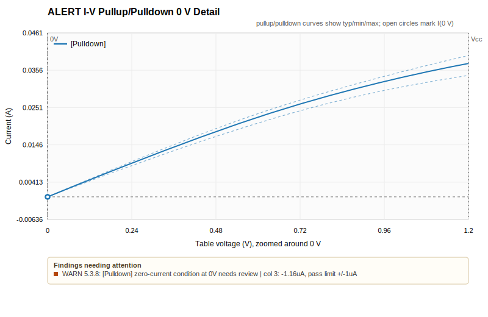

##### Zout load-line curves
<a id="curve-alert-zout"></a>

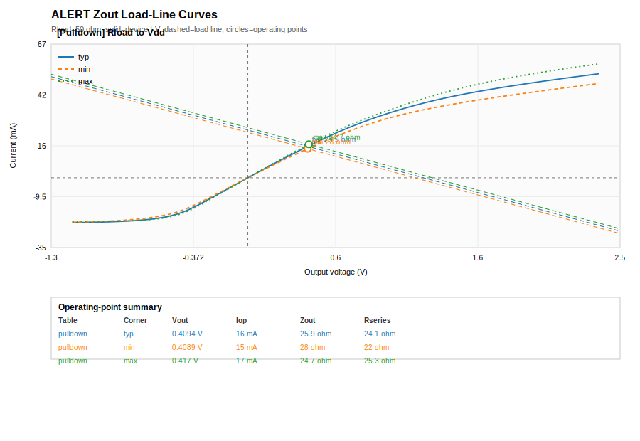

##### V-T waveforms
<a id="curve-alert-waveform"></a>

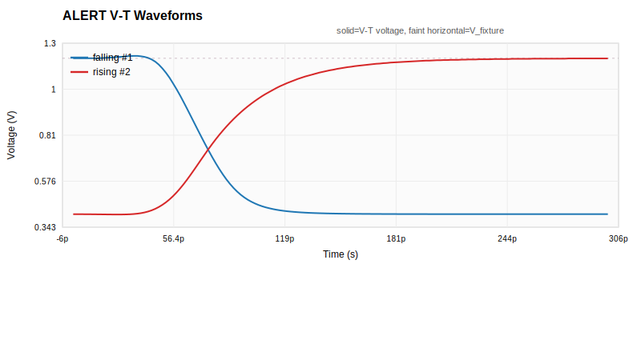


### Model: `NF_DQ`

- Candidate model score from model-scoped checked items: IQ3
- Model type: Terminator
- Waveform tables: 0


#### Visual Curves

##### I-V Clamp Curves
<a id="curve-nf-dq-iv"></a>

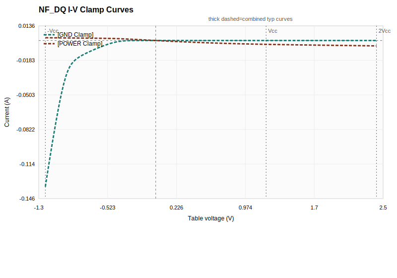

##### I-V clamp detail
<a id="curve-nf-dq-iv-clamp"></a>

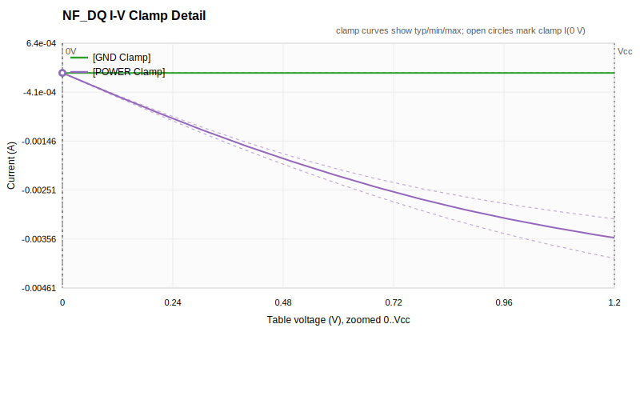


## Appendix A: IQ Levels
<a id="appendix-a-iq-levels"></a>

| Level | Name | Meaning |
|---|---|---|
| IQ0 | Not Checked | No documented quality checking has been performed. |
| IQ1 | Passes IBISCHK | IBISCHK has been run with zero errors and documented handling of warnings. |
| IQ2 | Suitable for Waveform Simulation | IQ1 plus all LEVEL 2 checks for basic waveform simulation data. |
| IQ3 | Suitable for Timing Analysis | IQ2 plus all LEVEL 3 checks for timing analysis data. |

## Appendix B: Special Designators
<a id="appendix-b-special-designators"></a>

Special letters may be appended to the IQ score when the supporting evidence is documented.

| Designator | Name | Meaning |
|---|---|---|
| G | Contains Golden Waveforms | The file contains golden waveform data using [Test Data] and [Test Load] or equivalent external documentation. |
| M | Measurement Correlated | IBIS simulation has been correlated against hardware measurements with documented methods/results. |
| S | Simulation Correlated | IBIS simulation has been correlated against a reference simulation such as SPICE with documented methods/results. |
| X | Exceptions | One or more checks require documented exceptions in [Notes] or comments. |

## Appendix C: Scoring Notes
<a id="appendix-c-scoring-notes"></a>

- Base level: The summary IQ number is the highest level for which all required checks at that level and below pass, are NA, or are accepted exceptions.
- Optional checks: OPTIONAL checks are good practice but do not change the summary IQ number.
- Correlation designators: Append M, S, and/or G when measurement correlation, simulation correlation, and/or golden waveform evidence is documented for a reasonable set of models.
- Exception designator: Append X when any check passes only by documented exception or any remaining parser warning needs user attention.
- Writeback: The summary IQ score must be written into the IBIS file, preferably in [Notes]; detailed per-check status is better stored in a quality report.
